- [不带指针成员变量的类——以复数类complex为例](#不带指针成员变量的类以复数类complex为例)
  - [头文件的结构](#头文件的结构)
  - [函数设计](#函数设计)
    - [构造函数](#构造函数)
      - [构造函数放在private中](#构造函数放在private中)
    - [const--\>常成员函数](#const--常成员函数)
  - [参数传递和返回值](#参数传递和返回值)
  - [友元](#友元)
  - [操作符重载](#操作符重载)
    - [成员函数](#成员函数)
    - [非成员函数](#非成员函数)
  - [complex类实现复习](#complex类实现复习)
- [带指针的——以string类为例](#带指针的以string类为例)
  - [类定义](#类定义)
  - [3个特殊函数:拷贝构造函数、拷贝赋值函数和析构函数](#3个特殊函数拷贝构造函数拷贝赋值函数和析构函数)
    - [构造函数和析构函数](#构造函数和析构函数)
    - [拷贝构造函数和拷贝赋值函数](#拷贝构造函数和拷贝赋值函数)
- [堆栈与内存管理](#堆栈与内存管理)
  - [堆栈及对象的生命周期](#堆栈及对象的生命周期)
  - [new和delete过程中的内存分配](#new和delete过程中的内存分配)
- [一些补充](#一些补充)
  - [static成员与this point](#static成员与this-point)
  - [cout补充](#cout补充)
  - [类模板](#类模板)
  - [函数模板](#函数模板)
  - [namespace](#namespace)
- [面向对象（OOP和OOD）](#面向对象oop和ood)
  - [复合(composition)](#复合composition)
  - [委托(aggregation;composition by reference)](#委托aggregationcomposition-by-reference)
  - [继承(extension)，表示is-a](#继承extension表示is-a)
  - [虚函数](#虚函数)
  - [继承+复合的构造析构分析](#继承复合的构造析构分析)
  - [委托＋继承的使用](#委托继承的使用)
- [面向对象设计范例](#面向对象设计范例)
  - [使用委托+继承实现Observer模式](#使用委托继承实现observer模式)
  - [使用委托+继承实现Composite模式](#使用委托继承实现composite模式)
  - [使用委托+继承实现Prototype模式](#使用委托继承实现prototype模式)

## 不带指针成员变量的类——以复数类complex为例

### 头文件的结构
头文件complex.h的结构如下，分为四部分
1. 防卫式声明，防止头文件被重复包含

```C
#ifndef _COMPLEX_
#define _COMPLEX_

//内部实现（见2——4）
#endif
```
2. 前置声明：声明头文件用到的类和函数

```C
#include<cmath>

class ostream;
class complex;

complex & _doapl(complex *this, const complex& r);
```
3. 声明类：声明类的函数和变量，简单的函数可以在此实现

```C
class complex{
……
};
```

4. 类定义：实现之前声明的各种函数

```C
complex::function……
```

- 内联函数由编译器自己判断，自己加inline 前缀只是给编译器建议
- 访问级别: private 一般放数据、public 一般放函数

### 函数设计
#### 构造函数
- 创建对象默认要被调用的
- 函数名与类名相同
- 可以有参，也可以有默认参数
- 没有返回值类型（构造函数的
- 构造函数可以重载


大气的写法

```C++
class complex{
    complex (double r=0,double x=0)
    :re(r),im(i)//构造函数独有的，尽量用这种方式赋值
    {}
};
```

##### 构造函数放在private中
不允许外界对象构造函数
典型例子：
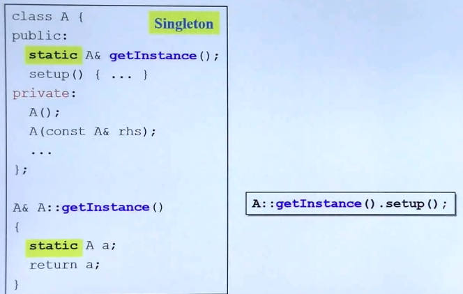

听完static后补充：
该类只有一个对象A，不允许创建对象，可以通过getInstance函数取得A然后.其他函数访问其他函数————妙啊

单例模式改进：
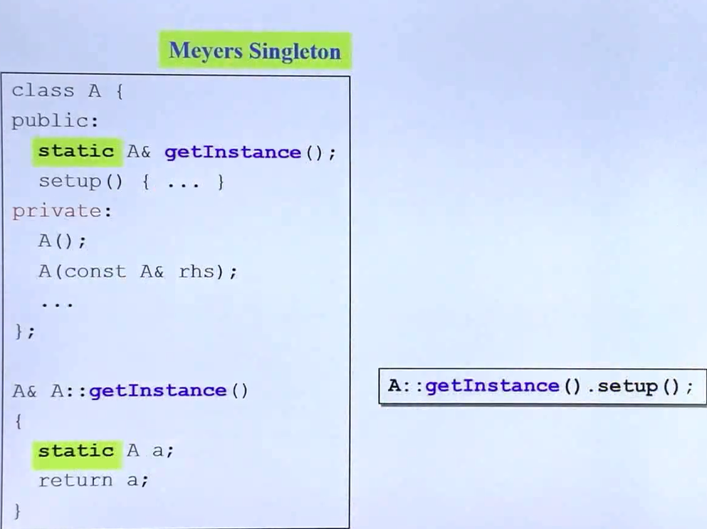
将static A a;放在函数里————好处：当没人调用时，这个类就不存在

#### const-->常成员函数
类内函数，如果只读取不写入，要加const
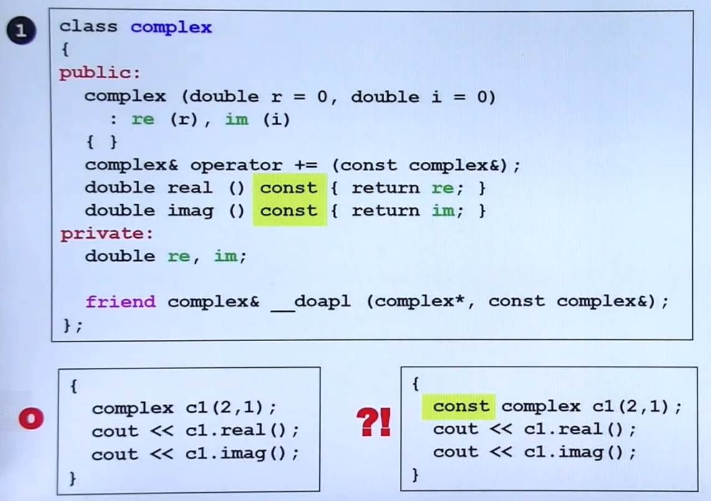

const成员函数只能调用带const的函数：意义是const成员函数不改变成员数据的值，所以调用的函数也不应该允许改变成员数据的值。

### 参数传递和返回值
- pass by value vs. pass by reference(to const)
value：整包都传过去压入栈（**尽量不要传value**）
reference：引用（如果不想被改动就+const）


参数传递：
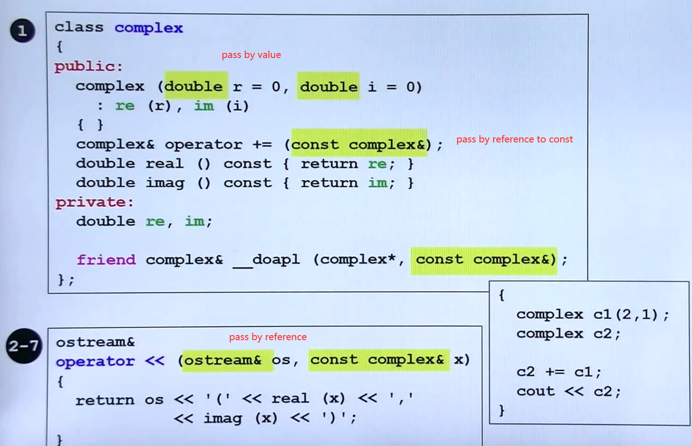

返回值：
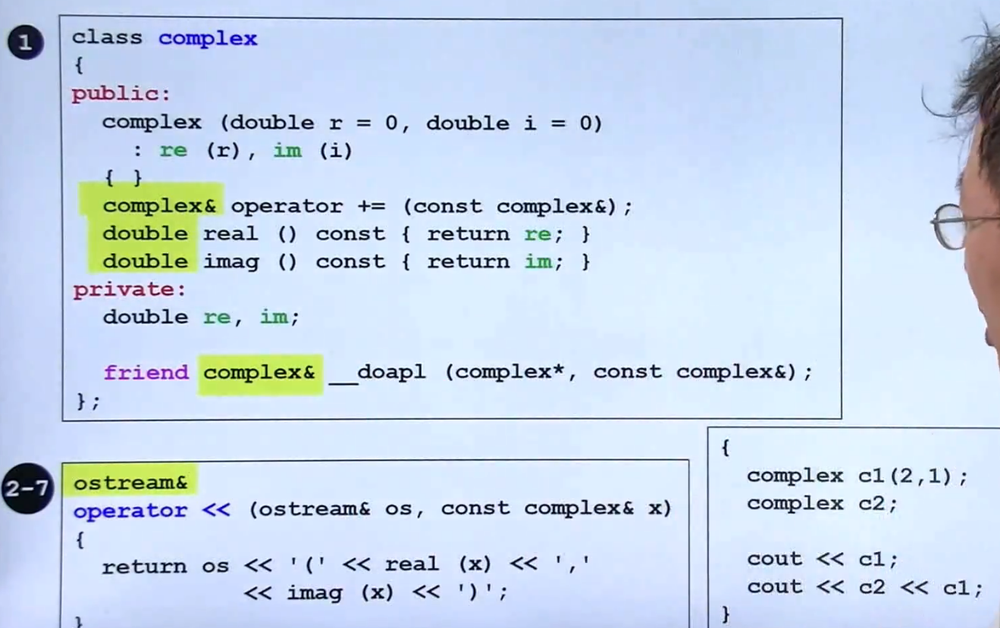

- **什么时候可以用reference**

返回引用：返回本身存在的（+=）/如果是返回函数内的local变量（如+，需再定义一个新的变量存结果）这时候返回这个结果就不能用返回引用
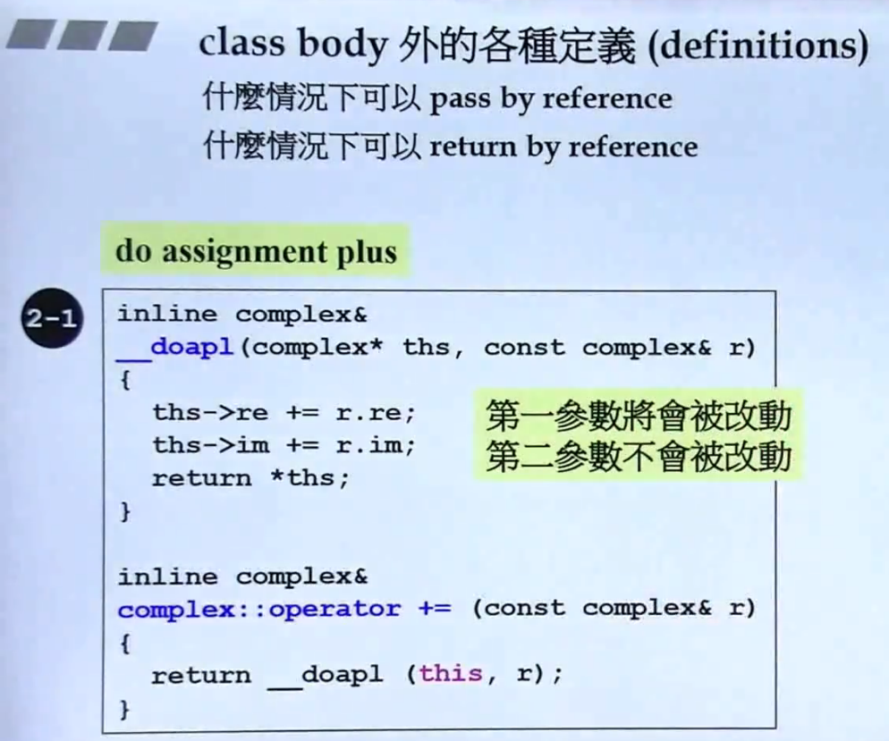

另外：
使用reference时：传递者无需知道接受者是以什么方式接收
如
+=写的时候随便写，不用管函数到底是返回&还是返回值
但如果要连续+=，就必须用complex&返回值类型

### 友元
友元函数/类可以自由访问该类的私有数据
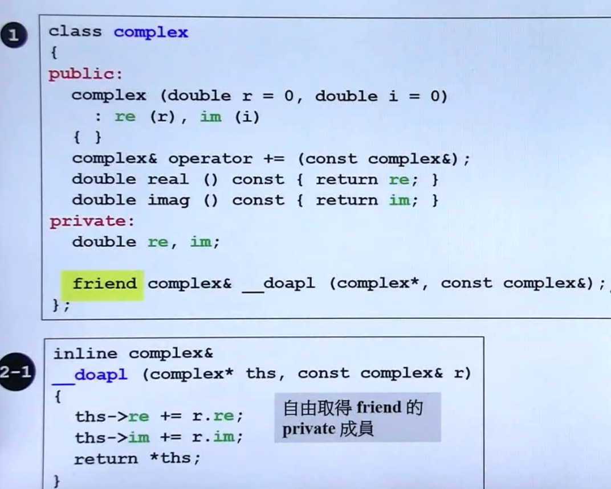


相同类中各个object互为友元，可以直接调用
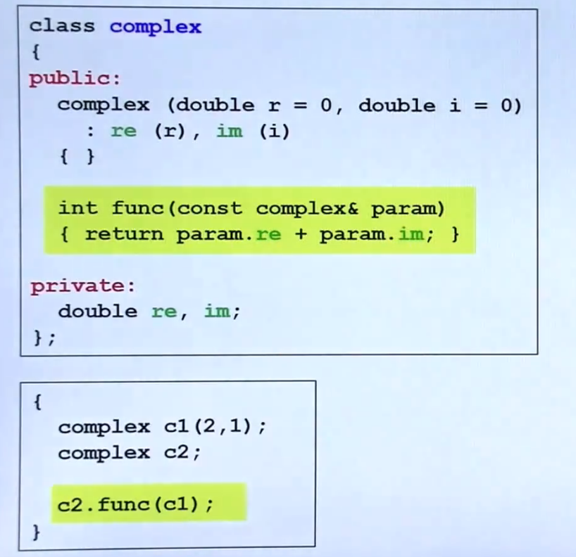


### 操作符重载
#### 成员函数
语法tip：成员函数的操作符重载隐藏一个this（不写，看不到）
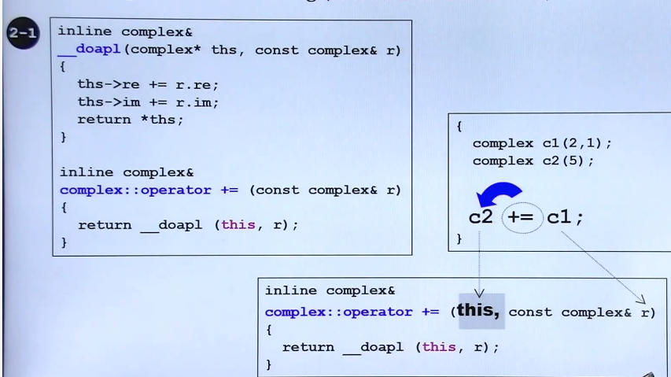
#### 非成员函数
以+为例：
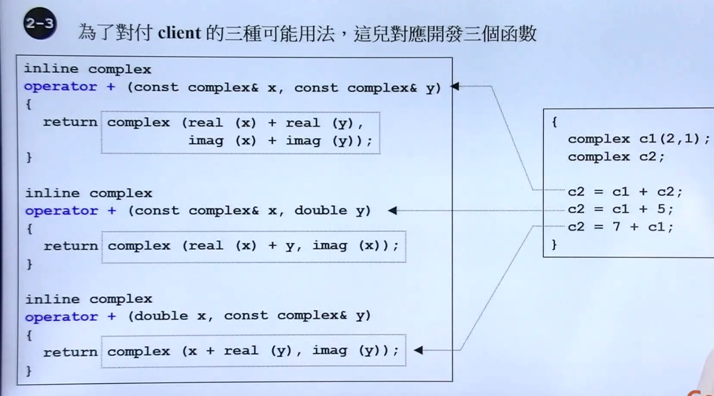

注意：
+ 上面这些函数返回值绝对不能是return by reference，因为他们返回的是局部变量
+ <<操作符只能全局函数实现

- 临时对象：
方括号中的complex（）的作用是创建临时对象，不需要命名

### complex类实现复习
```C++
#ifndef _COMPLEX_
#define _COMPLEX_
class complex{
  public:
    complex (double r=0,double i=0)
        :re(r),im(i)
        {}
    complex& operator +=(const complex&);
    double real() const {return re;}
    double imag() const {return im;}
  private:
    double re,im;
    friend complex& _doapl (complex*,const complex&);
    
};

complex& _doapl(complex* ths , const complex& r){
    ths->re+=r.re;
    ths->im+=r.im;
    return *ths ;
}

complex& complex::operator +=(const complex& r)
{return _doapl(this,r)}

complex operator +(const complex& x,const complex& y)
{
    return complex(real(x)+real(y),imag(x)+imag(y));
}
complex operator +(const complex& x,double y)
{
    return complex(real(x)+y,imag(x));
}
complex operator +(double x,const complex& y)
{
    return complex(x+real(y),imag(y));
}
ostream& operator << (ostream& os,const complex& x)
{
    return os<<'('<<real(x)<<','<<imag(x)<<')';
}


#endif
```


最后得到
complex.h和complex-test.cpp


## 带指针的——以string类为例

- 整体框架 
string.h
```C++
#ifndef _MYSTRING_
#define _MYSTRING_

class String
{

};

String::function(……)……
Global—function(……)……


#endif
```
string—test.cpp
```C++
int main(){
    String s1();
    String s2("hello");

    String s3(s1);
    cout<<s3<<endl;
    s3=s2;
    cout<<s3<<endl;

}
```

### 类定义
```C++
class String
{
public:
    String(const char* cstr=0);
    String(const String& str); 
    String& operator=(const String& str);
    ~String();
    char* get_c_str() const{ return m_data;}

private:
    char* m_data;
}

```
### 3个特殊函数:拷贝构造函数、拷贝赋值函数和析构函数
对于不带有指针的类,这3个函数可以使用编译器默认为我们生成的版本;
但是编写带有指针的类时就有必要定义这3个特殊函数.

#### 构造函数和析构函数
构造函数和析构函数中执行数据的深拷贝和释放.
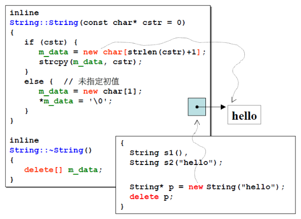

- 使用delete[]操作符释放数组内存,若直接使用delete操作符释放数组内存虽然能够通过编译,但有可能产生内存泄漏.

#### 拷贝构造函数和拷贝赋值函数

- 有指针的情况浅拷贝（拷贝指针）会造成内存泄漏

拷贝构造函数和拷贝赋值函数函数的使用场景不同,下面程序的拷贝3虽然使用了=赋值,但是因为是在初始化过程中使用的,所以调用的是拷贝构造函数.
```C++
String s1 = "hello";
String s2(s1);      // 拷贝1: 调用拷贝构造函数
String s3;
s3 = s1;            // 拷贝2: 调用拷贝赋值函数
String s4 = s1;     // 拷贝3: 调用拷贝构造函数
```


**拷贝构造函数**的实现较为简单,直接调用友元对象的数据指针进行拷贝即可.（两行蓝色部分相同）
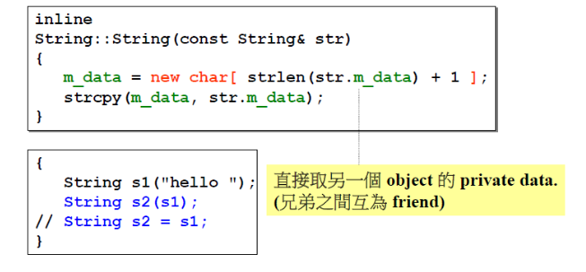

**拷贝赋值函数**中要检测自我赋值,这不仅是为了效率考虑,也是为了防止出现bug.
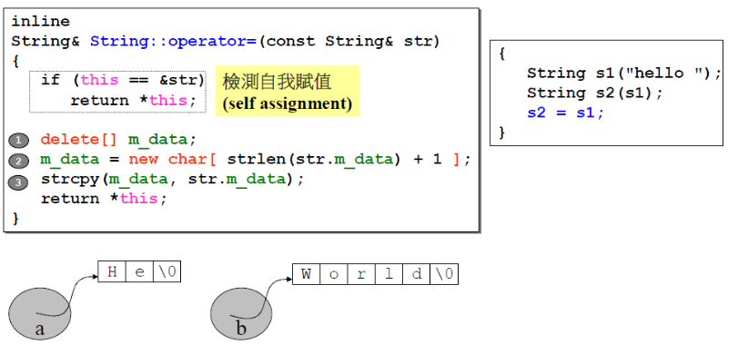
区分：
- (const String& str)的&是引用
- (this == &str)是取地址


bug：如果不检测，删除之后两个指针都指向空了，第二步就出现错误


## 堆栈与内存管理
### 堆栈及对象的生命周期
栈(stack),是存在于某作用域(scope)的一块内存空间.
- 例如当你调用函数,函数本身就会形成一个stack用来防治它所接收的参数以及返回地址.在函数本体内声明的任何变量,其所使用的内存块都取自上述stack.

堆(heap),是指由操作系统提供的一块global内存空间,程序可动态分配从其中获得若干区块.

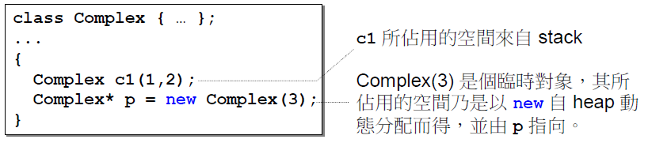

1. stack object的生命周期:
```C
class Complex { ... };
// ...
    
{
Complex c1(1,2);
}
```
程序中c1就是stack object,其生命周期在作用域(大括号)结束之际结束.这种作用域内的对象又称为auto object,因为它会被自动清理.

2. static object的生命周期
```C
class Complex { … };
// ...
​
{
static Complex c2(1,2);
}
```
程序中c2就是static object,其生命周期在作用域(大括号)结束之后仍然存在,直到整个程序结束.

3. global object的生命周期

```C
class Complex { … };
// ...
​
Complex c3(1,2);
​
int main()
{
...
}
```
程序中c3就是global object,其生命在在整个程序结束之后才结束,也可以将其视为一种static object,其作用域是整个程序.

4. heap object的生命周期
```C
class Complex { … };
// ...
​
{
Complex* p = new Complex;
// ...
delete p;
}
```
程序中p指向的对象就是heap object,其生命周期在它被deleted之际结束.若推出作用域时忘记delete指针p则会发生内存泄漏,即p所指向的heap object 仍然存在,但指针p的生命周期却结束了,作用域之外再也无法操作p指向的heap object.

### new和delete过程中的内存分配

- new操作**先分配内存**, **再调用构造函数**.

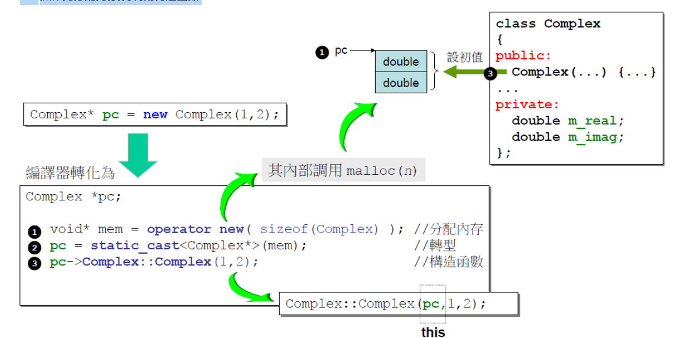

- delete操作**先调用析构函数**, **再释放内存**
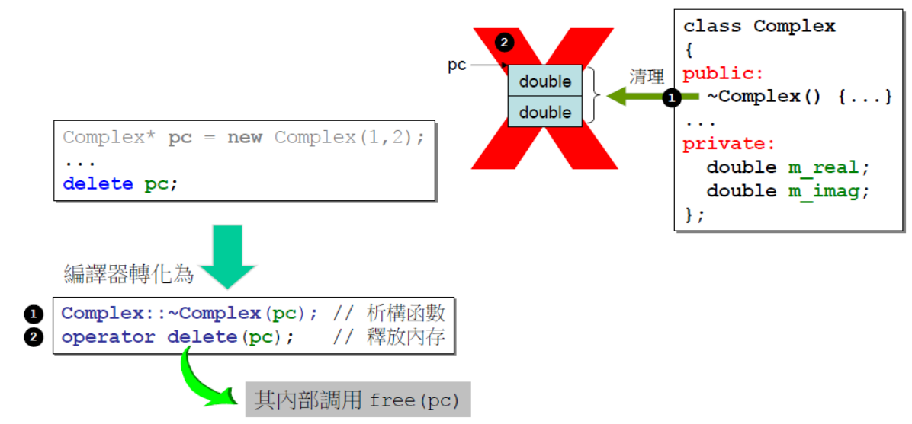


( )VC中对象在debug模式和release模式下的内存分布如下图所示：
变量在内存中所占字节数必须被补齐为16的倍数（深绿）
浅绿（前8后1（x4 bit），必要的浪费）
红色代表cookie保存内存块的大小,其最低位的1和0分别表示内存是否被回收.

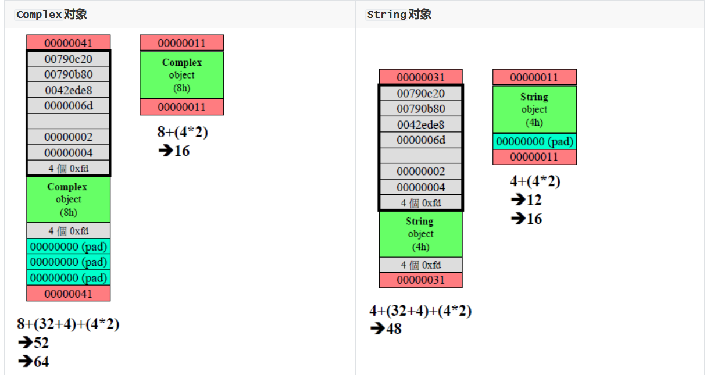

如果是数组：数组中的元素是连续的,数组头部4个字节记录了数组长度（所以比之前后面多了个+4）:
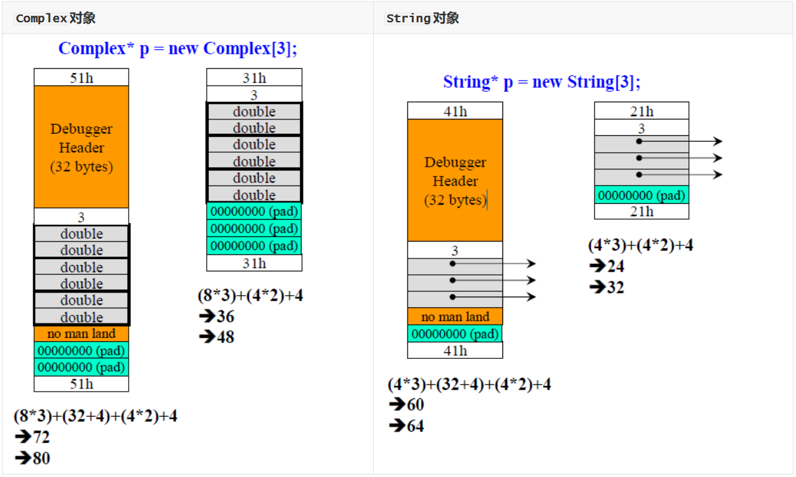

\
根据数组在内存中的状态,自然可以理解为什么new[]和delete[]应该配对使用了: **delete操作符仅会调用一次析构函数,而delete[]操作符依次对每个元素调用析构函数**.对于String这样带有指针的类,若将delete[]误用为delete会引起内存泄漏.


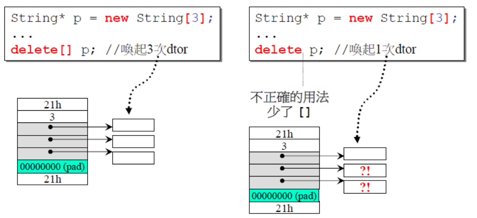

## 一些补充
### static成员与this point
普通数据：每个对象均存在一份，可以用this point指定。
静态数据：加了static的数据就跟对象脱离了，只有一份
静态函数：静态函数没有this point,只能处理静态数据non—static 函数不需要 this 指针即可调用.
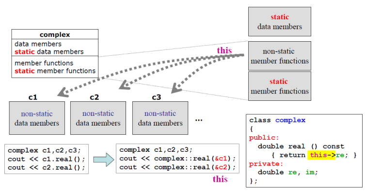

static成员函数可以通过对象调用,也可以通过类名调用.
```C++
class Account {
public:
    static double m_rate;
    static void set_rate(const double& x) { m_rate = x; }
};
double Account::m_rate = 8.0;
​
int main() {
    Account::set_rate(5.0);//通过类名调用
    Account a;
    a.set_rate(7.0);//通过对象名调用
}
```
### cout补充
- 为什么cout可以输出各式各样的数据类型？
从源码来看，cout继承自ostream，内含对各种类型的<<操作符重载

### 类模板
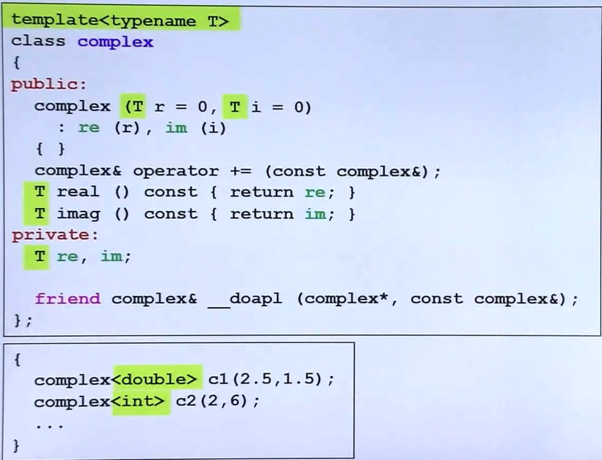

### 函数模板
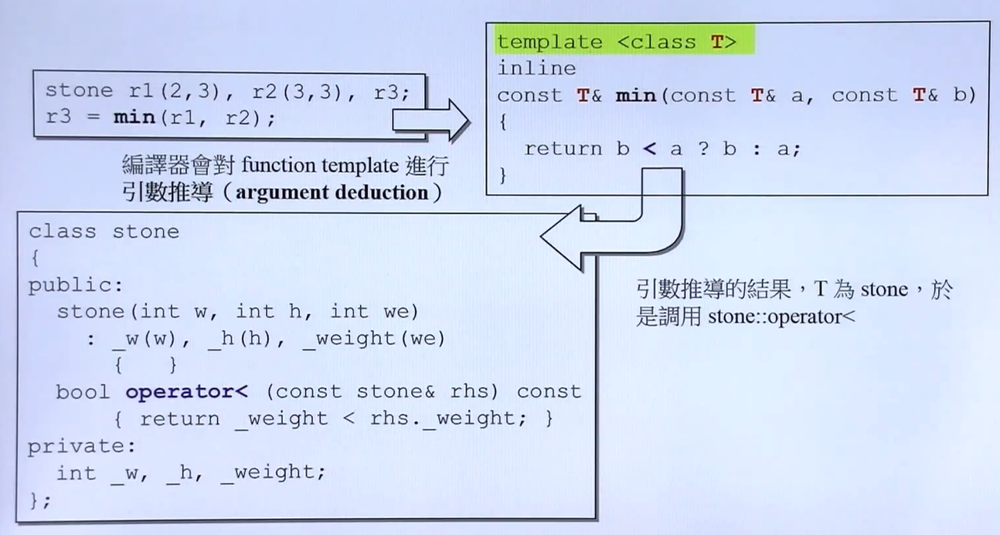

- 尖括号中的class跟之前的typename是作用一样的，相通的
- 函数模板不必像类模板一样每次使用都带尖括号，只需要r3 = min(r1,r2),编译器会自动匹配后面的参数类型


### namespace
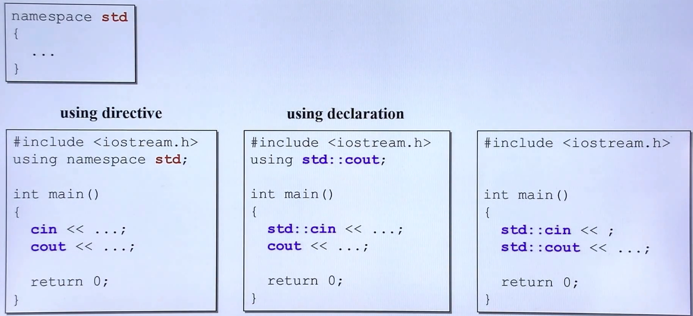

## 面向对象（OOP和OOD）

类之间的关系有复合(composition)、委托(aggregation)和继承(extension)3种.

### 复合(composition)
复合表示一种has-a的关系,STL中queue的实现就使用了复合关系.这种结构也被称为**adapter模式**（queue的功能都能通过deque实现）.
如果有外部就有内部，一起出现
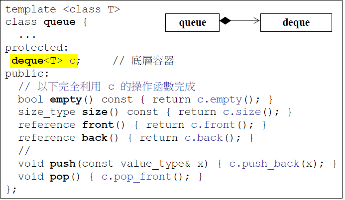

复合关系下构造由内而外,析构由外而内:
- 构造先调用component的再自己
- 析构先自己再component
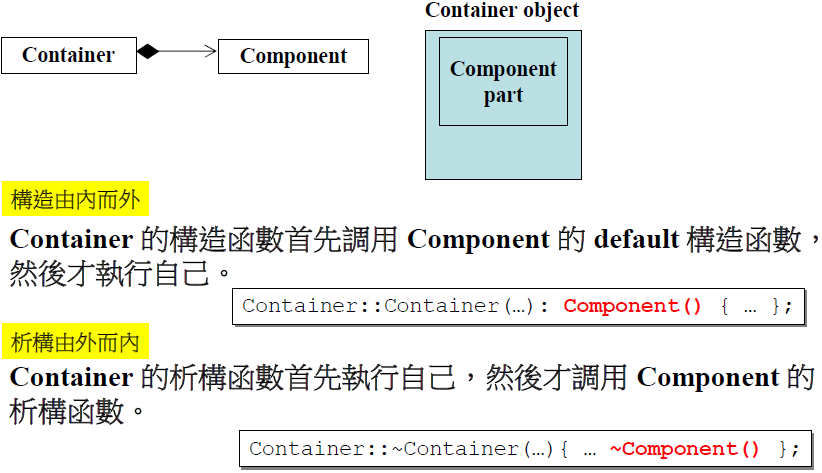

### 委托(aggregation;composition by reference)
有指针指向
先创建左边，需要被指向对象的时候右边才被创建
左边只是对外的接口，具体实现都是通过右边的设计来实现
该例子实现了reference counting共享
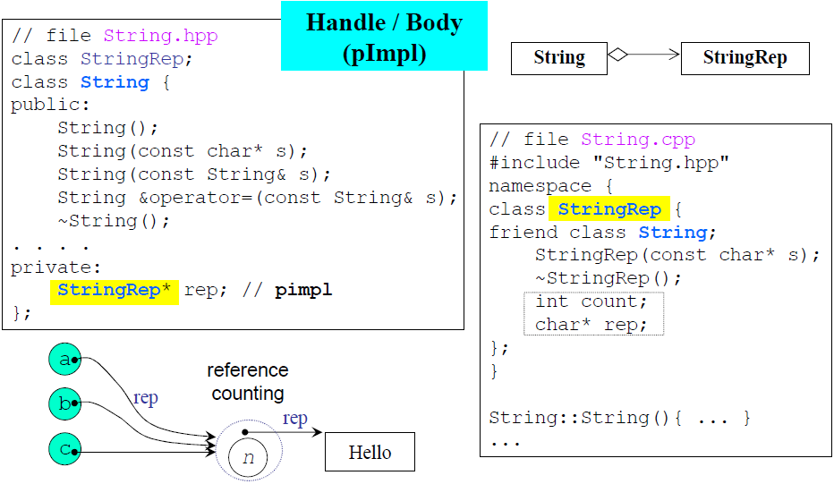

委托将类的定义与类的实现分隔开来,也被称为编译防火墙.


### 继承(extension)，表示is-a
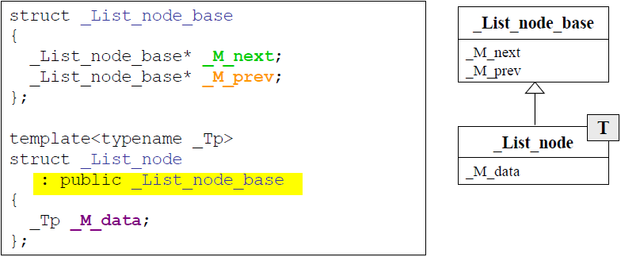
继承的构造和析构和复合一样：
- 构造由内而外（先父类再自己）,
- 析构由外而内（先自己再父类）
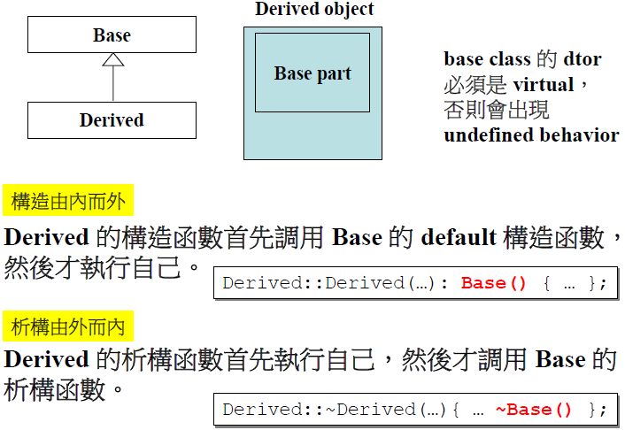

### 虚函数
成员函数有3种:非虚函数、虚函数和纯虚函数:

非虚(non-virtual)函數: 不希望子类重新定义(override)的函数.
虚(virtual)函數: 子类可以重新定义(override)的函数,且有默认定义.
纯虚(pure virtual)函數: 子类必须重新定义(override)的函数,没有默认定义.

使用虚函数实现框架: 框架的作者想要实现一般的文件处理类,由框架的使用者定义具体的文件处理过程,则可以用虚函数来实现.

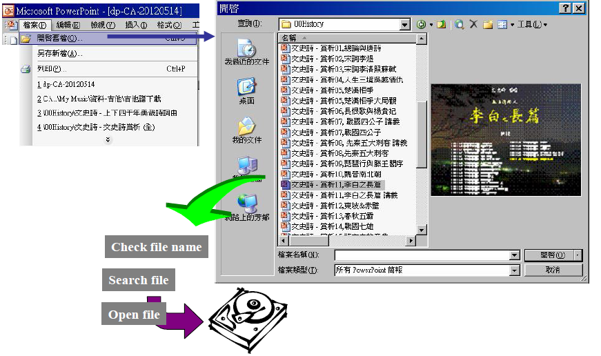

将框架中父类CDocument的Serialize()函数设为虚函数,由框架使用者编写的子类CMyDoc定义具体的文件处理过程,流程示意图和代码如下:
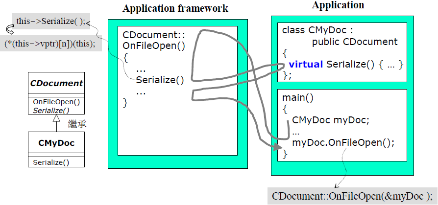
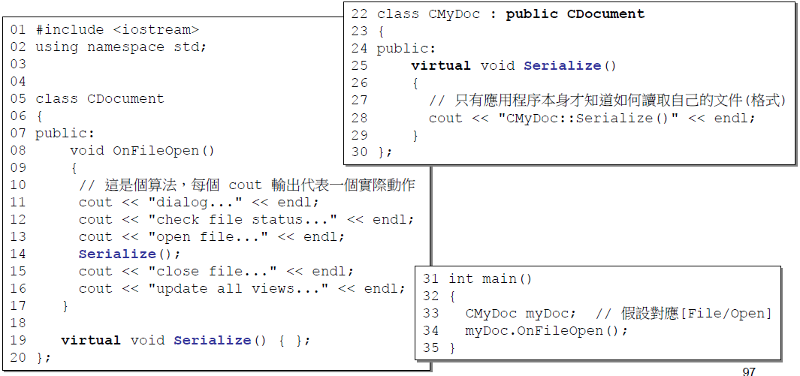

### 继承+复合的构造析构分析
1）先构造父类（如果父类还有父类，则先构造父类的父类）
2）在构造成员变量（构造组合类中的）
3）最后调用自己的构造方法
4）先析构自己
5）再析构成员变量（构造组合类中的）
6）后析构父类
例子：
输出：ABC
```C++
#include <iostream>
using namespace std;
class TestClass1
{
public:
	TestClass1()
	{
		cout << "A";
	}
};
class TestClass2
{
public:
	TestClass2()
	{
		cout << "B";
	}
};
class TestClass3:public TestClass1
{
	TestClass2 b;
public:
	TestClass3()
	{
		cout << "C";
	}
};
void main()
{
	TestClass3 obj;
}
```


### 委托＋继承的使用

例：一份数据，多种view来观察这份数据
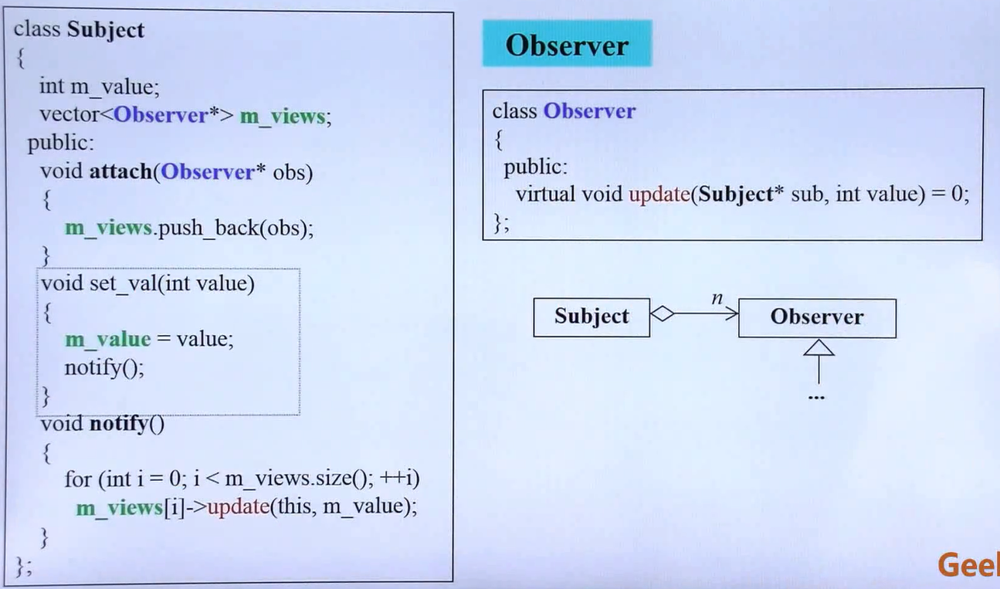

## 面向对象设计范例
### 使用委托+继承实现Observer模式
使用Observer模式实现多个窗口订阅同一份内容并保持实时更新
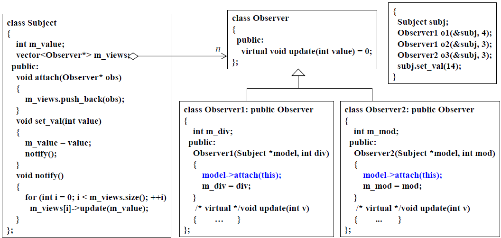

### 使用委托+继承实现Composite模式
实现多态
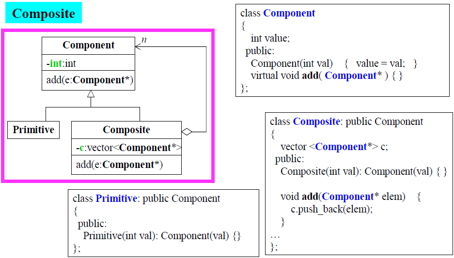

### 使用委托+继承实现Prototype模式
框架为未来考虑，未来创建的子类要向父类登记
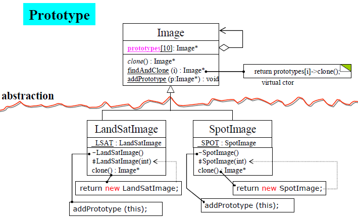