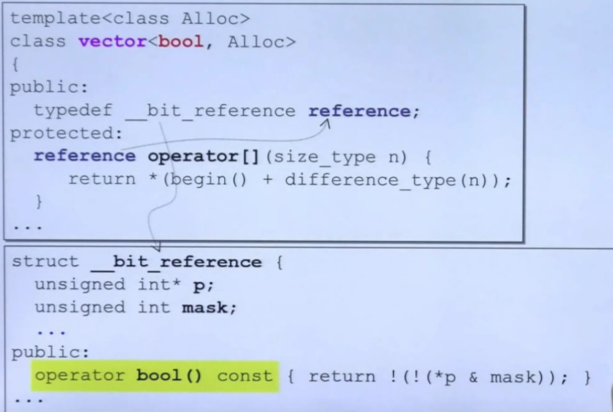
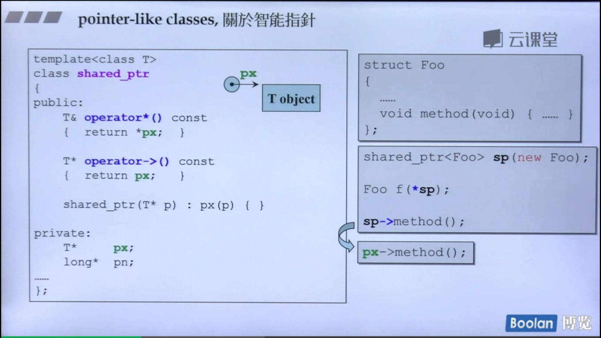
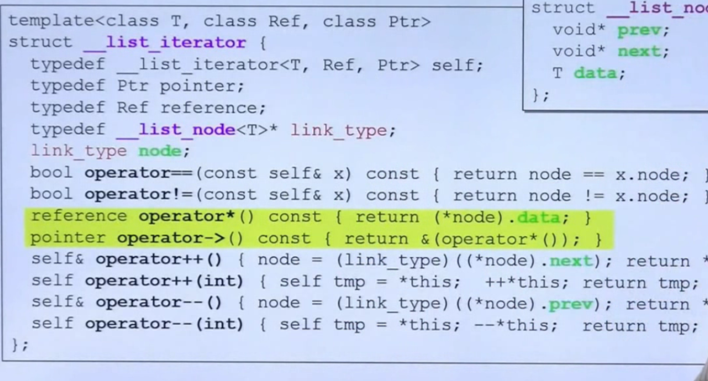

## 转换函数相关
### 转换函数(conversion function)
> 可以把"这种"东西，转化为"别种"东西。

**例：fraction(分数)类转为double**
```C++
class Fraction {
public:
	Fraction(int num, int den = 1) :
		m_numerator(num), m_denominator(den) {
	}
	operator double()const {
		return ((double)m_numerator / m_denominator);
	}
private:
	int m_numerator;  //分子
	int m_denominator;//分母
};
```
**调用：**
```C++
Fraction f(3,5);
double d = 4 + f;
```
> **对转换函数定义的说明：**
> - 形式特殊: operator double()const{}
> - 无返回值，想要转为什么类型，就写operator type
> - 无参数
> - 因为转换，不改变值，最好定义为const函数

> **对调用过程具体实现的说明：**
> - 对于double d = 4 + f;编译器先去查找是否有函数让这行代码通过
> - 是否重载了+匹配
> - 如果没有，是否可以将f转换为double。找到了operator double()const
> - f变成了0.6

### non-explicit-one-argument ctor
> non-explicit 不带explicit关键字
> explicit关键字，写在构造函数最前面，代表这个函数只有在构造类对象的时候调用，不要在别的时候乱调用
> one-argument 至少一个实参就可以
> 这种构造函数可以把"别种"东西，**自动的**转化为"这种"东西

**例：double转为fraction(分数)类**
```C++
class Fraction
{
public:
	Fraction(int num,int den = 1):
    	m_numerator(num),m_denominator(den){}
    
    Fraction operator+(const Fraction& f){
        return Fraction(...);
    }
private:
	int m_numerator;  
	int m_denominator;
};

```
**调用：**
```C++
Fraction f(3,5);
double d = 4 + f;

```

> **说明:**
> 在Fraction类中我们重载了+运算符，可以使两个Fraction对象进行相加。
> 但是调用的时候使用的是一个整数与一个Fraction对象进行相加。
> 此时调用的形式与设计不同，于是编译器去看看能不能将4转换为Fraction，如果可以转换，则符合了+重载。
> 于是自动调用构造函数Fraction(int num,int den = 1)，将4转换为Fraction，进行加法。

### 转换冲突

将两种方法整合
```C++
class Fraction
{
public:
	Fraction(int num,int den = 1):
    	m_numerator(num),m_denominator(den){}
    
    operator double()const {
		return ((double)m_numerator / m_denominator);
	}
    
    Fraction operator+(const Fraction& f){
        return Fraction(...);
    }
private:
	int m_numerator;  
	int m_denominator;
};

```

> 报错：二义性 ———— 4——>Fraction，还是Fraction——>4。产生歧义

### explicit-one-argument ctor

> 给构造函数添加explict关键字，此时"别种"东西无法转换为"这种"东西即Fraction对象。
> 不让编译器去暗度陈仓地偷偷调用构造函数。
> 只有真正需要构造的时候采取调用。

**设计时应避免冲突**
```C++
class Fraction
{
public:
	explicit Fraction(int num,int den = 1):
    	m_numerator(num),m_denominator(den){}
    
    operator double()const {
		return ((double)m_numerator / m_denominator);
	}
    
    Fraction operator+(const Fraction& f){
        return Fraction(...);
    }
private:
	int m_numerator;  
	int m_denominator;
};

```

### 在标准库中的使用

拓展知识：这是一种委托模式



## 类指针类(pointer-like classes)
### 智能指针
这个class创建的对象像指针。因为想要它比普通指针多做一些事情。即智能指针。

> **注意:"->"这个符号很特别**
> 例如说，上图右侧中的* sp中的，* 号,在使用后就会消失。
> 但是sp->method(),我们可以看到，调用sp->在右侧的类中，返回px,再往下看px->method(),会发现，这里其实少了一个->，这里就体现出这个符号的特殊性了，得到的东西会继续用箭头符号作用上去。


### 迭代器
> 在运算符上比智能指针需要重载更多运算符，处理更多功能。
> **有特别功能的智能指针。**
> 主要用于遍历容器。

例：list

