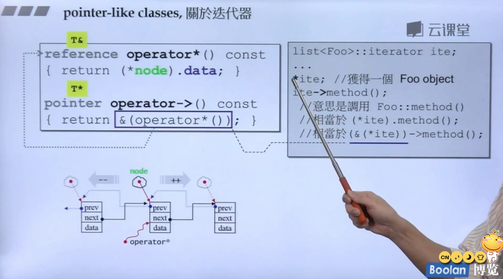

## 转换函数相关
### 转换函数(conversion function)
> 可以把"这种"东西，转化为"别种"东西。

**例：fraction(分数)类转为double**
```C++
class Fraction {
public:
	Fraction(int num, int den = 1) :
		m_numerator(num), m_denominator(den) {
	}
	operator double()const {
		return ((double)m_numerator / m_denominator);
	}
private:
	int m_numerator;  //分子
	int m_denominator;//分母
};
```
**调用：**
```C++
Fraction f(3,5);
double d = 4 + f;
```
> **对转换函数定义的说明：**
> - **形式特殊: operator double()const{}**
> - 无返回值，想要转为什么类型，就写operator type
> - 无参数
> - 因为转换，不改变值，最好定义为const函数

> **对调用过程具体实现的说明：**
> - 对于double d = 4 + f;编译器先去查找是否有函数让这行代码通过
> - 是否重载了+匹配
> - 如果没有，是否可以将f转换为double。找到了operator double()const
> - f变成了0.6

### non-explicit-one-argument ctor
> non-explicit 不带explicit关键字
> explicit关键字，写在构造函数最前面，代表这个函数只有在构造类对象的时候调用，不会隐式类型转换
> one-argument 至少一个实参就可以
> 这种构造函数可以把"别种"东西，**自动的**转化为"这种"东西

**例：double转为fraction(分数)类**
```C++
class Fraction
{
public:
	Fraction(int num,int den = 1):
    	m_numerator(num),m_denominator(den){}
    
    Fraction operator+(const Fraction& f){
        return Fraction(...);
    }
private:
	int m_numerator;  
	int m_denominator;
};

```
**调用：**
```C++
Fraction f(3,5);
double d = 4 + f;

```

> **说明:**
> 在Fraction类中我们重载了+运算符，可以使两个Fraction对象进行相加。
> 但是调用的时候使用的是一个整数与一个Fraction对象进行相加。
> 此时调用的形式与设计不同，于是编译器去看看能不能将4转换为Fraction，如果可以转换，则符合了+重载。
> 于是自动调用构造函数Fraction(int num,int den = 1)，将4转换为Fraction，进行加法。

### 转换冲突

将两种方法整合
```C++
class Fraction
{
public:
	Fraction(int num,int den = 1):
    	m_numerator(num),m_denominator(den){}
    
    operator double()const {
		return ((double)m_numerator / m_denominator);
	}
    
    Fraction operator+(const Fraction& f){
        return Fraction(...);
    }
private:
	int m_numerator;  
	int m_denominator;
};

```

> 调用时报错：二义性 ———— 4——>Fraction，还是Fraction——>4。产生歧义

### explicit-one-argument ctor

> 给构造函数添加**explict关键字**，此时"别种"东西无法转换为"这种"东西即Fraction对象。
> 不让编译器去暗度陈仓地偷偷调用构造函数。
> 只有真正需要构造的时候采取调用。

**设计时应避免冲突**
```C++
class Fraction
{
public:
	explicit Fraction(int num,int den = 1):
    	m_numerator(num),m_denominator(den){}
    
    operator double()const {
		return ((double)m_numerator / m_denominator);
	}
    
    Fraction operator+(const Fraction& f){
        return Fraction(...);
    }
private:
	int m_numerator;  
	int m_denominator;
};

```

### 在标准库中的使用

拓展知识：这是一种委托模式


## 一个class可能做出来后像两种东西
### 类指针类(pointer-like classes)
想让这个指针再多做一些事情
#### 智能指针
这个class创建的对象像指针。因为想要它比普通指针多做一些事情。即智能指针。
- *和->的写法几乎是固定的
- 用法：
写了一个class Foo，把这种天然的指针(new 出来的)包装到聪明的指针里去。(智能指针都会有一个构造函数，接受这种天然指针)就可以把new之后的指针做初值，执行构造函数。发生图如下：


> **注意:"->"这个符号很特别**
> 例如说，上图右侧中的* sp中的，* 号,在使用后就会消失。
> 但是sp->method(),我们可以看到，调用sp->在右侧的类中，返回px,再往下看px->method(),会发现，这里其实少了一个->，这里就体现出这个符号的特殊性了，得到的东西会继续用箭头符号作用上去。


#### 迭代器
> 在运算符上比智能指针需要**重载更多运算符**(也是目前的关注点)，处理更多功能。
> **有特别功能的智能指针。**
> 主要用于遍历容器。

例：list




### 仿函数(function-like classes)

> 设计一个类，让它的行为像函数。
> 小括号操作符，就叫做函数调用操作符。
> 所以如果有一个东西可以接受小括号操作符，就把这个东西称作函数，或者是一个像函数的东西。


- T operator ()(形参){……}；
- 继承见stl

## namespace
- 分块开发，避免命名冲突。
  - 主函数每一个测试包在一个namespace里面
  - 使得各个测试程序彼此不冲突

## 模板

### 类模板：见上篇复数类
> 定义类的时候将允许使用者任意指定的类型抽出来。
> 使用时需要进行类型的指定。

### 函数模板
> 使用不需要指定类型。编译器会自动进行实参推导。


### 成员模板

- 也就是模板的嵌套，模板中有模板。


> 说明: 黄色这一块是当前模板的一个成员，同时它自己也是个模板。所以它就叫做成员模板。
> T1,T2可以变化，U1,U2也可以变化。


> 鲫鱼类继承自鱼类，麻雀类继承自鸟类。
> 使用鲫鱼和麻雀构成的pair，然后拷贝到到鱼类和鸟类构成的pair，这样是可以的。反之则不行。
> 允许或不允许限制的条件为: 下方代码中的构造函数。(父类指针可以指向子类对象)
> 这样，让构造函数更有弹性 。

- 智能指针内的使用


> 同普通指针的，父类指针可以指向子类对象。
> 把子类的对象当做父类对象看待，就称为”向上造型“  (upcast)。
> 向上造型是安全的，向下造型是有风险的。

### 模板特化

> 泛化的反面就是特化
> 泛化(又叫全泛化)指的是用的时候指定类型。
> 根据特定的类型进行特殊处理，类似于函数重载。


#### 偏特化

1. 个数的偏
- 从左边开始绑定，不能跳。


2. 范围上的偏
例如，从接收任意范围T，到接收指针T*


### 模板模板参数

模板的参数本身是一个模板

如上图所示，传递任意的容器与元素类型进行组合
其中第一个打岔的部分，光看语法上并没有问题，但是，实际上在我们定义容器的时候有多个默认参数，这样做是无法通过编译的。
但是第二个OK


下图不是模板模板参数：


- 调用中我们使用第二种方法，指明第二模板参数，其实这个list< int >就已经不是模板了，已经指明了,即使它是用模板设计出来的东西。
- 但是已经绑定，写死，list中的元素类型为int;
- 注意与本小节第一张图对比。
- 所以temp<class T,class Sequence = deque< T >>第二个参数，不是模板模板参数。


