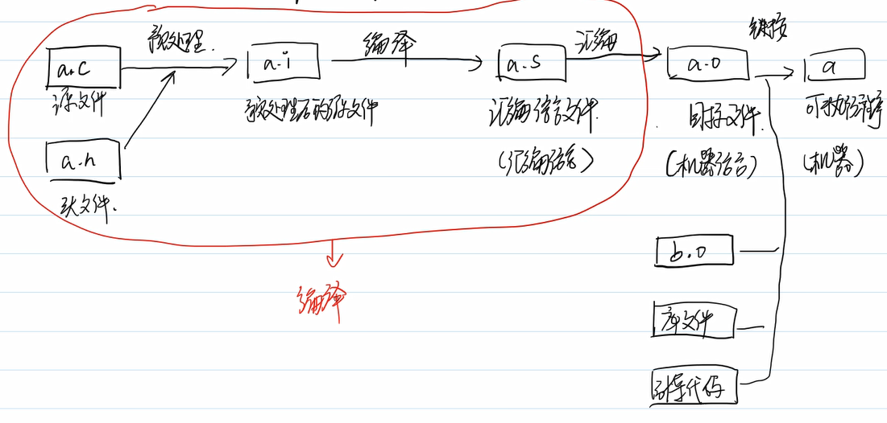
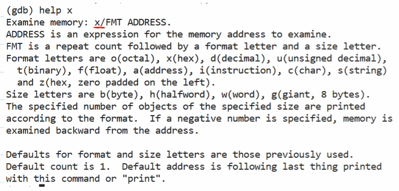

## 编译工具链
(难度高但不是特别重要)

### 1.预处理
1. #inclulde 文件包含
2. 宏定义（尽量用const、enum替换）
3. 宏函数（尽量用inline函数替换）

**linux下指令**：gcc -E hello.c -o hello.i
> -E 预处理指令
> -o 生成文件名

- 宏开关：
   1. #if #else #endif

   2. #ifdef N    #else   #endif
   
   3. #ifndef N   #else   #endif    (.h文件用的多，防卫式声明：如果没有包含该头文件，xxx【详见侯捷上笔记】)

### 2.编译

C语言a.i-->汇编代码a.s

**linux下指令**:
    gcc -S hello.i -o hello.s(可以从预处理后文件再编译)
    gcc -S hello.c -o hello.s(可以一步到位)

- x86架构 8086 数据总线16位  地址总线20位
- 一个字长：word 16位
- l：long word 32 bits
- q:quadra 64 bits

展开48字节的栈帧：
类型信息和变量名都在变异过程中被抹除掉：变为内存位置和字节长度
func调用，因为可能在不同文件里，这样就不知道内存位置。先假装已经调用了，等到链接过程再真正调用

编译过程总结：
1. push、pop、call、ret等命令、q l 指代
2. 所有的变量、数组元素、*p ——————> 地址+长度
3. 循环 for、while其本质和goto是一样的
4. 函数调用 栈帧独立、传递参数值传递
### 3. 汇编
将汇编语言-->二进制机器语言

**linux下指令1**：(as命令)as hello.s -o hello.o
- nm命令 将目标文件所有的符号列出
- 
  - U指现在还找不到具体地址

**※linux下指令2**：gcc -c hello.c -o hello.o
- 一步到位！

> objdump -d 反编译

### 4. 链接

把调用函数的名字-->地址
> **linux下指令1**：ld 直接调用 难度高 不推荐

**※linux下指令2**：gcc 间接调用：gcc hello.o -o hello
   函数/全局变量：定义0次/多次-->链接错误
   缺少main函数-->链接错误

### 4补充：库文件
轮子 共用的工具 特殊的.o文件，他人写好公开发行的

1. 静态库： 轮子打包到产品中
2. 动态库： 运行中加入到产品中

#### 生成静态库

#### 生成动态库

可以显示连接过程：

**软连接（符号链接）：实现动态库的更新和回滚**

更新过程

**linux下指令**：./hello

### gcc其他指令

- -D 等价于#define
  - gcc -c test.c -D DEBUG //相当于#define DEBUG

- -I 增加头文件搜索路径
   - gcc src/test.c -I include/
- -O 编译优化：编译器修改指令顺序和内存位置等； 可能对调试产生影响； 可能有bug
数字越大--优化的越深 c和汇编的对应就乱了
   - -O0 不优化
   - -O1 产品
   - -O2 开源软件
   - -O3 

编译警告：不允许出现警告
-Wall

## gdb
GNU Debugger

要求：**编译时加上如下两个命令**
- 不开优化 -O0
- 补充调试信息(保存变量名信息) -g

### 进入gdb调试

- gdb+可执行程序名
   - gdb test

### gdb的命令

- list/l    [文件名：][行号] | [函数名]     看文件内容 
- run/r           运行程序
- break/b   [文件名：][行号] | [函数名]      打断点   打完断点后再r就会运行到断点处停
- c/continue   继续运行
- step/s    vs里的F11
- next/n    vs里的F10
- finish    跳出本次函数调用
- info break / i b      
- delete    [num]    删除编号为num的断点(不加参数删除所有断点，记得再输一个y)
- ignore    [num] [count] 无视num断点count次

### 在gdb中查看监视

1. print/p  [表达式]    //不适合持续的观察
2. display  [表达式]    //持续监视
   1. 删除：先info display查看编号； 再undisplay删除

### 在gdb中查看内存：x

MIT： 数字(看几个单位)+字母(格式)+字母(每单位多大)

例：

### 检查崩溃的程序

出现错误：

调整core(ulimit只能影响一个终端):
   修改第一行为：core file size          (blocks, -c) unlimited
   指令如下：

若为生成，需要调整：

查看错误原因：

- 栈溢出导致的崩溃

### gdb加命令行参数

