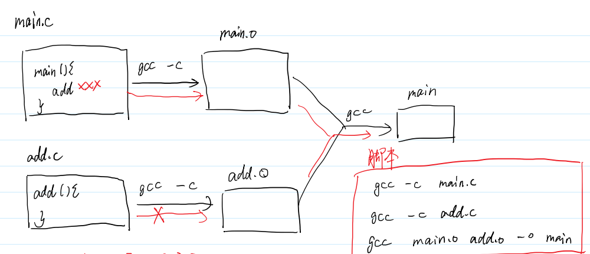
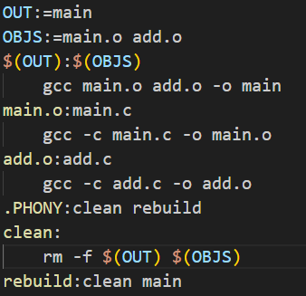
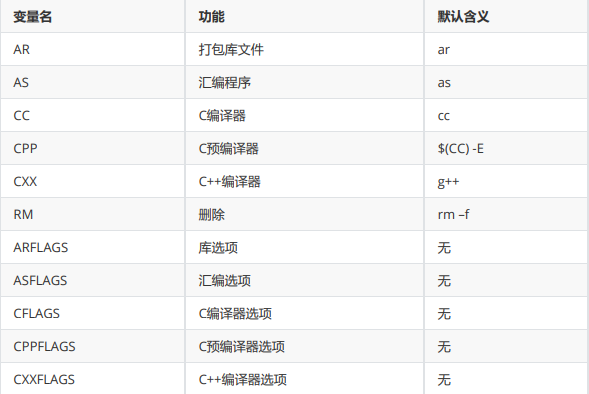
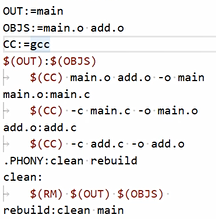

## 增量编译
1. 正常编译需要许多gcc命令，设计脚本自动执行三行



- 问题：如果只修改一项，还是全部编译，浪费算力
- 解决：makefile：**增量编译**生成代码
    - 一种"目标-依赖"，只有目标不存在或者目标比依赖旧才会执行命令

## makefile实现

脚本、文件命有要求

1. 名字必须是makefile或Makefile
2. 规则的集合
   1. **目标文件(1个)：依赖文件(0-多个)**
   2. **<_tab_>命令(0-多个)**
3. **把最终要生成的文件作为第一个规则的目标**
```makefile
main:main.o add.o
	gcc main.o add.o -o main
main.o:main.c
	gcc -c main.c -o main.o
add.o:add.c
	gcc -c add.c -o add.o
```
make main.o //以main.o做为生成文件终点

## 伪目标
1. 目标不存在
2. 执行命令生成不了目标
 
- **意义：执行每次make都一定执行的指令**

作用：
- 清理二进制文件
```
  clean:
	rm -f main.o add.o main
```
- 全量编译
rebuild:clean main


- 先写下面这行告诉有哪些伪目标
.PHONY:clean rebuild


## 变量

1. 自定义变量：  变量名:=值  //所有值都是**字符串类型**
    引用变量：$(变量名)


2. 预定义变量：



3. 自动变量：同一变量名根据规则变化而变化


```makefile
OUT:=main
OBJS:=main.o add.o
CC:=gcc
$(OUT):$(OBJS)
	$(CC) $^ -o $@
main.o:main.c
	$(CC) -c $^ -o $@
add.o:add.c
	$(CC) -c $^ -o $@
.PHONY:clean rebuild
clean:
	$(RM) $(OUT) $(OBJS)
rebuild:clean main
```

## 用%字符管理格式关系
换文件需要换三行：OBJS……；main.o……；add.o……
**使用百分号格式匹配：按格式从第一个规则的依赖中去匹配**

```makefile
OUT:=main
OBJS:=main.o add.o
CC:=gcc
$(OUT):$(OBJS)
	$(CC) $^ -o $@
%.o:%.c
	$(CC) -c $^ -o $@
.PHONY:clean rebuild
clean:
	$(RM) $(OUT) $(OBJS)
rebuild:clean main
```
**迁移后只需要修改OBJS这一行**


## 内置函数

**wildcard    通配符**：从当前目录所有文件中，取出符合要求的文件名

**patsubst    模式匹配**: (a,b,c)把a换为b，在c中挑

**最终形成的Makefile：**
```makefile
OUT:=main
SRCS:=$(wildcard *.c)
#OBJS:=main.o add.o sub.o
OBJS:=$(patsubst %.c,%.o,$(SRCS))
CC:=gcc
$(OUT):$(OBJS)
	$(CC) $^ -o $@
%.o:%.c
	$(CC) -c $^ -o $@
.PHONY:clean rebuild
clean:
	$(RM) $(OUT) $(OBJS)
rebuild:clean main
```

## 单独编译链接
多个.c分别生成自己的可执行程序
```makefile
SRCS:=$(wildcard *.c)
EXE:=$(patsubst %.c,%,$(SRCS))
CC:=gcc
all:$(EXE)
%:%.c
	$(CC) $^ -o $@
clean:
	$(RM) $(EXE)
rebuild:clean all
```


```makefile
SRCS:=$(wildcard src/*.c)
OBJS:=$(patsubst src/%.c,objs/%.o,$(SRCS))
HEADER:=header
EXE:=main
CC:=gcc
$(EXE):$(OBJS)
	$(CC) $^ -o $@
objs/%.o:src/%.c
	$(CC) -c $^ -o $@ -I $(HEADER)
clean:
	$(RM) $(EXE)
rebuild:clean $(EXE)

```