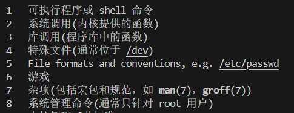
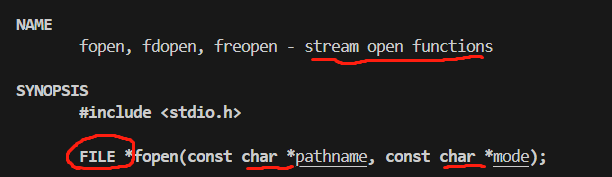

## linux系统编程

写应用，需要调用操作系统帮忙

1. shell
2. 库函数(printf)：跨平台       //  ISOC规范
3. system calls 系统调用：直接使用操作系统内核功能   //POSIX规范


## 怎样学习系统编程
man 手册

- 安装库函数手册
sudo apt install manpages-posix-dev 

- man手册内容
  - 名字-声明-细节-返回值
- 阅读顺序
  - 1. 先阅读名字
  - 2. 看声明和返回值
    - 头文件
    - 指针类型的参数--**主调函数分配内存**
  （看有没有const）
    - 指针类型返回值--**主调函数是否要释放内存**
    
    void *malloc(size_t size);
    - 返回值不实现功能，只处理报错
  - 3. 细节：按需查看

## 文件

- 狭义：存储在外部存储介质上的数据集合
- 广义：慢、容量大、持久存储  ——— 万物皆文件

### 文件类型

普通文件 、目标文件、软连接
字符设备文件  (鼠标)  以字符为单位
块设备文件  (磁盘)     以块为单位
管道文件  (让两个文件之间彼此通信)
sorket文件(网络通信)

### 文件使用


## fopen

库函数


- FILE: 文件流/**用户态**文件缓冲区
- 参数1：字符串：路径
- 参数2：r只读打开，r+读写打开，w只写创建，w+读写创建

### 写代码前的准备工作
- 43func.h

- 调用


### 追加模式
"a" ：即append 只写追加————默认从文件结尾写入
"a+"           读写追加————打开时处于文件的开始,写入时(不管此时ptr处于什么位置)跳到文件的末尾

日志系统使用

文件流


### 验证过程：

```C++
#include <43func.h>
int main(int argc, char *argv[])
{
    // 运行时执行./fopen file1
    ARGS_CHECK(argc, 2);//参数个数检查
    //FILE *fp=fopen(argv[1],"r");

    // FILE *fp=fopen(argv[1],"a");//追加模式
    // ERROR_CHECK(fp,NULL,"fopen");//fopen使用时不成功（没有该文件）检查
    // fwrite("howareyou",1,9,fp);//写入

    FILE *fp=fopen(argv[1],"a+");//
    ERROR_CHECK(fp,NULL,"fopen");//fopen使用时不成功（没有该文件）检查
    char buf[10]={0};
    fread(buf,1,9,fp);//a+可读
    puts(buf);
    printf("before fseek, loc = %ld\n",ftell(fp));
    fseek(fp,0,SEEK_SET);
    printf("after fseek, loc = %ld\n",ftell(fp));
    fwrite("howareyou",1,9,fp);//写入
    fclose(fp);
}
```

## 改变文件属性

1. 用函数实现改变文件权限chmod    //man 2 chmod
2. 获取当前目录getcwd
man手册：
       #include <unistd.h>

       char *getcwd(char *buf, size_t size);
/*
1、 buf不为空，返回buf
*/

设计：