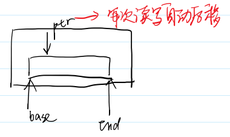
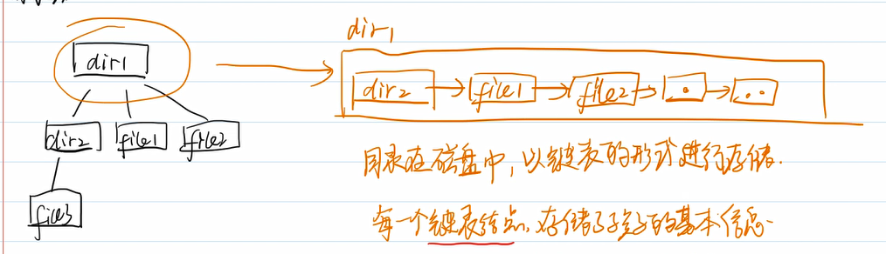
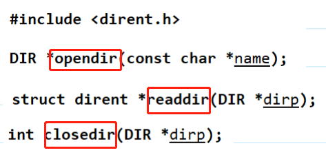
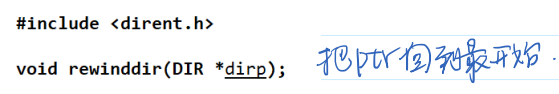
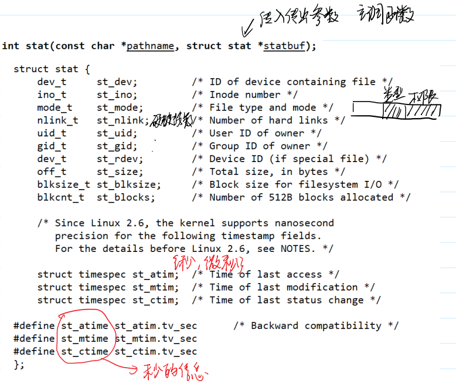

## linux系统编程

写应用，需要调用操作系统帮忙

1. shell
2. 库函数(printf)：跨平台       //  ISOC规范
3. system calls 系统调用：直接使用操作系统内核功能   //POSIX规范


## 怎样学习系统编程
man 手册

- 安装库函数手册
sudo apt install manpages-posix-dev 

- man手册内容
  - 名字-声明-细节-返回值
- 阅读顺序
  - 1. 先阅读名字
  - 2. 看声明和返回值
    - 头文件
    - 指针类型的参数--**主调函数分配内存**
  （看有没有const）
    - 指针类型返回值--**主调函数是否要释放内存**
    
    void *malloc(size_t size);
    - 返回值不实现功能，只处理报错
  - 3. 细节：按需查看


## 文件

- 狭义：存储在外部存储介质上的数据集合
- 广义：慢、容量大、持久存储  ——— 万物皆文件

### 文件类型

普通文件 、目标文件、软连接
字符设备文件  (鼠标)  以字符为单位
块设备文件  (磁盘)     以块为单位
管道文件  (让两个文件之间彼此通信)
sorket文件(网络通信)

### 文件使用


## 通过man学习相关接口
### fopen

库函数


- FILE: 文件流/**用户态**文件缓冲区
- 参数1：字符串：路径
- 参数2：r只读打开，r+读写打开，w只写创建，w+读写创建

#### 写代码前的准备工作
- 43func.h

- 调用


#### 追加模式
"a" ：即append 只写追加————默认从文件结尾写入
"a+"           读写追加————打开时处于文件的开始,写入时(不管此时ptr处于什么位置)跳到文件的末尾

日志系统使用

文件流


#### 验证过程：

```C++
#include <43func.h>
int main(int argc, char *argv[])
{
    // 运行时执行./fopen file1
    ARGS_CHECK(argc, 2);//参数个数检查
    //FILE *fp=fopen(argv[1],"r");

    // FILE *fp=fopen(argv[1],"a");//追加模式
    // ERROR_CHECK(fp,NULL,"fopen");//fopen使用时不成功（没有该文件）检查
    // fwrite("howareyou",1,9,fp);//写入

    FILE *fp=fopen(argv[1],"a+");//
    ERROR_CHECK(fp,NULL,"fopen");//fopen使用时不成功（没有该文件）检查
    char buf[10]={0};
    fread(buf,1,9,fp);//a+可读
    puts(buf);
    printf("before fseek, loc = %ld\n",ftell(fp));
    fseek(fp,0,SEEK_SET);
    printf("after fseek, loc = %ld\n",ftell(fp));
    fwrite("howareyou",1,9,fp);//写入
    fclose(fp);
}
```

### 改变文件属性相关接口

#### 1. 用函数实现改变文件权限chmod    //man 2 chmod
```c++
#include<43func.h>
int main(int argc,char *argv[]){
    // ./chmod 777 dir1
    //执行chmod 将dir1文件权限改为777
    ARGS_CHECK(argc,3);
    //chmod(argv[2],argv[1]);///报错，第二个参数应该是八进制无符号整形
    __mode_t mode;
    sscanf(argv[1],"%o",&mode);
    int ret = chmod(argv[2],mode);
    ERROR_CHECK(ret,-1,"chmod");
}
```
#### 2. 获取当前目录getcwd

**学习目的**：了解指针作为参数和作为返回值的技巧
- man手册：
```C++
       #include <unistd.h>

       char *getcwd(char *buf, size_t size);
       //buf 传入传出参数

```

- 设计：

```C++
/*
返回值情况
1、 buf不为空，返回buf
*/
#include<43func.h>
int main(){
    char buf[1024] = {0};
    char *ret = getcwd(buf,sizeof(buf));
    //传入首地址，及长度信息(数组传入时长度信息丢失)
    
    ERROR_CHECK(ret,NULL,"getcwd");//报错检测，目录的数组太短可能目录输出越界就会报错
    printf("ret = %p,ret = %s\n",ret,ret);
    printf("ret = %p,ret = %s\n",buf,buf);
}
//2、buf为空，返回一个堆空间的地址
#include<43func.h>
int main(){
    printf("cwd = %s\n",getcwd(NULL,0));
}

```

#### 3. 改变当前工作目录chdir
当前工作目录是一个进程的属性
- man手册
#include <unistd.h>
    int chdir(const char *path);


改成功了，但是**只影响了子进程**

#### 4. rmdir mkdir

- man 2 mkdir
 #include <sys/stat.h>
       #include <sys/types.h>

       int mkdir(const char *pathname, mode_t mode);
- man 2 rmdir


- 实现

1. mkdir

```C
#include<43func.h>
int main(int argc,char *argv[]){
    ARGS_CHECK(argc,2);
    int ret = mkdir(argv[1],0777);//需要8进制的777，所以写0777
    //所有创建文件的行为都会受到umask的影响
    ERROR_CHECK(ret,-1,"mkdir");

}
```

2. rmdir

**只能删除空目录**
```C
#include<43func.h>
int main(int argc,char *argv[]){
    ARGS_CHECK(argc,2);
    int ret = rmdir(argv[1]);
    ERROR_CHECK(ret,-1,"rmdir");

}
```


## 目录流
- 流
自动后移：用户可以不了解接口的情况下访问所有数据

例：C++迭代器

- 文件流回顾：见文件使用
- 目录流：

目录在磁盘中，以(带有ptr的)链表的形式进行存储
每一个**链表节点**(目录项，dirent:directory entry)，储存孩子的基本信息


- 目录流：是目录文件在内存中的缓冲区

每次除了取ptr所指地址，还会指针后移


### 目录流相关三个接口


### readdir


### 自己实现ls

```C
#include <43func.h>
int main(int argc, char *argv[]){
    // ./myLs dir
    ARGS_CHECK(argc,2);
    DIR *dirp = opendir(argv[1]);//打开父目录，返回目录流指针
    ERROR_CHECK(dirp,NULL,"opendir");
    struct dirent * pdirent;//创建目录项指针
    //当目录项指针不为空，遍历目录，输出目录项各个内容
    while((pdirent = readdir(dirp)) != NULL){        
      printf("inode = %ld, reclen = %d, type = %d, name = %s\n",
              pdirent->d_ino,pdirent->d_reclen, pdirent->d_type, pdirent->d_name);
    }
    closedir(dirp);//关闭文件
}
```

### 想要指针回退
> telldir: return current location in directory stream
> seekdir:set the position of the next readdir() call in the directory stream.


```C
#include <43func.h>
int main(int argc, char *argv[]){
    // ./myLs dir
    ARGS_CHECK(argc,2);
    DIR *dirp = opendir(argv[1]);
    ERROR_CHECK(dirp,NULL,"opendir");
    struct dirent * pdirent;
    long loc;
    while((pdirent = readdir(dirp)) != NULL){
        if(strcmp(pdirent->d_name,"file2") == 0){
            loc = telldir(dirp);//记录当前文件流ptr
        }
        printf("inode = %ld, reclen = %d, type = %d, name = %s\n",
            pdirent->d_ino,pdirent->d_reclen, pdirent->d_type, pdirent->d_name);
    }
    puts("----------------------------------------------------");
    seekdir(dirp,loc);//指针回退到记录位置的后一位，原因是tell的时候ptr会后移一位
    pdirent = readdir(dirp);
    printf("inode = %ld, reclen = %d, type = %d, name = %s\n",
        pdirent->d_ino,pdirent->d_reclen, pdirent->d_type, pdirent->d_name);
    closedir(dirp);
}
```

### rewinddir 解决只能回退到指针后一位的问题

```C
#include <43func.h>
int main(int argc, char *argv[]){
    // ./myLs dir
    ARGS_CHECK(argc,2);
    DIR *dirp = opendir(argv[1]);
    ERROR_CHECK(dirp,NULL,"opendir");
    struct dirent * pdirent;
    while((pdirent = readdir(dirp)) != NULL){
        printf("inode = %ld, reclen = %d, type = %d, name = %s\n",
            pdirent->d_ino,pdirent->d_reclen, pdirent->d_type, pdirent->d_name);
    }
    puts("----------------------------------------------------");
    rewinddir(dirp);
    pdirent = readdir(dirp);
    printf("inode = %ld, reclen = %d, type = %d, name = %s\n",
        pdirent->d_ino,pdirent->d_reclen, pdirent->d_type, pdirent->d_name);
    closedir(dirp);
}
```
### stat
1. 作为命令   stat 文件名 ————显示文件信息
2. stat函数————显示文件信息，具体实现：


- stat配合目录流实现la -al

