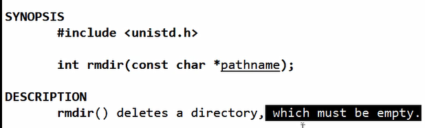
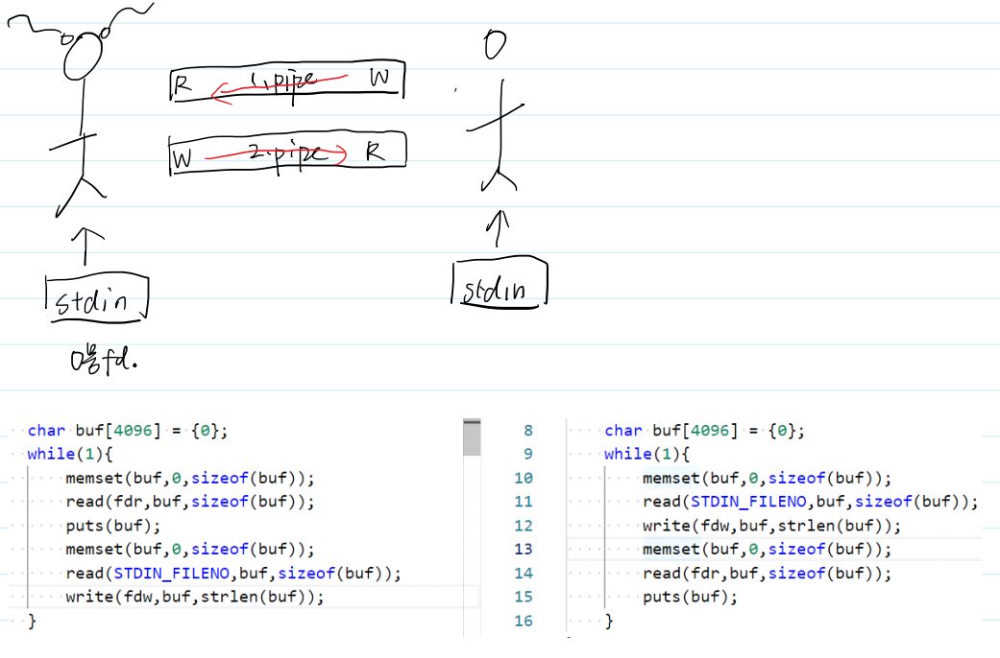

## linux系统编程

写应用，需要调用操作系统帮忙

1. shell
2. 库函数(printf)：跨平台       //  ISOC规范
3. system calls 系统调用：直接使用操作系统内核功能   //POSIX规范


## 怎样学习系统编程
### man 手册

- 安装库函数手册
sudo apt install manpages-posix-dev 
### 步骤
- man手册内容
  - 名字-声明-细节-返回值
- 阅读顺序
  - 1. 先阅读名字
  - 2. 看声明和返回值
    - 头文件
    - 指针类型的参数--**主调函数分配内存**
  （看有没有const）
    - 指针类型返回值--**主调函数是否要释放内存**
    
    void *malloc(size_t size);
    - 返回值不实现功能，只处理报错
  - 3. 细节：按需查看


## 文件

- 狭义：存储在外部存储介质上的数据集合
- 广义：慢、容量大、持久存储  ——— 万物皆文件

### 文件类型

普通文件 、目标文件、软连接
字符设备文件  (鼠标)  以字符为单位
块设备文件  (磁盘)     以块为单位
管道文件  (让两个文件之间彼此通信)
sorket文件(网络通信)

### 文件使用


## 通过man学习文件相关接口
### fopen

库函数


- FILE: 文件流/**用户态**文件缓冲区
- 参数1：字符串：路径
- 参数2：r只读打开，r+读写打开，w只写创建，w+读写创建

#### 写代码前的准备工作
- 43func.h

- 调用


#### 追加模式
"a" ：即append 只写追加————默认从文件结尾写入
"a+"           读写追加————打开时处于文件的开始,写入时(不管此时ptr处于什么位置)跳到文件的末尾

应用：日志系统使用

文件流


#### 验证过程：

```C++
#include <43func.h>
int main(int argc, char *argv[])
{
    // 运行时执行./fopen file1
    ARGS_CHECK(argc, 2);//参数个数检查
    //FILE *fp=fopen(argv[1],"r");

    // FILE *fp=fopen(argv[1],"a");//追加模式
    // ERROR_CHECK(fp,NULL,"fopen");//fopen使用时不成功（没有该文件）检查
    // fwrite("howareyou",1,9,fp);//写入

    FILE *fp=fopen(argv[1],"a+");//
    ERROR_CHECK(fp,NULL,"fopen");//fopen使用时不成功（没有该文件）检查
    char buf[10]={0};
    fread(buf,1,9,fp);//a+可读
    puts(buf);
    printf("before fseek, loc = %ld\n",ftell(fp));
    fseek(fp,0,SEEK_SET);
    printf("after fseek, loc = %ld\n",ftell(fp));
    fwrite("howareyou",1,9,fp);//写入
    fclose(fp);
}
```

### 改变文件属性相关接口

#### 1. 用函数实现改变文件权限chmod    //man 2 chmod
```c++
#include<43func.h>
int main(int argc,char *argv[]){
    // ./chmod 777 dir1
    //执行chmod 将dir1文件权限改为777
    ARGS_CHECK(argc,3);
    //chmod(argv[2],argv[1]);///报错，第二个参数应该是八进制无符号整形
    __mode_t mode;
    sscanf(argv[1],"%o",&mode);
    int ret = chmod(argv[2],mode);
    ERROR_CHECK(ret,-1,"chmod");
}
```
#### 2. 获取当前目录getcwd

**学习目的**：了解指针作为参数和作为返回值的技巧
- man手册：
```C++
       #include <unistd.h>

       char *getcwd(char *buf, size_t size);
       //buf 传入传出参数

```

- 设计：

```C++
/*
返回值情况
1、 buf不为空，返回buf
*/
#include<43func.h>
int main(){
    char buf[1024] = {0};
    char *ret = getcwd(buf,sizeof(buf));
    //传入首地址，及长度信息(数组传入时长度信息丢失)
    
    ERROR_CHECK(ret,NULL,"getcwd");//报错检测，目录的数组太短可能目录输出越界就会报错
    printf("ret = %p,ret = %s\n",ret,ret);
    printf("ret = %p,ret = %s\n",buf,buf);
}
//2、buf为空，返回一个堆空间的地址
#include<43func.h>
int main(){
    printf("cwd = %s\n",getcwd(NULL,0));
}

```

#### 3. 改变当前工作目录chdir
当前工作目录是一个进程的属性
- man手册
#include <unistd.h>
    int chdir(const char *path);


改成功了，但是**只影响了子进程**

#### 4. rmdir mkdir

- man 2 mkdir
 #include <sys/stat.h>
       #include <sys/types.h>

       int mkdir(const char *pathname, mode_t mode);
- man 2 rmdir


- 实现

1. mkdir

```C
#include<43func.h>
int main(int argc,char *argv[]){
    ARGS_CHECK(argc,2);
    int ret = mkdir(argv[1],0777);//需要8进制的777，所以写0777
    //所有创建文件的行为都会受到umask的影响
    ERROR_CHECK(ret,-1,"mkdir");

}
```

2. rmdir

**只能删除空目录**
```C
#include<43func.h>
int main(int argc,char *argv[]){
    ARGS_CHECK(argc,2);
    int ret = rmdir(argv[1]);
    ERROR_CHECK(ret,-1,"rmdir");

}
```


## 目录流基础
- 流
自动后移：用户可以不了解接口的情况下访问所有数据

例：C++迭代器

- 文件流回顾：见文件使用
- 目录流：

目录在磁盘中，以(带有ptr的)链表的形式进行存储
每一个**链表节点**(目录项，dirent:directory entry)，储存孩子的基本信息


- 目录流：是目录文件在内存中的缓冲区

每次除了取ptr所指地址，还会指针后移


### 目录流相关三个接口


### readdir


### 自己实现ls

```C
#include <43func.h>
int main(int argc, char *argv[]){
    // ./myLs dir
    ARGS_CHECK(argc,2);
    DIR *dirp = opendir(argv[1]);//打开父目录，返回目录流指针
    ERROR_CHECK(dirp,NULL,"opendir");
    struct dirent * pdirent;//创建目录项指针
    //当目录项指针不为空，遍历目录，输出目录项各个内容
    while((pdirent = readdir(dirp)) != NULL){        
      printf("inode = %ld, reclen = %d, type = %d, name = %s\n",
              pdirent->d_ino,pdirent->d_reclen, pdirent->d_type, pdirent->d_name);
    }
    closedir(dirp);//关闭文件
}
```

### 想要指针回退
> telldir: return current location in directory stream
> seekdir:set the position of the next readdir() call in the directory stream.


```C
#include <43func.h>
int main(int argc, char *argv[]){
    // ./myLs dir
    ARGS_CHECK(argc,2);
    DIR *dirp = opendir(argv[1]);
    ERROR_CHECK(dirp,NULL,"opendir");
    struct dirent * pdirent;
    long loc;
    while((pdirent = readdir(dirp)) != NULL){
        if(strcmp(pdirent->d_name,"file2") == 0){
            loc = telldir(dirp);//记录当前文件流ptr
        }
        printf("inode = %ld, reclen = %d, type = %d, name = %s\n",
            pdirent->d_ino,pdirent->d_reclen, pdirent->d_type, pdirent->d_name);
    }
    puts("----------------------------------------------------");
    seekdir(dirp,loc);//指针回退到记录位置的后一位，原因是tell的时候ptr会后移一位
    pdirent = readdir(dirp);
    printf("inode = %ld, reclen = %d, type = %d, name = %s\n",
        pdirent->d_ino,pdirent->d_reclen, pdirent->d_type, pdirent->d_name);
    closedir(dirp);
}
```

### rewinddir 解决只能回退到指针后一位的问题

```C
#include <43func.h>
int main(int argc, char *argv[]){
    // ./myLs dir
    ARGS_CHECK(argc,2);
    DIR *dirp = opendir(argv[1]);
    ERROR_CHECK(dirp,NULL,"opendir");
    struct dirent * pdirent;
    while((pdirent = readdir(dirp)) != NULL){
        printf("inode = %ld, reclen = %d, type = %d, name = %s\n",
            pdirent->d_ino,pdirent->d_reclen, pdirent->d_type, pdirent->d_name);
    }
    puts("----------------------------------------------------");
    rewinddir(dirp);
    pdirent = readdir(dirp);
    printf("inode = %ld, reclen = %d, type = %d, name = %s\n",
        pdirent->d_ino,pdirent->d_reclen, pdirent->d_type, pdirent->d_name);
    closedir(dirp);
}
```

## 目录流应用
### stat实现ll
1. 作为命令   stat 文件名 ————显示文件信息
2. stat函数————显示文件信息，具体实现：


- stat配合目录流实现la -al

**牢记：文件名和路径不完全是对等的，只有在当前目录下的文件才对等**
**牢记：文件名和路径不完全是对等的，只有在当前目录下的文件才对等**
**牢记：文件名和路径不完全是对等的，只有在当前目录下的文件才对等**


```C
#include <43func.h>
int main(int argc, char *argv[]){
    // ./myLs dir
    ARGS_CHECK(argc,2);
    DIR *dirp = opendir(argv[1]);
    ERROR_CHECK(dirp,NULL,"opendir");
    struct dirent * pdirent;
    struct stat statbuf;
    int ret = chdir(argv[1]);
    ERROR_CHECK(ret,-1,"chdir");
    while((pdirent = readdir(dirp)) != NULL){
        ret = stat(pdirent->d_name,&statbuf);//文件名只有在当前目录下才是路径
        ERROR_CHECK(ret,-1,"stat");
        printf("%8o %ld %d %d %ld %ld %s\n", 
            statbuf.st_mode,
            statbuf.st_nlink,
            statbuf.st_uid,
            statbuf.st_gid,
            statbuf.st_size,
            statbuf.st_mtime,
            pdirent->d_name);
    }
    closedir(dirp);
}
```
输出：


优化：


```C
#include <43func.h>
int main(int argc, char *argv[]){
    // ./myLs dir
    ARGS_CHECK(argc,2);
    DIR *dirp = opendir(argv[1]);
    ERROR_CHECK(dirp,NULL,"opendir");
    struct dirent * pdirent;
    struct stat statbuf;
    int ret = chdir(argv[1]);
    ERROR_CHECK(ret,-1,"chdir");
    while((pdirent = readdir(dirp)) != NULL){
        ret = stat(pdirent->d_name,&statbuf);//文件名只有在当前目录下才是路径
        ERROR_CHECK(ret,-1,"stat");
        printf("%6o %ld %s %s %8ld %s %s\n", 
            statbuf.st_mode,
            statbuf.st_nlink,
            getpwuid(statbuf.st_uid)->pw_name,
            getgrgid(statbuf.st_gid)->gr_name,
            statbuf.st_size,
            ctime(&statbuf.st_mtime),
            pdirent->d_name);
    }
    closedir(dirp);
}
```
输出：


### 实现tree命令

对文件的树结构DFS——递归实现


```C
#include <43func.h>
int DFSprint(char *path, int width);
int main(int argc, char *argv[]){
    ARGS_CHECK(argc,2);
    puts(argv[1]);
    DFSprint(argv[1],4);
}
int DFSprint(char *path, int width){
    DIR* dirp = opendir(path);
    ERROR_CHECK(dirp,NULL,"opendir");
    struct dirent *pdirent;
    char newPath[1024] = {0};
    while((pdirent = readdir(dirp)) != NULL){
        if(strcmp(pdirent->d_name,".") == 0 ||
            strcmp(pdirent->d_name,"..") == 0){
                continue;
            }
        printf("├");
        for(int i = 1; i < width; ++i){
            printf("─");
        }
        puts(pdirent->d_name);
        if(pdirent->d_type == DT_DIR){
            sprintf(newPath,"%s%s%s",path,"/",pdirent->d_name);
            //printf("newPath = %s\n", newPath);
            DFSprint(newPath,width+4);
        }
    }
}
```


## 不带缓冲的文件io

### **文件描述符**：用它来访问某个具体的文件对象

- 上一节所讨论的文件都是使用FILE类型来管理，根据FILE类型的结构可知它的本质是一个缓冲区。与FILE类型相关的文件操作（比如fopen，fread等等）称为带缓冲的IO，它们是ISO C的组成部分
- POSIX标准支持另一类**不带缓冲区的IO**。在这里，**文件是使用文件描述符来描述**。文件描述符是一个**非负整数**。从原理上来说，进程地址空间的**内核部分里面会维护一个已经打开的文件的数组**，这个数组用来管理所有已经打开的文件（打开的文件存储在进程地址空间的内核区中，称为文件对象），而**文件描述符就是这个数组的索引**。因此，文件描述符可以实现进程和打开文件之间的交互

### 打开、创建和关闭文件
```C
#include <sys/types.h> //头文件
#include <sys/stat.h>
#include <fcntl.h>
int open(const char *pathname, int flags); //文件名 打开方式
int open(const char *pathname, int flags, mode_t mode);//文件名 打开方式 权限
int creat(const char *pathname, mode_t mode); //文件名 权限
//creat现在已经不常用了，它等价于
open(pathname,O_CREAT|O_TRUNC|O_WRONLY,mode);
```
- 使用open函数可以打开或者创建并打开一个文件，使用creat函数可以创建一个文件
- 执行成功时，open函数返回一个文件描述符，表示已经打开的文件；执行失败是，open函数返回-1，并设置相应的errno
- flags和mode都是一组掩码的合成值，**flags表示打开或创建的方式**，**mode表示文件的访问权限**。
- flags可选项：


- 使用完文件以后，要记得使用close来关闭文件。
    - 一旦调用close，则该进程对文件所加的锁全都被释放，并且使文件的打开引用计数减1，只有文件的打开引用计数变为0以后，文件才会被真正的关闭。用ulimit -a命令可以查看单个进程能同时打开的文件的上限
```C
int close(int fd);//fd表示文件描述词,是先前由open或creat创建文件时的返回值。
```

> 为什么int可以作为文件描述符？
> 

#### open的例子

```C
#include <43func.h>
int main(int argc, char *argv[]){
    // ./open file1
    ARGS_CHECK(argc,2);
    //int fd = open(argv[1], O_WRONLY);
    //int fd = open(argv[1], O_WRONLY|O_CREAT,0666);
    //创建文件的行为，总是会受到umask的影响
    int fd = open(argv[1], O_WRONLY|O_CREAT|O_EXCL,0666);
    ERROR_CHECK(fd, -1, "open");
    printf("fd = %d\n", fd);
    close(fd);
}
```
#### fopen底层调用的open


### 读写文件

使用read和write来读写文件，它们统称为不带缓冲的IO

```C
#include <unistd.h>
ssize_t read(int fd, void *buf, size_t count);//文件描述符 缓冲区 长度
ssize_t write(int fd, const void *buf, size_t count);

//复习：void *做参数，可以穿任意类型； 做返回值时必须强制类型转换
```


- 对于read和write函数，出错返回-1，读取完了之后，返回0， 其他情况返回读写的个数。


```C
//读取文件内容
    // ./open file1
    ARGS_CHECK(argc,2);
    int fd = open(argv[1], O_RDWR);
    ERROR_CHECK(fd, -1, "open");
    printf("fd = %d\n", fd);
    //读文本文件
    char buf[10] = {0};
    ssize_t ret = read(fd,buf,sizeof(buf));
    puts(buf);
    //读二进制文件，怎么写怎么读
    int i;
    read(fd,&i,sizeof(i));
    printf("i = %d\n", i);
    close(fd);


//写文件
#include <43func.h>
int main(int argc, char *argv[]){
    // ./open file1
    ARGS_CHECK(argc,2);
    int fd = open(argv[1], O_RDWR);
    ERROR_CHECK(fd, -1, "open");
    printf("fd = %d\n", fd);
    //char buf[10] = "hello";//这里如果是字符串，就是文本文件
    //write(fd,buf,strlen(buf));
    int i = 10000000;
    write(fd,&i,sizeof(i));
    close(fd);
}

//如果希望查看文件的2进制信息，在vim中输入命令:%!xxd
//使用od -h 命令也可查看文件的16进制形式

```

### cp命令实现


**关键：write(fdw,buf,ret); // 第三个参数是ret，表示读多少写多少**

```C
#include <43func.h>
int main(int argc, char *argv[]){
    //./cp src dst
    ARGS_CHECK(argc,3);
    int fdr = open(argv[1],O_RDONLY);
    ERROR_CHECK(fdr,-1,"open fdr");
    int fdw = open(argv[2],O_WRONLY|O_CREAT|O_TRUNC,0666);
    ERROR_CHECK(fdw,-1,"open fdw");
    char buf[4096] = {0};
    while(1){
        memset(buf,0,sizeof(buf));
        ssize_t ret = read(fdr,buf,sizeof(buf));
        if(ret == 0){
            break;
        }
        write(fdw,buf,ret);//第三个参数是ret，表示读多少写多少
    }
    close(fdr);
    close(fdw);
}
```


### 性能问题


### 改变文件大小 ftruncate

- 使用**ftruncate函数**可以改变文件大小或创建固定大小文件
- 改变文件大小时：
  - 大——>小：截断
  - 小——>大：补0
- 函数ftruncate会将参数fd指定的文件大小改为参数length指定的大小。参数fd为已打开的文件描述词，而且必须是以写入模式打开的文件。如果原来的文件大小比参数length大，则超过的部分会被删去（实际上修改了文件的inode信息）。执行成功则返回0，失败返回-1

```C
#include <unistd.h>
int ftruncate(int fd, off_t length);
```

实例：
```C
#include <43func.h>
int main(int argc,char *argv[]){
    ARGS_CHECK(argc,2);
    int fd = open(argv[1], O_RDWR);
    ERROR_CHECK(fd,-1,"open");
    int ret = ftruncate(fd,40960);
    ERROR_CHECK(ret,-1,"ftruncate");
}
```


###  内存映射mmap
让磁盘和内存直接映射

CPU ———— 内存 ———— 外部设备（磁盘）

cpu直接读写内存数据，外设也可以直接和内存打交道（文件缓冲区）
cpu如果跟外设打交道，必须经过内存，浪费
解决：
DMA:直接内存访问——操作内存=操作外设

mmap：
1. 在**用户态**找一片**内存空间**，该内存**跟磁盘**建立**映射**
2. 使用*或[]可以读写内存——等价于——读写文件(不需要read/write)

限制：
1. 文件大小固定-ftruncate
2. 只能是磁盘文件
3. 建立映射之前先open


### mmap函数

man帮助手册
```C
#include <sys/mman.h>
void *mmap(void *adr, size_t len, int prot, int flag, int fd, off_t offset);
int munmap(void *addr,size_t length);//释放上面的空间
```
- addr参数用于指定映射存储区的起始地址。这里设置为**NULL**，这样就由系统自动分配（通常是在**堆空间**里面寻找）。分配区域的首地址作为返回值(类似malloc)
- len 表示大小固定
- prot：表示权限。**PROT_READ|PROT_WRITE** 表示可读可写
- flag参数表示属性： 在目前是采用**MAP_SHARED**(多个进程共享映射区)
- fd 映射的文件()
- offset写**0**

使用与实现：

```C
#include <43func.h>
int main(int argc, char *argv[]){
    ARGS_CHECK(argc,2);
    int fd = open(argv[1],O_RDWR);
    ERROR_CHECK(fd,-1,"open");
    int ret = ftruncate(fd,5);
    ERROR_CHECK(ret,-1,"ftruncate");
    char *p = (char *)mmap(NULL,5,PROT_READ|PROT_WRITE,MAP_SHARED,fd,0);
    ERROR_CHECK(p,MAP_FAILED,"mmap");
    for(int i = 0;i <5; ++i){
        printf("%c", p[i]);//读
    }
    printf("\n");
    p[0] = 'H';
    munmap(p,5);
}
```

### lseek
相较于fseek，lseek移动内核态，fseek移动用户态的
- 函数lseek将文件指针设定到相对于whence，偏移值为offset的位置。它的返回值是读写点距离文件开始的距离

```C
#include <sys/types.h>
#include <unistd.h>
off_t lseek(int fd, off_t offset, int whence);//fd文件描述词
//whence 可以是下面三个常量的一个

//SEEK_SET 从文件头开始计算
//SEEK_CUR 从当前指针开始计算
//SEEK_END 从文件尾开始计算

```

调用：
```C
#include <43func.h>
int main(int argc, char *argv[]){
    ARGS_CHECK(argc,2);
    int fd = open(argv[1], O_RDWR);
    ERROR_CHECK(fd,-1,"open");
    lseek(fd,40960,SEEK_SET);
    write(fd,"1",1);
    close(fd);
}
```
> 可以诱发文件空洞


### 文件流底层是使用了文件对象


写法的改进及原因↑


### printf对应的fd是1

**重定向实现本质：1号文件描述符不在屏幕而在文件**


1、代码使用了下面的dup函数
```C
#include <43func.h>
int main(int argc, char *argv[]){
    printf("\n");
    ARGS_CHECK(argc,2);
    int oldfd = open(argv[1],O_RDWR);
    ERROR_CHECK(oldfd,-1,"open");
    close(STDOUT_FILENO);
    int newfd = dup(oldfd);
    printf("oldfd = %d\n", oldfd);
    printf("newfd = %d\n", newfd);
}
```

### 文件描述符的复制dup

1. 数值上不同
2. 偏移量共享

```C
#include <unistd.h>
int dup(int oldfd);
int dup2(int oldfd, int newfd);
```
- dup返回一个新的文件描述符（是自动分配的，数值是没有使用的文件描述符的最小编号）。这个新的描述符是旧文件描述符的拷贝。这意味着两个描述符共享同一个数据结构

```C
#include <43func.h>
int main(int argc, char *argv[]){
    ARGS_CHECK(argc,2);
    int oldfd = open(argv[1],O_RDWR);
    ERROR_CHECK(oldfd,-1,"open");
    printf("oldfd = %d\n", oldfd);
    int newfd = dup(oldfd);
    printf("newfd = %d\n", newfd);
    write(oldfd,"hello",5);
    close(oldfd);//再最后一行与在现在效果一样，原因是用了引用计数
    write(newfd,"world",5);
}
```
- **引用计数**：保证了都关掉才释放


- dup2目标描述符将变成旧描述符的复制品，此时两个文件描述符现在都指向同一个文件对象，并且是oldfd指向的文件
- （执行完成以后，如果newfd已经打开了文件，该文件将会被关闭）


- 实现


## 即时聊天

### 有名管道 /FIFO


```C
$ mkfifo [管道名字]
使用cat打开管道可以打开管道的读端
$ cat [管道名字]
打开另一个终端，向管道当中输入内容可以实现写入内容
$ echo “string” > [管道名字]
此时读端也会显示内容
//要一端读一端写，才能继续，否则会阻塞
```
> 禁止使用vim来打开管道文件
### 用系统调用操作管道

**open O_WRONLY 建立写端 
open O_RDONLY 建立读端**


> 管道在open的时候阻塞的


### 死锁的产生与解决
- 产生


- 解决：调整顺序


### 全双工的实现

管道是半双工，为了实现即时聊天，用两个管道组成全双工。


- 问题：只能一条输入一条输出如此往复


- 解决：引入io多路复用(小助手)
目的：集中管理多个导致阻塞的事件


### io多路复用的实现

#### **select**

```C
int select(int maxfd, //最大的文件描述符（其值应该为最大的文件描述符字 + 1）
            fd_set *readset,//内核 读 操作的描述符字集合
            fd_set *writeset, //内核 写 操作的描述符字集合
            fd_set *exceptionset, //内核 异常 操作的描述符字集合
            struct timeval * timeout);//等待描述符就绪需要多少时间。
            //NULL代表永远等下去，一个固定值代表等待固定时间，0代表根本不等待

//参数的类型fd_set 就是io多路复用实现提到的"小助手"
// 返回值是就绪描述字的正数目，0——超时，-1——出错


//readset、writeset、exceptionset都是fd_set集合
//集合的相关操作如下：
void FD_ZERO(fd_set *fdset); /* 将所有fd清零 */
void FD_SET(int fd, fd_set *fdset); /* 增加一个fd */
void FD_CLR(int fd, fd_set *fdset); /* 删除一个fd */
int FD_ISSET(int fd, fd_set *fdset); /* 判断一个fd是否有设置 */
```


- 实现步骤：

1. 创建fd_set
2. 设置合适的监听
   1. FD_ZERO 清空
   2. FD_SET 加入监听
3. 调用select函数，会让进程阻塞
4. 当监听的fd中，有任何一个就绪，则select就绪
5. 轮流询问所有监听的fd，是否就绪：用 FD_ISSET


**实现即时聊天：**
```C
#include <43func.h>
int main(int argc, char *argv[]){
    // ./chat1 1.pipe 2.pipe
    ARGS_CHECK(argc,3);
    int fdr = open(argv[1], O_RDONLY);
    int fdw = open(argv[2], O_WRONLY);
    puts("pipe open");
    char buf[4096] = {0};
    fd_set rdset;
    while(1){
        FD_ZERO(&rdset);
        FD_SET(STDIN_FILENO,&rdset);
        FD_SET(fdr,&rdset);
        select(fdr+1,&rdset,NULL,NULL,NULL);
        if(FD_ISSET(fdr,&rdset)){
            puts("msg from pipe");
            memset(buf,0,sizeof(buf));
            read(fdr,buf,sizeof(buf));
            puts(buf);
        }
        if(FD_ISSET(STDIN_FILENO,&rdset)){
            puts("msg from stdin");
            memset(buf,0,sizeof(buf));
            read(STDIN_FILENO,buf,sizeof(buf));
            write(fdw,buf,strlen(buf));
        }
    }
}
```
- tips:

1. 设置监听在while循环内部，每次都要做，清空并重新设置。原因select函数的fd_set *readset参数是传入传出参数，有可能把设置的rdset修改掉。
2. 如何找到就绪的fd
   1. 轮询 polling
   2. 回调 callback
    
    布置任务，工人除了知道要做工作外，还会找我要任务做什么。


#### select的关闭

- 如果一方退出，另一方会陷入死循环(管道一直就绪导致的)
> 且ctrl+c强制退出不正常，一般不这么退出
1. 写端关闭： 读端read会读到EOF 一直就绪
2. (读端关闭：) 写端继续write，会进程崩溃、收到SIGPIPE信号


- 解决：
1. 用ctrl+d退出：输出一个EOF 
2. 轮询时，如果read读到了eof就关闭就好了

```C
        if(FD_ISSET(fdr,&rdset)){
            puts("msg from pipe");
            memset(buf,0,sizeof(buf));
            int ret = read(fdr,buf,sizeof(buf));
            if(ret ==0){
                printf("end!\n");
                break;
            }
            puts(buf);
        }
        if(FD_ISSET(STDIN_FILENO,&rdset)){
            puts("msg from stdin");
            memset(buf,0,sizeof(buf));
            int ret = read(STDIN_FILENO,buf,sizeof(buf));
            if(ret == 0){
                write(fdw,"nishigehaoren",13);
                break;
            }
            write(fdw,buf,strlen(buf));
        }
```

#### select的超时

在于参数 ： struct timeval * timeout //等待描述符就绪需要多少时间。

- timeout 传入传出——调用select会修改timeout里面的内容——每次循环开始都要设置timeout
- 使用select的返回值，来区分超时导致的就绪(返回0)
```C
struct timeval{
    long tv_sec;//秒
    long tv_usec;//微秒
};

//使用
        struct timeval timeout;
        timeout.tv_sec = 2;
        timeout.tv_usec = 500000;
        int sret = select(fdr+1,&rdset,NULL,NULL,&timeout);
        if(sret == 0){
            puts("time out!");
            continue;
        }
```


#### 关于管道


> 写的数据：先到读缓冲区、再到暂存区、再到写缓冲区
> 直到写缓冲区非空


- 以非阻塞方式打开管道一端 open O_RDWR
  - 可以在一个进程中打开管道两端

- 当管道的写端向管道中写入数据达到上限以后，后续的写入操作将会导致进程进入阻塞态，称为**写阻塞现象**


#### 使用selsct同时监听读和写


 > 写入行为和select认为就绪的行为冲突，永久阻塞


#### select实现的原理

关注 fd_set：fdset实际上是一个文件描述符的位图，采用数组的形式来存储
1. 

```C
//fd_set的成员是一个长整型的结构体
typedef long int __fd_mask;
//将字节转化为位
#define __NFDBITS (8 * (int) sizeof (__fd_mask))
//位图-判断是否存在文件描述符d
#define __FD_MASK(d) ((__fd_mask) (1UL << ((d) % __NFDBITS)))


//select和pselect的fd_set结构体
typedef struct
{
//成员就是一个长整型的数组，用来实现位图
__fd_mask __fds_bits[__FD_SETSIZE / __NFDBITS];
} fd_set;
// fd_set里面文件描述符的数量，可以使用ulimit -n进行查看
#define FD_SETSIZE __FD_SETSIZ
```
一次最多打开1024个文件，刚好数组大小1024 byte，作为监视


#### 调用select

1. rdset 从用户态拷贝到内核态(监听集合0~nfds-1)
2. 每当有一个硬件产生相应，从0 ~ nfds-1查看有没有能对的上的
3. rdset 就绪，是这个硬件就标为1，不是标0(本来就是0)，变为就绪集合
4. 集合有1，写回原来的rdset

原来监听谁谁是1————就绪的是1

- 缺陷：

1. 监听和就绪混杂在一起
2. 文件数量固定(位图数量固定)
3. 大量用户态——内核态的拷贝
4. <最严重的问题>找就绪浪费时间(轮询)

- 解决：
用另一种io多路复用机制eopll，只返回就绪的文件描述符
