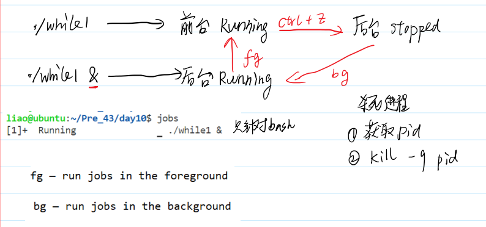

## 如何学习？
- 重概念，轻代码——功能被线程取代

- **进程**：正在运行的**程序**。
    **动态的**————**静态的**

- 概念
正在运行的程序，os资源(CPU和内存)分配的基本单位

> io资源是基于内存资源的基础上的


- 发展：


## 发展中的缺陷及解决

### 多道程序设计的缺陷


## 解决：虚拟内存实现


- 局部性原理：
这次访问的数据或进程，下次更可能访问附近的内存。所以**热点**少且集中。

- 切分：
1、按功能区分分段； 
2、**分页**(固定大小，常见)

把热点的页面分配给物理内存，别的进程也分配，如下：


> 如果物理内存不够了。**换出**：把之前的暂时不用的放到磁盘(交换分区/win虚拟内存)里。不同系统叫法不同
> 虚拟地址可能相同，代码中涉及的都是虚拟地址
> 虚拟内存大小跟物理内存大小无关，是一个逻辑上的大小


### 分时系统的缺陷

- 用户要主动放弃CPU
关心用户CPU资源的分配(小功能持续占用CPU导致优先级很高)

### 解决：虚拟CPU

>用户——**虚拟CPU**——CPU
>让用户**以为**自己是CPU的独占者

- 两个概念：

1. **并行**：在某一**时刻**，多个进程同时运行
2. **并发**：在某**一段时间**，多个进程同时运行

> 一个CPU核心，不能并行


#### 实现：进程的切换


1. 进程的调度：
有若干个进程，均可占用CPU——**时间片轮转法**
>每个任务单次占用CPU时间——时间片；
>所有进程加起来运行的时间——调度周期


> 有一个就绪队列，两个进程p1, p2，调度周期10ms。那么调度器给p1 5ms, p2 5ms 。p1的5ms运行完后，时钟中断，加入另一个进程p2 运行5ms。如此往复。
> 运行时的状态：运行态
> 未运行但可占用cpu的状态：就绪态
> 所以进程在运行态和就绪态转换
> p1运行时可能产生新的进程p3，那么就绪队列加入p3，下一个调度周期中，每个进程分3.33ms
> 如果p1不是因为cpu的原因无法运行(比如调用read，可能等待IO)，丧失占用CPU的能力，此时的状态：阻塞态/睡眠态
> 此时把p1从就绪队列移除到睡眠队列，如果p1就绪后，在把p1移动到就绪队列末，在下一个调度周期运行(变成就绪态，而不会立即变成运行态)


2. 进程的切换：改变pc指针

寄存器的状态：上下文 —— 进程的切换就是上下文的切换

> 保存p1的状态，指向p2
> 上下文切换需要时间，对实际工作没用
> 时间片越小，切换越频繁，系统性能下降

linux：完全公平调度算法(行为和时间片轮转几乎一样)
    唯一的区别：优先级随着进程的执行动态调整

`cat /proc/cpuinfo `查看CPU信息


## os如何管理进程

- 进程 = 任务

> 教科书：每个进程都有一个PCB(进程控制块)

- linux实现上面：每个进程都有一个 **task_struct 任务描述符/进程描述符**
    任务队列(一个双向链表)：把操作系统所有的进程管理起来

- task_struct：描述了进程的一切信息


### pid

是一个正整数，给用户**标识不同的进程**
ps命令查看


ppid: 第一个p: parent 
> 在linux中，进程之间存在亲缘关系

#### ps的亲缘关系


### getpid


多次执行————多个进程


## 进程的权限——它有什么身份

文件权限有：r w x

进程在运行过程中，必须具有一类似于用户的身份，以便于内核进行进程的权限控制，**默认情况下，程序进程拥有启动用户的身份。**
- 有**真实身份**和**有效身份**两种。默认情况下，用户的有效用户ID和真实ID是相同的，有效组ID和真实组ID是相同的。

获取id信息
```C
uid_t uid;
gid_t gid;
uid = getuid();
gid = getgid();
printf("uid = %d, gid = %d\n",uid,gid);
uid_t euid;
gid_t egid;
uid = geteuid();
gid = getegid();
printf("euid = %d, egid = %d\n",euid,egid);
```

### 文件特殊权限

- 引入


> x——>s

还有三个高位特殊权限

#### 1. suid 
条件：
- u的x和o的x 必须存在
- u的s存在(suid)
作用：
用户运行该程序时将修改自己的**有效用户ID (即euid)**为**文件拥有者**。

- 改变密码passwd的本质就是有s权限

明文存储有缺陷——>加密
    存成用户名+盐值+密文


#### 2. sgid权限

条件：
- u的x和g的x存在
- 拥有g的s(sgid)

作用：
该程序运行时将修改自己的有效组ID为文件用户组ID


#### 3. sticky粘滞位
条件：对于其他用户o，同时拥有w和t(sticky)权限
作用：o用户 可以新建文件，可以删除自己的文件，不能删除别人的文件


## 进程相关的命令


### ps

#### UNIX风格：ps -elf


- 第一列是F 表示进程标识，通常用4来表示root权限，1来表示只有拷贝没有执行
- 第二列是S 表示运行状态
  - 
  - I——idle 空闲

- 随后三列是UID/PID/PPID 表示有效用户ID、进程ID和父进程ID
- 随后是C 表示CPU占用百分比
- 随后是PRI/NI 表示优先级和nice值，用来分配时间片
- 随后是ADDR/SZ/WCHAN ADDR表示进程在内存的哪个部分（- 表示用户态），
- SZ表示驻留内存，及占用了多少物理内存页（包括数据段、代码段和栈）
- WCHAN 阻塞的系统调用：表示睡眠进程正在执行的内核函数的名字
- 随后是TTY 描述登录的终端，远程终端是pts/编号
- 随后是TIME 表示占用CPU的总时间
- 随后是CMD 表示触发进程的命令是什么

#### BSD风格：ps aux
优势：可以看内存使用率

#随后是VSZ 表示占用的虚拟内存量
#随后是RSS 表示占用的固定内存量（内存驻留集即未交换的内存的大小）
#随后是TTY 表示运行终端 本机登录进程是tty1～6 网络连接是pts/n
#随后是STAT 表示进程状态
    
#随后是START 表示启动时间
#随后是TIME 表示CPU占用时间
#随后是COMMAND 表示进程触发命令

- 使用 free 命令也可以查看系统的内存占用信息：


buffers和cache的区别：
- 
- 缓冲区起到排队的作用：本质是队列，先进先出——处理输出输出差距过大的问题
- 高速缓存：为了提升访问速度(直接把经常用的数据复制一份到高速区，提高效率)


### top
获取实时的进程状态


### 优先级系统

目的：分配时间片长度
Linux的优先级总共的范围有140。对于ubuntu操作系统而言，其范围是-40到99，优先级的**数值越低，表示其优先级越高**。


- -40~59 —— 实时优先级，实施**实时调度策略**。
  - FIFO:以按照先进先出的方式运行进程，除非主动退出，它不会被同级或着更低优先级的进程抢占，只能被更高优先级的进程抢占
  - RR:RR在FIFO的基础上增加时间片管理，相同优先级的进程会分配相同的时间片，而低优先级的进程无法抢占高优先级的进程，即使高优先级的进程时间片耗尽。

- 60~99 —— 普通优先级，**普通调度策略**(完全公平调度)

用户无法修改调度**策略**——只能调整60-99的

NICE 间接修改优先级：nice值可以用来调整优先级，其范围为-20～19。其中正数表示降低权限，负数表示提升权限。
#### nice

#### renice


### 前台和后台

前台：可以响应**键盘中断**的进程
    ctrl+c 中止； ctrl+\ 终止； ctrl+z 暂停
后台：不可以响应……


- jobs：列出本窗口，只针对bash，列出后台进程
- fg：把后台进程拉到前面来
- ctrl+z：把前台变成后台暂停
- bt：后台暂停->后台运行
- kill：获取pid(用ps -elf)后**kill -9 进程的pid**杀死进程



### crontab 定时任务

单用户定时任务crontab -e
全局定时任务 sudo vim /etc/crontab
加*表示任意都可以(在h即为每小时执行一次)


# 作业


