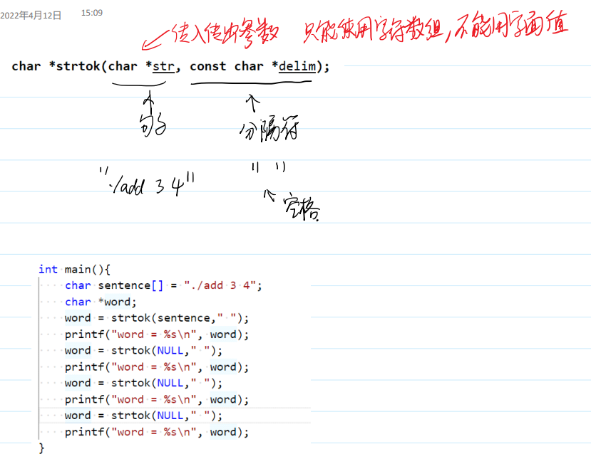

## 如何学习？

- 重概念，轻代码——功能被线程取代

- **进程**：正在运行的**程序**。
    **动态的**————**静态的**

- 概念
正在运行的程序，os资源(CPU和内存)分配的基本单位

> io资源是基于内存资源的基础上的


- 发展：


## 发展中的缺陷及解决

### 多道程序设计的缺陷


### 解决：虚拟内存实现


- 局部性原理：
这次访问的数据或进程，下次更可能访问附近的内存。所以**热点**少且集中。

- 切分：
1、按功能区分**分段**； 
2、**分页**(固定大小，常见)每次申请至少1页内存

把热点的页面分配给物理内存，别的进程也分配，物理内存可以驻留多个进程如下：


> 如果物理内存不够了。**换出**：把之前的暂时不用的放到磁盘(交换分区/win叫虚拟内存)里。虚拟内存的概念不同系统叫法不同
>
> 虚拟地址可能相同，代码中涉及的都是虚拟地址
>
> 虚拟内存大小跟物理内存大小无关，是一个逻辑上的大小


### 分时系统的缺陷

- 要用户主动放弃CPU
关心用户CPU资源的分配(小功能持续占用CPU导致优先级很高)

### 解决：虚拟CPU

>用户——**虚拟CPU**——CPU
>
>让进程**以为**自己是CPU的独占者

- 两个概念：

1. **并行**：在某一**时刻**，多个进程同时运行
2. **并发**：在某**一段时间**，多个进程同时运行

> 一个CPU核心，不能并行
>
> 微观无并行，宏观并发

#### 实现：进程的切换

1. **进程的调度**：有若干个进程，均可占用CPU——**时间片轮转法**
>每个任务单次占用CPU时间——时间片；
>
>所有进程加起来运行的时间——调度周期
>
>轮转的进程在就绪队列中


> 有一个就绪队列，两个进程p1, p2，调度周期10ms。那么调度器给p1 5ms, p2 5ms 。p1的5ms运行完后，时钟中断，加入另一个进程p2 运行5ms。如此往复。
>
> 运行时的状态：运行态
>
> 未运行但可占用cpu的状态：就绪态
>
> 所以进程在运行态和就绪态转换
>
> p1运行时可能产生新的进程p3，那么就绪队列加入p3，下一个调度周期中，每个进程分3.33ms
> 如果p1不是因为cpu的原因无法运行(比如调用read，可能等待IO)，丧失占用CPU的能力，此时的状态：阻塞态/睡眠态
>
> 此时把p1从就绪队列移除到睡眠队列，如果p1就绪后，在把p1移动到就绪队列末，在下一个调度周期运行(变成就绪态，而不会立即变成运行态)


2. 进程的切换：改变pc指针

寄存器的状态：上下文 —— 进程的切换就是上下文的切换

> 保存p1的状态，指向p2
>
> 上下文切换需要时间，对实际工作没用
>
> 时间片越小，切换越频繁，系统性能下降

linux：完全公平调度算法(行为和时间片轮转几乎一样)

唯一的区别：优先级随着进程的执行动态调整

>  ` cat /proc/cpuinfo `查看CPU信息


## os如何管理进程(task_struct/pid)

- 进程 = 任务

> 教科书：每个进程都有一个PCB(进程控制块)

- linux实现上面：每个进程都有一个 **task_struct 任务描述符/进程描述符**
    task_struct维持在任务队列里(一个双向链表)：把操作系统所有的进程管理起来，任务队列**由操作系统内核来管理**

- task_struct：描述了进程的一切信息


### pid

是一个正整数，给用户**标识不同的进程**
ps命令查看


ppid: 第一个p: parent 
> 在linux中，进程之间存在亲缘关系

#### ps的亲缘关系


### getpid


多次执行————多个进程


## 进程的权限——它有什么身份

文件权限有：r w x

进程在运行过程中，必须具有一类似于用户的身份，以便于内核进行进程的权限控制，**默认情况下，程序进程拥有启动用户的身份。**
- 有**真实身份**和**有效身份**两种。默认情况下，用户的有效用户ID和真实ID是相同的，有效组ID和真实组ID是相同的。

获取id信息
```C
uid_t uid;//真实
gid_t gid;
uid = getuid();
gid = getgid();
printf("uid = %d, gid = %d\n",uid,gid);
uid_t euid;//有效
gid_t egid;
uid = geteuid();
gid = getegid();
printf("euid = %d, egid = %d\n",euid,egid);
```

### 文件特殊权限

- 引入


> x——>s

还有三个高位特殊权限

#### 1. suid 
条件：
- u+x o+x suid(u+s)

作用：

-  用户运行该程序时将修改自己的**有效用户ID (即euid)**为**文件拥有者**。

> 改变密码passwd的本质就是有s权限

明文存储有缺陷——>加密

存成用户名+盐值+密文


#### 2. sgid权限

条件：
- o+x g+x sgid(g+s)

作用：
该程序运行时将修改自己的有效组ID为文件用户组ID


#### 3. sticky粘滞位
条件：对于其他用户o，同时拥有w和t(sticky)权限

作用：o用户 可以新建文件，可以删除自己的文件，不能删除别人的文件


## 进程相关的命令


### ps

#### UNIX风格：ps -elf


- 第一列是F 表示进程标识，通常用4来表示root权限，1来表示只有拷贝没有执行
- 第二列是S 表示运行状态
  - 
  - I——idle 空闲

- 随后三列是UID/PID/PPID 表示有效用户ID、进程ID和父进程ID
- 随后是C 表示CPU占用百分比
- 随后是PRI/NI 表示优先级和nice值，用来分配时间片
- 随后是ADDR/SZ/WCHAN ADDR表示进程在内存的哪个部分（- 表示用户态），
- SZ表示驻留内存，及占用了多少物理内存页（包括数据段、代码段和栈）
- WCHAN 阻塞的系统调用：表示睡眠进程正在执行的内核函数的名字
- 随后是TTY 描述登录的终端，远程终端是pts/编号
- 随后是TIME 表示占用CPU的总时间
- 随后是CMD 表示触发进程的命令是什么

#### BSD风格：ps aux
优势：可以看内存使用率

- 随后是VSZ 表示占用的虚拟内存量
- 随后是RSS 表示占用的固定内存量（内存驻留集即未交换的内存的大小）
- 随后是TTY 表示运行终端 本机登录进程是tty1～6 网络连接是pts/n
- 随后是STAT 表示进程状态
    
- 随后是START 表示启动时间
- 随后是TIME 表示CPU占用时间
- 随后是COMMAND 表示进程触发命令

#### 使用 free 命令也可以查看系统的内存占用信息：


**buffers缓冲和cache缓存的区别：**

- 
- 缓冲区起到排队的作用：本质是队列，先进先出——处理输出输出差距过大的问题
- 高速缓存：为了提升访问速度(直接把经常用的数据复制一份到高速区，提高效率)


### top
获取实时的进程状态


### 优先级系统

目的：分配时间片长度

Linux的优先级总共的范围有140。对于ubuntu操作系统而言，其范围是-40到99，优先级的**数值越低，表示其优先级越高**。


- -40~59 —— 实时优先级，实施**实时调度策略**。
  - FIFO:以按照先进先出的方式运行进程，除非主动退出，它不会被同级或着更低优先级的进程抢占，只能被更高优先级的进程抢占
  - RR:RR在FIFO的基础上增加时间片管理，相同优先级的进程会分配相同的时间片，而低优先级的进程无法抢占高优先级的进程，即使高优先级的进程时间片耗尽。

- 60~99 —— 普通优先级，**普通调度策略**(完全公平调度)


#### nice
用户无法修改调度**策略**——只能调整60-99的

NICE 间接修改优先级：nice值可以用来调整优先级，其范围为-20～19。其中正数表示降低权限，负数表示提升权限。


#### renice


### 前台和后台

前台：可以响应**键盘中断**的进程
    ctrl+c 中止； ctrl+\ 终止； ctrl+z 暂停

后台：不可以响应……


- jobs：列出本窗口，只针对bash，列出后台进程
- fg：把后台进程拉到前面来
- ctrl+z：把前台变成后台暂停
- bt：后台暂停->后台运行
- kill：获取pid(用ps -elf)后**kill -9 进程的pid**杀死进程


### crontab 定时任务

单用户定时任务crontab -e
全局定时任务 sudo vim /etc/crontab
加*表示任意都可以(在h即为每小时执行一次)


## 作业


## system
在3号 是库文件，win也可以用，但是性能差
system 函数可以创建一个新进程，新进程使用shell脚本执行传入的命令command。

system.c间接调用程序(可以混合语言)：sleep.c 和 hello.py。
```C
#include <43func.h>
int main(){
//     printf("I am going to call him to sleep!\n");
//     system("./sleep");
//     printf("call over!\n");
    printf("I am going to call python!\n");
    system("python3 hello.py");
    printf("done!\n");
}
```

### 调用过程
耗时！


## fork系统调用(笔试题，几个子进程，画图)


> 复制：两个独立的进程，代码段和pc指针一样！
>
> 返回值两个：区分两个不同的进程。父进程返回子进程的pid，子进程返回0：
> 
> 

### fork实现的底层原理(了解为主)

1. fork会拷贝一个task_struct
2. 子进程修改必要数据，pid ppid等
    前两步之间：不允许中断 不可抢占->要求时间短—— 称为上半部
3. 加入到就绪队列
    可抢占 时间长 下半部

### 系统调用是怎么实现的

CPU 设置不同状态 ：
- 用户态：只能执行部分指令
- 内核态：可以执行所有指令(硬件的指令、访问内核态空间)

硬件发生一些事情。**中断**：(用户态——>内核态)
先中止，处理中断指令程序，再恢复


> 右图系统调用：像普通函数，区别在于系统调用中间切换到了内核态。

tips:
- 中断的处理是**异步**的，即当前进程的执行指令和中断发生**顺序是未知**的。
- **异常**是一个类似于中断的概念，它是进程主动发送给CPU的信息，所以也被称为**软件中断**。
- **系统调用**就是利用了软件中断（这个软件中断名为**陷入**）实现的。顺序已知，类似普通函数。

### fork的性能(了解为主)
虚拟内存全部重新分配：

虚拟内存映射的改进：


> 只读时候可行，但如果修改会同时影响两个进程
> 写时复制，分配新的物理内存

### fork的拷贝

逻辑上：父子进程的**用户态空间**(栈、堆、数据段)是拷贝的(一方修改不影响另一个)
    

> fopen FILE 用户态 拷贝的


### 文件流FILE的拷贝


printf的本质：往stdout写入内容——\n或满——拷贝到内核文件对象

有没有换行的影响：

> 不加换行导致文件流内有残余内容被拷贝，下次执行的结果与预期不一致

### 内核态是拷贝的还是共享的？
重要：
**文件对象FO是共享的，索引数组是拷贝的**

两个不同的文件描述符指向同一个文件对象，行为类似于dup


## exec函数组
将一个可执行程序文件加载到本进程的地址空间——清空自身，加载path内容——**一个进程执行了多个可执行程序文件**
- 它们通常适用于在 fork 之后，将子进程的指令部分进行替换修改。


掌握两个
- execl(l-list) -可变参数
- execv(v-vector) - 元素为指针的数组

**调用exec：把数据(栈堆数据段)全部清空，将path加载进来，去取代原代码段，重置pc指针。**

### exec例子

1. 
2. 


实际上，我们之前所使用的 system 函数以及从bash或者是其他shell启动进程的本质就是 fork+exec 。
自己实现高效的exec：


### 从句子中分割得到单词 strtok
用法奇葩，第一次传字符串，往后传NULL

第二次后可改为：


## wait
使用fork不加sleep时：

> 格式不对，子进程的ppid有问题

- **进程的退出 —— 资源由父进程回收**(父进程调用wait回收)
- 得出原因：
  - 子进程先于父进程中止
  - 这种进程称为**孤儿进程**，找1号进程(一直wait)作为新的父进程
- 解决：
  - 父进程调用wait
  - 进入阻塞，等待子进程中止，回收资源
  - 如果不关心进程的退出状态，参数可以是一个空指针

- bash的wait


### 僵尸进程
- 终止了，资源没回收
如果父进程不做清理工作，则已经退出的子进程将成为**僵尸进程**(defunct)，


### 获取子进程的退出状态
存储子进程的终止情况


### waitpid
pid_t waitpid(pid_t pid, int *stat_loc, int options);

等谁去死  关键在于options 
如果给 waitpid 的options参数设置一个名为**WNOHANG**的宏，则**系统调用会变成非阻塞模式**：当执行这个系统调用时，进程会**立刻检查是否有子进程**发送子进程**终止**信号，**如果没有终止则系统调用立即返回0**。


**非阻塞配合循环**使用：父进程等待子进程终止，先去waitpid，如果没终止，就去做别的，过一会再来waitpid，一个循环。


### 进程的终止
- 正常退出：
1. 在main函数中调用return
   1. 如何获取？ wait或者bash命令：echo $? 返回上一次命令的返回值
2. exit(返回值) 不管在哪个函数里都有退出
> 上面两种(不在文件对象而是)在文件流STDOUT里的数据会显示出来

3. _exit(返回值) 文件流里的不会显示——要记得加换行,容易丢失缓冲区
4. _Exit(返回值) 同3

> 调用这2-4退出函数是没有返回返回值这个过程的

- 异常终止：
  
1. 主动异常终止：abort()；给自己发6号信号
2. 被动：kill

## 操作系统怎么管理进程(了解)
### 终端
终端是登录到Linux操作系统所需要的入口设备。终端可以是本地的，也可以是远程的。当操作系统启动的时候，init进程会创建子进程并使用 exec 来执行getty程序，从而打开终端设备或者等待远程登录，然后再使用 exec 调用login程序验证用户名和密码。
### 进程组
每个进程除了有一个进程ID以外，还属于一个进程组。
```C
pid_t getpgrp(void);//获取进程组ID
pid_t getpgid(pid_t pid);//获取PID为pid的进程的进程组ID，如果pid为0，则获取本进程所属进程
组ID
```

当使用shell运行程序创建进程的时候，被创建进程是shell的子进程，并且这个进程将会创建一个进程组，再使用 fork 派生的进程都属于这个进程组。
```C
int setpgid(pid_t pid, pid_t pgid);//将pid进程的进程组ID设置为pgid
//如果pid为0，使用调用者的进程ID
//如果pgid为0，则进程组ID和pid一致

```

> 如果使用 setpgid 修改进程组，那么再次使用 ctrl+c 触发键盘中断信号的时候，将只会终止父进程。

### 会话 session
**会话**是一个或者多个进程组的集合。
创建新会话的进程被称为新会话的**会话首进程**，会话首进程的PID就是会话ID。

- 一个会话可以有一个**控制终端**。
- 和控制终端建立连接的会话首进程被称为**控制进程**。（通常登录时会自动连接，或者使用 open 打开文件 /dev/tty ）
- 一个会话存在**最多一个前台进程组**和多个后台进程组，如果会话和控制终端相连，则必定存在一个前台进程组。
- 从终端输入的中断，会将信号发送到前台进程组所有进程
- 终端断开连接，挂断信号会发送给控制进程

```
pid_t setsid(void);
pid_t getsid(pid_t pid);

```
对于目前不是进程组组长的进程，可以使用系统调用 setsid 可以新建一个会话。使用 getsid 可以获取会话ID。


### 守护进程的创建流程
守护进程：即使会话关闭，进程依然可以持续运行
- 以d结尾，如sshd

1. 要创建新会话
2. 重置掉cwd和umask
3. (不应该和当前会话产生任何交互了)关闭所有的文件描述符——**利用日志系统**

```C
//守护进程流程
void Daemon()
{
    const int MAXFD = 64;
    int i = 0;
    if (fork() != 0)
    {
        exit(0);
    }           // 父进程退出，守护进程是孤儿进程
    setsid();   // 成为新进程组组长和新会话领导，脱离控制终端
    chdir("/"); // 设置工作目录为根目录
    umask(0);   // 重设文件访问权限掩码
    for (; i < MAXFD; i++)
    {
        close(i); // 尽可能关闭所有从父进程继承来的文件
    }
}
int main()
{
    Daemon(); // 成为守护进程
    while (1)
    {
        sleep(1);
    }
    return 0;
}
```
### 日志系统
syslog跟printf一样，但是有优先级
有优先级：priority参数


使用：


