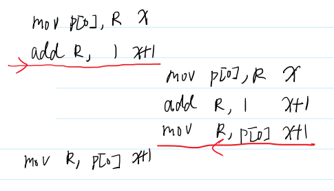
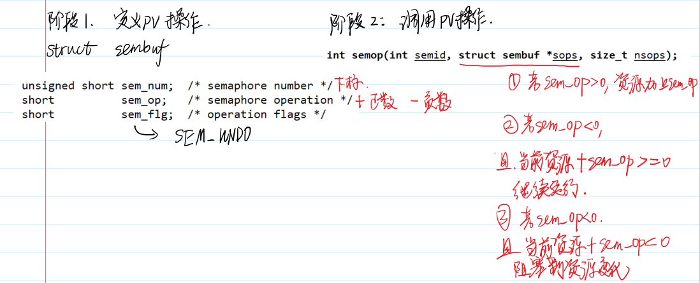

# 进程间通信 IPC
在多个进程之间，如果需要进行通信的话，隔离特性会造成一些通信的障碍。所以我们需要一些手段来跨越隔离，实现进程间通信。
- 打破进程间的隔离，从而进程间可以共享数据

- **管道**
- 共享内存(难)
- 信号量(难)
- 消息队列
- **信号**

## 管道


1. 有名管道：在文件系统中存在一个管道文件
2. 匿名管道：在文件系统中不存在
   1. 只用于父子进程间

### popen (用的很少)
先使用 fork 创建一个子进程，父子进程之间用**管道**(两端是文件流)连接在一起
> 3号 库函数 跨平台 效率不高
> popen 库函数会首先使用 fork 创建一个子进程，并且在父子进程之间创建一根管道用于通信，然后调用 exec 执行command。command表示子进程要执行的shell命令。

```C
FILE *popen(const char *command, const char *type);
int pclose(FILE *stream);
```
> type:
> "w":父进程可写入FILE；子进程读(把自己的STDIN 重定向为管道)
> 
> "r":父进程可读取FILE;子进程写(把自己的STDOUT 重定向为管道)

### pipe 系统调用(无名管道)

数组名做参数，长度是2 的int数组的数组名
int pipe(int pipefd[2]);

pipe在内核态见两个对象，两个文件描述符描述它，对应管道读端(pipefd[0])和写端(pipefd[1])


自言自语，从1写入后自然而然从0读出来

#### 先pipe再fork

子进程也有两个文件描述符指向这两个文件对象——子进程读写，父进程写读——实现管道双向通信
- 单工通信：

1. 父 读 子 写：子进程[1]写，自然传到[0]，父进程[0]取出——子[0]父[1]可关闭
2. 父 写 子 读：父进程[1]写，自然传到[0]，子进程[0]取出——子[1]父[0]可
关闭


- 全双工：

消息打印的顺序是固定的 同步的——(read的阻塞导致)


### 有名管道的函数

1. mkdifo创建
2. unlink删除
3. rename改变名字/位置
4. link创建新的硬链接


## 共享内存
效率最高的(多)进程间通信——极端需要效率时使用

让两个虚拟内存的地址空间映射到同一片物理内存
改p1的虚拟页内存—>物理页修改->p2……pn的虚拟页随之修改


### 例子

- 库文件 经常使用共享内存
> lsof 展示所有打开的库文件


### System V的共享内存机制
> 介绍性为主
内核使用一个非负整数**键**来区分不同的共享内存区域（或者是信号量或消息队列）。服务端进程和客户端进程可以使用**同一个键来定位**共享内存段**进行通信**。键可以手动指定，也可以使用接口 ftok 生成。

#### ftok
```C
key_t ftok(const char *pathname, int proj_id);

#include <func.h>
int main(int argc, char *argv[])
{
ARGS_CHECK(argc,2);
key_t key = ftok(argv[1],1);//调用 随机key
ERROR_CHECK(key,-1,"ftok");
printf("key = %d\n", key);
return 0;
}
```
> key 多个进程找到同一个身份(key)
> **项目描述符填1就好**
> 文件相同，项目相同 ——key相同 不变

- ipcs命令    来查看这些IPC的信息
```S
$ipcs
# key shmid owner perms bytes nattch status
# 键 描述符 拥有者 权限 占据空间 连接数 状态
$ipcs -l
# 查看各个IPC的限制
$ipcrm -m shmid
# 手动删除

```
#### shmget 创建共享内存
使用 shmget 接口可以根据键来获取一个共享内存段。
```C
int shmget(key_t key, size_t size, int shmflg);
```

> key 刚刚拿到的key
> size 分配内存的大小：一般写页大小的整数倍
> shmflg 描述生成的属性：
   > 1. IPC_CREAT 没有共享内存段时创建共享内存段
   >
   > 2. 权限问题 IPC_CREAT | 0600

- 创建共享内存最终代码


#### shmat / shmdt  

- 把共享内存加载到虚拟内存空间及从虚拟内存回收
- 


- 基本使用


> 默认会把内存全部设为0 ；
> 第一次执行//内容 
> 第二次注释掉。第二次执行后面，可以输出——说明可以实现了共享内存

- 私有共享内存


> IPC_PRIVATE 相当于0 每次创建新的件键
> 只能父子间使用(上例：子进程拿到父进程的消息)


- 竞争条件

出现数据操作丢失现象：


两个进程并发地访问共享资源

两个进程看到的内存是一样的，如果时间片用完，切到另一个进程，如下：



> 由于进程的切换导致加的次数变少了


#### 上半部作业


答案：


#### shmctl

```C
int shmctl(int shmid, int cmd, struct shmid_ds *buf);
/* 违背了单一职责原则：屎山 */
```
> - cmd:
>     - IPC_STAT: 获取状态
>     - IPC_SET： 修改状态(要先STAT再改，因为要用到struct shmid_ds *buf要先STAT加载进去)
>     - IPC_RMID ： 删除共享内存(不是直接删除)——标记共享内存段标记为待删除，所有进程都解除链接时就删除，且不能再attach

```C
struct shmid_ds   // 状态
{
    struct ipc_perm shm_perm; /* Ownership and permissions */
    size_t shm_segsz;         /* Size of segment (bytes) */
    time_t shm_atime;         /* Last attach time */
    time_t shm_dtime;         /* Last detach time */
    time_t shm_ctime;         /* Last change time */
    pid_t shm_cpid;           /* PID of creator */
    pid_t shm_lpid;           /* PID of last shmat(2)/shmdt(2) */
    shmatt_t shm_nattch;      /* No. of current attaches */
    ...
};
struct ipc_perm   //权限
{
    key_t __key;          /* Key supplied to shmget(2) */
    uid_t uid;            /* Effective UID of owner */
    gid_t gid;            /* Effective GID of owner */
    uid_t cuid;           /* Effective UID of creator */
    gid_t cgid;           /* Effective GID of creator */
    unsigned short mode;  /* Permissions + SHM_DEST and
     SHM_LOCKED flags */
    unsigned short __seq; /* Sequence number */
};

```

- 使用
```C
// 获取共享内存段信息
#include <func.h>
int main()
{
    int shmid = shmget(1000, 4096, 0600 | IPC_CREAT); // key为1000 大小为4096 创建一个0600的共享内存 
    ERROR_CHECK(shmid, -1, "shmget");
    char *p = (char *)shmat(shmid, NULL, 0);
    ERROR_CHECK(p, (char *)-1, "shmat");
    struct shmid_ds stat;
    int ret = shmctl(shmid, IPC_STAT, &stat);
    ERROR_CHECK(ret, -1, "shmctl");
    printf("cuid = %d perm = %o size= %ld nattch =%ld\n", stat.shm_perm.cuid, stat.shm_perm.mode, stat.shm_segsz, stat.shm_nattch);
    return 0;
}

// 修改共享内存段的权限
#include <func.h>
int main()
{
    int shmid = shmget(1000, 4096, 0600 | IPC_CREAT);
    ERROR_CHECK(shmid, -1, "shmget");
    char *p = (char *)shmat(shmid, NULL, 0);
    ERROR_CHECK(p, (char *)-1, "shmat");
    struct shmid_ds stat;
    int ret = shmctl(shmid, IPC_STAT, &stat);
    ERROR_CHECK(ret, -1, "shmctl");
    printf("cuid = %d perm = %o size= %ld nattch =%ld\n", stat.shm_perm.cuid, stat.shm_perm.mode, stat.shm_segsz, stat.shm_nattch);
    stat.shm_perm.mode = 0666;
    ret = shmctl(shmid, IPC_SET, &stat);
    ERROR_CHECK(ret, -1, "shmctl");
    return 0;
}

// 删除共享内存
#include <func.h>
int main()
{
    int shmid = shmget(1000, 4096, 0600 | IPC_CREAT);
    ERROR_CHECK(shmid, -1, "shmget");
    char *p = (char *)shmat(shmid, NULL, 0);
    ERROR_CHECK(p, (char *)-1, "shmat");
    int ret = shmctl(shmid, IPC_RMID, NULL);
    ERROR_CHECK(ret, -1, "shmctl");
    sleep(20);
    shmdt(p);
    return 0;
}


```

### 虚拟内存和物理内存的转换

按页划分，固定大小

页内偏移和页号：虚拟地址和物理地址对应的时候最后12位是相同的(页内偏移转化时不变 )，所以只需要高20位建立物理内存和虚拟内存的映射就可以


#### 减少页表的大小-分级页表

- 原理：局部性原理
首先，创建一个小**页表**，页表中存在1024个页表项（对应虚拟地址的中间10位），如果每个页表项需要4个字节存储，那么这个页表需要占据4096字节也就是一页的空间，这样整个页表可以映射1024个页面；然后，创建一个**页目录表**，页目录表当中存储每个页表所在页的页表项，即页目录表项，共需要1024项（对应虚拟地址的高10位）。


#### 页表每个进程一个
- 原因：不同进程虚拟地址物理地址映射关系不同

- 进程切换的代价：
  - 切换上下文(寄存器状态PC)
  - 切换页表

- 父子进程fork 写时复制
  - 未写入时共用一个页表
  - 若发生写入，子进程新建页表，出发缺页异常(没有物理页)，足够后分配物理页


## 信号量sem(介绍)

是一种**互斥机制**(system V版本)，/信号灯，控制什么时候信号可以走

信号量数组：每个信号量都是一个整数：描述资源的个数(>0 绿灯 ； <=0红灯)


分类：
- 计数信号量(用得少)：有多个信号量值，每个信号量值代表一个不同的资源。
- 二元信号量：资源只有两种可能性(0/1)
  - P操作：测试并加锁(会减少信号量)
    - 检查信号量sem值：若>0 --sem； 若sem<=0 等待(阻塞)
    - 测试和加锁操作不可分割 ：是一种原语——需要硬件配合
  - V操作：解锁 ++sem

临界区： 被PV进程保存起来的代码片段(越小越好)
```
P
P[0]++
V
```

> 凡是用计数信号量可以做的事情都可以用二元信号量+共享内存实现

### 利用信号量保护共享资源

system V信号量是一个信号量集合(整数数组)

1. 创建信号量semget
```C
int semget(key_t key, int nsems, int semflg);

//调用
int semArrid = semget(1000,1,IPC_CREAT|0600);
ERROR_CHECK(semArrid,-1,"semget");
```
> nsems参数表示集合中总共有多少个信号量值，semflg参数和 shmget 函数一致。

2. 设置初始资源值semctl
```C
int semctl(int semid, int semnum, int cmd, ...);
//根据cmd的不同有不同的参数

//1. cmd = SETVAL
//semnum是数组下标0~nsems-1
//第四个参数选int的
```


```C
//2. cmd = GETVAL
```


- 调用


#### 实现PV操作

P操作：测试并枷锁

​	sem<=0 阻塞
​		sem>0 --sem

V操作：解锁
		+sem

1. 定义PV操作

2. 调用PV操作




```C
#include <43func.h>
#define N 10000000
int main()
{
    int semArrid = semget(1000, 1, IPC_CREAT | 0600);
    ERROR_CHECK(semArrid, -1, "semget");
    int ret = semctl(semArrid, 0, SETVAL, 1);
    ERROR_CHECK(ret, -1, "semctl");


    struct sembuf P;
    P.sem_num = 0;        // 信号量值在集合中的下标
    P.sem_op = -1;        // 信号量值修改
    P.sem_flg = SEM_UNDO; // 如果P操作被终止，会自动恢复
    struct sembuf V;
    V.sem_num = 0;
    V.sem_op = 1;
    V.sem_flg = SEM_UNDO;
    int shmid = shmget(1000, 4096, IPC_CREAT | 0600);
    int *p = (int *)shmat(shmid, NULL, 0);
    p[0] = 0;
    if (!fork())
    {
        for (int i = 0; i < N; ++i)
        {
            semop(semArrid, &P, 1);
            ++p[0];
            semop(semArrid, &V, 1);
        }
        exit(0);
    }
    else
    {
        for (int i = 0; i < N; ++i)
        {
            semop(semArrid, &P, 1);
            ++p[0];
            semop(semArrid, &V, 1);
        }
        wait(NULL);
        printf("p[0] = %d\n", p[0]);
    }
    return 0;
} // 如果程序的执行速度太慢，可以使用top检查进程执行状态


```
#### 更高精度的时间统计 gettimeofday

```C
int gettimeofday(struct timeval *tv, struct timezone *tz);
struct timeval {
time_t tv_sec; /* seconds */
suseconds_t tv_usec; /* microseconds */
};
```

- 统计结果


> 信号量速度慢


#### semctl 细讲


```C


```

### 计数信号量


### 生产者消费者问题

存在一个仓库的格子上限为N，每个格子可以存储一个商品，消费者可以从仓库中取出商品，生产者可以放入商品，但是执行的过程中，商品数量不能为负数，也不能超过N个。

- 生产者：+商品资源； -仓库资源
- 消费者：-商品资源； +仓库资源

#### 二元信号量解决

- PV一定要把所有对共享资源的访问保护到

```C
#include <43func.h>
int main()
{
    int semArrid = semget(1000, 1, IPC_CREAT | 0600);//创建 1 个信号量
    ERROR_CHECK(semArrid, -1, "semget");
    int ret = semctl(semArrid, 0, SETVAL, 1);//信号量初值为 1
    ERROR_CHECK(ret, -1, "semctl");

    //定义PV操作
    struct sembuf P;
    P.sem_num = 0;        // 信号量值在集合中的下标
    P.sem_op = -1;        // 信号量值修改
    P.sem_flg = SEM_UNDO; // 如果P操作被终止，会自动恢复
    struct sembuf V;
    V.sem_num = 0;
    V.sem_op = 1;
    V.sem_flg = SEM_UNDO;

    //共享内存创建
    int shmid = shmget(1000, 4096, IPC_CREAT | 0600);
    int *p = (int *)shmat(shmid, NULL, 0);
    p[0] = 0;//商品资源
    p[1] = 10;//仓库资源

    if (!fork())
    {
        // 子进程是消费者
        while (1)
        {
            sleep(2);
            printf("I am consumer, before consume, product = %d, space =%d\n", p[0], p[1]);
            semop(semArrid, &P, 1);
            if (p[0] > 0)
            {
                --p[0];
                printf("Buy a product\n");
                ++p[1];
            }
            semop(semArrid, &V, 1);
            printf("I am consumer, after consume, product = %d, space =%d\n", p[0], p[1]);
        }
        exit(0);
    }
    else
    {
        // 父进程是生产者
        while (1)
        {
            sleep(1);
            printf("I am producer, before produce, product = %d, space =%d\n", p[0], p[1]);
            semop(semArrid, &P, 1);
            if (p[1] > 0)//仓库>0可以生产
            {
                --p[1];
                printf("Produce a product\n");
                ++p[0];
            }
            semop(semArrid, &V, 1);
            printf("I am producer, after produce, product = %d, space =%d\n", p[0], p[1]);
        }
        wait(NULL);
    }
    return 0;
}
```

#### 计数信号量

使用计数信号量的优势就是能**减少加锁的区域**。如果将二元信号量的条件判断放在加锁区域以外，出现错误（就是格子/商品数量超出限制范围）。

```C
#include <func.h>
int main()
{
    int semArrid = semget(1000, 2, IPC_CREAT | 0600);
    ERROR_CHECK(semArrid, -1, "semget");
    unsigned short arr[2] = {0, 10};
    int ret = semctl(semArrid, 0, SETALL, arr);
    ERROR_CHECK(ret, -1, "semctl");
    if (!fork())
    {
        // 子进程是消费者
        struct sembuf consume[2];
        consume[0].sem_num = 0; // 0表示商品 1表示空格
        consume[0].sem_op = -1; // 商品减1
        consume[0].sem_flg = SEM_UNDO;
        consume[1].sem_num = 1;
        consume[1].sem_op = 1; // 空格加1
        consume[1].sem_flg = SEM_UNDO;
        while (1)
        {
            sleep(2);
            printf("I am consumer, before consume, product = %d, space = %d\n",
                   semctl(semArrid, 0, GETVAL), semctl(semArrid, 1, GETVAL));
            // semop(semArrid,consume,2); 这种写法显示太快了
            semop(semArrid, &consume[0], 1);
            printf("Buy a product\n");
            semop(semArrid, &consume[1], 1);
            printf("I am consumer, after consume, product = %d, space = %d\n",
                   semctl(semArrid, 0, GETVAL), semctl(semArrid, 1, GETVAL));
        }
        exit(0);
    }
    else
    {
        // 父进程是生产者
        struct sembuf produce[2];
        produce[0].sem_num = 0; // 0表示商品 1表示空格
        produce[0].sem_op = 1;  // 商品加1
        produce[0].sem_flg = SEM_UNDO;
        produce[1].sem_num = 1;
        produce[1].sem_op = -1; // 空格减1
        produce[1].sem_flg = SEM_UNDO;
        while (1)
        {
            sleep(1);
            printf("I am producer, before produce, product = %d, space = %d\n",
                   semctl(semArrid, 0, GETVAL), semctl(semArrid, 1, GETVAL));
            // semop(semArrid,produce,2);
            semop(semArrid, &produce[1], 1);
            printf("Produce a product\n");
            semop(semArrid, &produce[0], 1);
            printf("I am producer, after produce, product = %d, space = %d\n",
                   semctl(semArrid, 0, GETVAL), semctl(semArrid, 1, GETVAL));
        }
        wait(NULL);
    }
    return 0;
}
```


#### 死锁
- 处于加锁状态的进程异常终止了


如果不使用SEM_UNDO，处于加锁状态的代码依然又可能会触发报错导致进程终止，并且信号量的数值并不会恢复，导致**死锁**，
而使用SEM_UNDO的时候，如果进程在加锁状态下终止，那么信号量的数值会直接根据加锁次数回退，并且最小值为0。


## 消息队列
- 有两种消息队列
1. 进程间通信的一种——只能在本机通信(本课程所讲)
2. 广义的消息队列：一种网络中间件，用于网络通信

- 与管道的区别

1. 可以保留消息的边界：
    管道的流式结构：

    有边界的：

2. 

- 特点：
先进先出 —— 学的SystemV版本的消息队列


- msgget 可以用来创建一个消息队列
```C
int msgget(key_t key, int msgflg);  //返回的int就是msgid

//调用
int msgid = msgget(1000 , IPC_CREAT|0600);

```
- msgsnd msgrcv 发送接收消息

```C
int msgsnd(int msqid, const void *msgp, size_t msgsz, int msgflg);

ssize_t msgrcv(int msqid, void *msgp, size_t msgsz, long msgtyp,int msgflg);

//msgp参数总是指向一个消息数据，这个结构体类型必须要重新声明
struct msgbuf{
    long mtype;     //表示消息类型
    char mtext[1];  //重定义主要就是更改1的大小
};
//msgsz  发送/接受 消息内容的长度，不包括前面的整数

```

- 调用(发送)

```C
#include <43func.h>
typedef struct msgbuf{
    long mtype;
    char mtext[256];
} myMsg_t;
int main(){
    int msqid = msgget(1000,IPC_CREAT|0600);
    ERROR_CHECK(msqid,-1,"msgget");
    myMsg_t msg1;//Huangxiaoming
    myMsg_t msg2;//Wuyifan
    myMsg_t msg3;//Caixukun
    msg1.mtype = 1;
    strcpy(msg1.mtext,"Ganenguoqusuoyou,weilairenshijiaren");
    msg2.mtype = 2;
    strcpy(msg2.mtext,"skr skr~");
    msg3.mtype = 3;
    strcpy(msg3.mtext,"jinitaimei");
    msgsnd(msqid,&msg1,strlen(msg1.mtext), 0);
    msgsnd(msqid,&msg2,strlen(msg2.mtext), 0);
    msgsnd(msqid,&msg3,strlen(msg3.mtext), 0);
    puts("send over");

}
```

- 调用(收消息)

```C
#include <43func.h>
typedef struct msgbuf{
    long mtype;
    char mtext[256];
} myMsg_t;
int main(){
    int msqid = msgget(1000,IPC_CREAT|0600);
    ERROR_CHECK(msqid,-1,"msgget");
    long type;
    printf("who are you? 1 huangxiaoming 2 wuyifan 3 caixukun\n");
    scanf("%ld",&type);
    myMsg_t msg;
    memset(&msg,0,sizeof(msg));
    //msgrcv(msqid,&msg,sizeof(msg.mtext),type,0);type是大于0的 按数值搜
    //msgrcv(msqid,&msg,sizeof(msg.mtext),0,0); 不管是谁发的，保持先进先出
    int ret = msgrcv(msqid,&msg,sizeof(msg.mtext),0,IPC_NOWAIT);//IPC_NOWAIT 取消阻塞状态，没有消息立刻返回-1
    ERROR_CHECK(ret,-1,"msgrcv");
    printf("you are %ld, msg = %s\n", type, msg.mtext);
}
```

## proc文件系统

- 是一个伪文件系统，不是真正的文件系统
- 是操作系统的运行状态在文件系统的映射


- 有名管道 也是这种映射 ：可以向操作文件一样操作管道

- 作用：可以像修改文件一样修改操作系统的属性
  - cat 读
  - echo > 写
- 进程pid都是文件名
- sys/是操作系统目录

# 信号

## 概述

- 软件层面上的异步事件机制

  - 软件层面：进程发给进程；操作系统发给进程——导致的异

- 区分：**中断** 硬件层面

  - 

**不同的信号由不同的整形value区分**

kill 13 杀死信号


**信号的默认行为**


> core文件生成的原理？ - 遇到信号了然后生成core


- **要做的是更改默认的信号行为**


- 信号产生的时机


## 信号产生的故事

信号产生时会**修改目标进程的task_struct**(进程描述符)，目标进程认为所有的信号都来自于内核。

此信号的实现可以分为两个阶段，**信号产生**表示内核已知信号发生并修改进程的数据结构；**信号递送**表示内核执行信号处理流程。已经产生但是还没有传递的信号被称为挂起信号（pending signal）或者是**未决信号**。如果信号一直处于未决状态，那么就称进程阻塞了信号传递。

**响应时机**：可递送信号的时机：几乎所有状态都可以，只有d(不可中断睡眠)状态不可以


## 更改默认的信号行为

### 函数signal注册信号

不再执行默认行为，而是调用一个函数


> 第一行太复杂，所以给函数指针参数起了别名
>
> 注册：只是说有这么一个函数，等到信号真正到来时才调用

- 信号递送的行为：

```C
#include <func.h>
void sigfunc(int signum){
	printf("signum = %d is coming\n",signum);//signum表示信号的具体数值
}
int main(){
    void(*ret)(int);
	ret = signal(SIGINT, sigfunc);//将SIGINT信号的处理行为注册成sigfunc
    ERROR_CHECK(ret,SIG_ERR,"signal");
	printf("proces begin!\n");
	while(1);
	return 0;
}
```

> 现在ctrl+c终止不了了，SIGINT(2号信号)被注册成了sigfunc，然后调用ctrl+c执行打印信号数值的函数
>
> sigfunc是自己写的，但是是被信号调用，被动调用——回调函数
>
> 记得加上换行——不加在STDOUT用户态文件缓冲区，可能丢失printf内容
>
> 
>
> 可以注册多个信号，如把三号信号也注册了


### 阻塞和未决*


> 第一个信号递送期间，其他信号只有第一个信号处于未决状态，其他的被丢弃

**原理：**

- 阻塞(一种能力)：让产生的信号不能马上递送，而是处于未决状态
- 未决(一种状态)：已产生但是未递送的信号

**用位图来管理**：

- mask: 阻塞信号集

- pending: 未决信号集

 

### 不同信号的阻塞

- 原理：2号递送时不把3加入mask

类似于栈，如下图：


### 关于系统调用的自动重启

### 低速系统调用

- 有可能陷入永久等待的系统调用

比如：上一节的while(1)改成read(stdin)


在信号递送完成之后，会自动重启低俗系统调用


### signal 的特点

1. 一次注册，永久生效

   ​	如果想要只生效一次，在sigfunc函数里调用signal(SIGINT,SIG_DFL)//SIG_DFL恢复默认信号处理

2. 递送A会把A加入mask，其他信号不会加入mask

3. 会自动重启低速系统调用


### sigaction可以完全取代signal

```C
int sigaction(int signum, const struct sigaction *act, struct sigaction *oldact);
//act新状态 传入参数
//oldact保存旧状态 不想保存写NULL

struct sigaction {
    //前两个二选一：设计好的递送行为，对应sigfunc
	void (*sa_handler)(int);//信号编号
	void (*sa_sigaction)(int, siginfo_t *, void *);//信号编号，信号相关信息结构体指针(很多信息)，额外信息(不用)
    
	sigset_t sa_mask;//额外mask，本质是一个位图，如果还要屏蔽其他信号
	int sa_flags;//属性
	void (*sa_restorer)(void);//没用
};


```

> - sa_flags：
>
> 
>
> 1. SA_SIGINFO : 二选一选 sa_handler  作为回调函数； 且**默认不会自动重启低速系统调用**(可以用SA_RESTART修改)； 递送过程中会把自己加入mask
> 2. 三参版本的可以调用更多额外信息。
>

> - sigset_t  sa_mask
>
> **指定递送过程中**的额外屏蔽信号，是一种临时的额外阻塞
>
> 
>
> 在位图中的信号，也会加入阻塞集合(只有在指定递送的过程中才有用)

### sigprocmask 实现全程阻塞


### 获取pending集合


### pause 暂停

将自己的进程一直处于阻塞状态，直到发送信号


### kill / raise 给他人/自己 发送信号


### alarm


#### 自己实现sleep


> 不能混合使用sleep和alarm


### 时钟


- 定时器的使用


# 四窗口聊天


