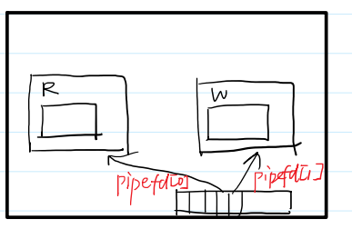

# 进程间通信 IPC
在多个进程之间，如果需要进行通信的话，隔离特性会造成一些通信的障碍。所以我们需要一些手段来跨越隔离，实现进程间通信。
- 打破进程间的隔离，从而进程间可以共享数据

- **管道**
- 共享内存(难)
- 信号量(难)
- 消息队列
- **信号**

## 管道


1. 有名管道：在文件系统中存在一个管道文件
2. 匿名管道：在文件系统中不存在
   1. 只用于父子进程间

### popen (用的很少)
先使用 fork 创建一个子进程，父子进程之间用**管道**(两端是文件流)连接在一起
> 3号 库函数 跨平台 效率不高
> popen 库函数会首先使用 fork 创建一个子进程，并且在父子进程之间创建一根管道用于通信，然后调用 exec 执行command。command表示子进程要执行的shell命令。

```C
FILE *popen(const char *command, const char *type);
int pclose(FILE *stream);
```
> type:
> "w":父进程可写入FILE；子进程读(把自己的STDIN 重定向为管道)
> 
> "r":父进程可读取FILE;子进程写(把自己的STDOUT 重定向为管道)

### pipe 系统调用(无名管道)

数组名做参数，长度是2 的int数组的数组名
int pipe(int pipefd[2]);

pipe在内核态见两个对象，两个文件描述符描述它，对应管道读端(pipefd[0])和写端(pipefd[1])


自言自语，从1写入后自然而然从0读出来

#### 先pipe再fork

子进程也有两个文件描述符指向这两个文件对象——子进程读写，父进程写读——实现管道双向通信
- 单工通信：

1. 父 读 子 写：子进程[1]写，自然传到[0]，父进程[0]取出——子[0]父[1]可关闭
2. 父 写 子 读：父进程[1]写，自然传到[0]，子进程[0]取出——子[1]父[0]可
关闭


- 全双工：

消息打印的顺序是固定的 同步的——(read的阻塞导致)


### 有名管道的函数

1. mkdifo创建
2. unlink删除
3. rename改变名字/位置
4. link创建新的硬链接


## 共享内存
效率最高的(多)进程间通信——极端需要效率时使用

让两个虚拟内存的地址空间映射到同一片物理内存
改p1的虚拟页内存—>物理页修改->p2……pn的虚拟页随之修改


### 例子

- 库文件 经常使用共享内存
> lsof 展示所有打开的库文件


### System V的共享内存机制
> 介绍性为主
内核使用一个非负整数**键**来区分不同的共享内存区域（或者是信号量或消息队列）。服务端进程和客户端进程可以使用**同一个键来定位**共享内存段**进行通信**。键可以手动指定，也可以使用接口 ftok 生成。

#### ftok
```C
key_t ftok(const char *pathname, int proj_id);

#include <func.h>
int main(int argc, char *argv[])
{
ARGS_CHECK(argc,2);
key_t key = ftok(argv[1],1);//调用 随机key
ERROR_CHECK(key,-1,"ftok");
printf("key = %d\n", key);
return 0;
}
```
> key 多个进程找到同一个身份(key)
> **项目描述符填1就好**
> 文件相同，项目相同 ——key相同 不变

- ipcs命令    来查看这些IPC的信息
```S
$ipcs
# key shmid owner perms bytes nattch status
# 键 描述符 拥有者 权限 占据空间 连接数 状态
$ipcs -l
# 查看各个IPC的限制
$ipcrm -m shmid
# 手动删除

```
#### shmget 创建共享内存
使用 shmget 接口可以根据键来获取一个共享内存段。
```C
int shmget(key_t key, size_t size, int shmflg);
```

> key 刚刚拿到的key
> size 分配内存的大小：一般写页大小的整数倍
> shmflg 描述生成的属性：
   > 1. IPC_CREAT 没有共享内存段时创建共享内存段
   >
   > 2. 权限问题 IPC_CREAT | 0600

- 创建共享内存最终代码


#### shmat / shmdt  

- 把共享内存加载到虚拟内存空间及从虚拟内存回收
- 


- 基本使用


> 默认会把内存全部设为0 ；
> 第一次执行//内容 
> 第二次注释掉。第二次执行后面，可以输出——说明可以实现了共享内存

- 私有共享内存


> IPC_PRIVATE 相当于0 每次创建新的件键
> 只能父子间使用(上例：子进程拿到父进程的消息)


- 竞争条件

出现数据操作丢失现象：


两个进程并发地访问共享资源

两个进程看到的内存是一样的，如果时间片用完，切到另一个进程，如下：


> 由于进程的切换导致加的次数变少了


#### 上半部作业


答案：


#### shmctl

```C
int shmctl(int shmid, int cmd, struct shmid_ds *buf);
/*
违背了单一职责原则：屎山
*/
```
> - cmd:
>     - IPC_STAT: 获取状态
>     - IPC_SET： 修改状态(要先STAT再改，因为要用到struct shmid_ds *buf要先STAT加载进去)
>     - IPC_RMID ： 删除共享内存(不是直接删除)——标记共享内存段标记为待删除，所有进程都解除链接时就删除，且不能再attach

```C
struct shmid_ds   // 状态
{
    struct ipc_perm shm_perm; /* Ownership and permissions */
    size_t shm_segsz;         /* Size of segment (bytes) */
    time_t shm_atime;         /* Last attach time */
    time_t shm_dtime;         /* Last detach time */
    time_t shm_ctime;         /* Last change time */
    pid_t shm_cpid;           /* PID of creator */
    pid_t shm_lpid;           /* PID of last shmat(2)/shmdt(2) */
    shmatt_t shm_nattch;      /* No. of current attaches */
    ...
};
struct ipc_perm   //权限
{
    key_t __key;          /* Key supplied to shmget(2) */
    uid_t uid;            /* Effective UID of owner */
    gid_t gid;            /* Effective GID of owner */
    uid_t cuid;           /* Effective UID of creator */
    gid_t cgid;           /* Effective GID of creator */
    unsigned short mode;  /* Permissions + SHM_DEST and
     SHM_LOCKED flags */
    unsigned short __seq; /* Sequence number */
};

```

- 使用
```C
// 获取共享内存段信息
#include <func.h>
int main()
{
    int shmid = shmget(1000, 4096, 0600 | IPC_CREAT); // key为1000 大小为4096 创建一个
    0600的共享内存 ERROR_CHECK(shmid, -1, "shmget");
    char *p = (char *)shmat(shmid, NULL, 0);
    ERROR_CHECK(p, (char *)-1, "shmat");
    struct shmid_ds stat;
    int ret = shmctl(shmid, IPC_STAT, &stat);
    ERROR_CHECK(ret, -1, "shmctl");
    printf("cuid = %d perm = %o size= %ld nattch =%ld\n", stat.shm_perm.cuid, stat.shm_perm.mode, stat.shm_segsz, stat.shm_nattch);
    return 0;
}

// 修改共享内存段的权限
#include <func.h>
int main()
{
    int shmid = shmget(1000, 4096, 0600 | IPC_CREAT);
    ERROR_CHECK(shmid, -1, "shmget");
    char *p = (char *)shmat(shmid, NULL, 0);
    ERROR_CHECK(p, (char *)-1, "shmat");
    struct shmid_ds stat;
    int ret = shmctl(shmid, IPC_STAT, &stat);
    ERROR_CHECK(ret, -1, "shmctl");
    printf("cuid = %d perm = %o size= %ld nattch =%ld\n", stat.shm_perm.cuid, stat.shm_perm.mode, stat.shm_segsz, stat.shm_nattch);
    stat.shm_perm.mode = 0666;
    ret = shmctl(shmid, IPC_SET, &stat);
    ERROR_CHECK(ret, -1, "shmctl");
    return 0;
}

// 删除共享内存
#include <func.h>
int main()
{
    int shmid = shmget(1000, 4096, 0600 | IPC_CREAT);
    ERROR_CHECK(shmid, -1, "shmget");
    char *p = (char *)shmat(shmid, NULL, 0);
    ERROR_CHECK(p, (char *)-1, "shmat");
    int ret = shmctl(shmid, IPC_RMID, NULL);
    ERROR_CHECK(ret, -1, "shmctl");
    sleep(20);
    shmdt(p);
    return 0;
}


```

### 虚拟内存和物理内存的转换

按页划分，固定大小

页内偏移和页号：虚拟地址和物理地址对应的时候最后12位是相同的(页内偏移转化时不变 )


#### 减少页表的大小-分级页表

- 原理：局部性原理
首先，创建一个小**页表**，页表中存在1024个页表项（对应虚拟地址的中间10位），如果每个页表项需要4个字节存储，那么这个页表需要占据4096字节也就是一页的空间，这样整个页表可以映射1024个页面；然后，创建一个**页目录表**，页目录表当中存储每个页表所在页的页表项，即页目录表项，共需要1024项（对应虚拟地址的高10位）。


#### 页表每个进程一个
- 原因：不同进程虚拟地址物理地址映射关系不同

- 进程切换的代价：
  - 切换上下文(寄存器状态PC)
  - 切换页表

- 父子进程fork 写时复制
  - 未写入时共用一个页表
  - 若发生写入，子进程新建页表，出发缺页异常(没有物理页)，足够后分配物理页


## 信号量sem(介绍)

是一种互斥机制(system V版本)，/信号灯，控制什么时候信号可以走

是一个整数：描述资源的个数(>0 绿灯 ； <=0红灯)


分类：
- 计数信号量(用得少)
- 二元信号量：资源只有两种可能性(0/1)
  - P操作：测试并加锁
    - 检查信号量sem值：若>0 --sem； 若sem<=0 等待
    - 两个操作不可分割 ：是一种原语——需要硬件配合
  - V操作：解锁 ++sem

临界区： 被PV进程保存起来的代码片段(越小越好)
```
P
P[0]++
V
```

#### 利用信号量保护共享资源

system V信号量是一个信号量集合(整数数组)

1. 创建信号量semget
```C
int semget(key_t key, int nsems, int semflg);

//调用
int semArrid = semget(1000,1,IPC_CREAT|0600);
ERROR_CHECK(semArrid,-1,"semget");
```
> nsems参数表示集合中总共有多少个信号量值，semflg参数和 shmget 函数一致。

2. 设置初始资源值semctl
```C
int semctl(int semid, int semnum, int cmd, ...);
//根据cmd的不同有不同的参数

//1. cmd = SETVAL
//semnum是数组下标0~nsems-1
//第四个参数选int的
```


```C
//2. cmd = GETVAL
```


- 调用


#### 实现PV操作

P操作：测试并枷锁
    sem<=0 阻塞
    sem>0 --sem
V操作：解锁
    +sem

1. 定义PV操作

2. 调用PV操作


```C
#include <func.h>
#define N 10000000
int main()
{
    int semArrid = semget(1000, 1, IPC_CREAT | 0600);
    ERROR_CHECK(semArrid, -1, "semget");
    int ret = semctl(semArrid, 0, SETVAL, 1);
    ERROR_CHECK(ret, -1, "semctl");


    struct sembuf P;
    P.sem_num = 0;        // 信号量值在集合中的下标
    P.sem_op = -1;        // 信号量值修改
    P.sem_flg = SEM_UNDO; // 如果P操作被终止，会自动恢复
    struct sembuf V;
    V.sem_num = 0;
    V.sem_op = 1;
    V.sem_flg = SEM_UNDO;
    int shmid = shmget(1000, 4096, IPC_CREAT | 0600);
    int *p = (int *)shmat(shmid, NULL, 0);
    p[0] = 0;
    if (!fork())
    {
        for (int i = 0; i < N; ++i)
        {
            semop(semArrid, &P, 1);
            ++p[0];
            semop(semArrid, &V, 1);
        }
        exit(0);
    }
    else
    {
        for (int i = 0; i < N; ++i)
        {
            semop(semArrid, &P, 1);
            ++p[0];
            semop(semArrid, &V, 1);
        }
        wait(NULL);
        printf("p[0] = %d\n", p[0]);
    }
    return 0;
} // 如果程序的执行速度太慢，可以使用top检查进程执行状态


```
#### 更高精度的时间统计 gettimeofday

```C
int gettimeofday(struct timeval *tv, struct timezone *tz);
struct timeval {
time_t tv_sec; /* seconds */
suseconds_t tv_usec; /* microseconds */
};
```

- 统计结果


> 信号量速度慢


#### semctl 细讲


```C


```

#### 计数信号量

