# 线程

- 为什么还需要线程？

1. 进程需要切换
CPU寄存器要切换、虚拟地址和物理地址的映射要切换，即：上下文切换、页表切换
2. 进程间通信麻烦

## 概述

### 线程 轻量级的进程

1. 线程是一个正在执行的程序
2. 同一个进程存在多个线程，多个线程共享内存资源

**tips1：**
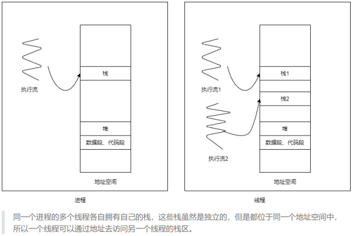
- 线程也会有上下文状态：内含PC指针和STACK指针
- 同一个进程的多个线程
  - 数据段、代码段共享，
  - 为了避免彼此影响，会有自己的栈(保证函数调用等不会干扰)

**tips2：**

1. 用户级线程：调度由进程自己分配
2. 内核级线程：调度由OS分配

- CPU调度以线程为单位，之前的进程可以看成单线程进程

- 在linux中，进程控制块和线程控制块一样，每个进程和线程都有自己的task_struct ， (区分：看是否独占地址空间)
- linux中，需要先创建进程，在进程内创建线程

1. 减少了上下文切换的代价(跟地址转换有关的都不用变了)
2. 不需要页表切换
3. 同一进程内部的线程通信简单(彼此都是共享内存)

> 在Linux文件系统中，路径 /proc 挂载了一个伪文件系统，通过这个伪文件系统用户可以采用访问普通文件的方式（使用read系统调用等），来访问操作系统内核的数据结构。其中，
> 在 /proc/[num] 目录中，就包含了pid为num的进程的大量的内核数据。
> 而在 /proc/[num]/task 就包含本进程中所有线程的内核数据。我们之前的编写进程都可以看成是单线程进程。

**tips3:**
链接时要加上 -pthread ， 否则会报错链接错误


### 线程库的历史

NPTL 从用户态1：1复刻到内核态

### 多线程下不能使用perror

- 一个典型的报错
- 
- 1. return -1
- 2. 修改**全局变量**errno ，打印错误字符串
  - errno依赖的内存在数据段，多线程共享
  - 所以存在竞争条件，并发访问的问题

- 栈是独享的：**多线程用返回值的数值(在栈上)来确定报错的类型**

可以使用`char *strerror(int errno)` 将返回值转换为字符串类型

```C
#define THREAD_ERROR_CHECK(ret, msg)                       \
    {                                                      \
        if (ret != 0)                                      \
        {                                                  \
            fprintf(stderr, "%s%s\n", msg, strerror(ret)); \
        }                                                  \
    }
```

## 线程的创建和终止

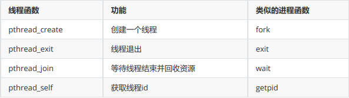

### 创建子线程

一启动进程，就创建了主线程.栈区从main开始压栈

主线程中执行**pthread_create**函数，创建子进程

```C
//1. 创建子线程
int pthread_create(pthread_t *thread, const pthread_attr_t *attr,void *(*start_routine) (void *), void *arg);
//线程id， 线程属性 默认NULL， 线程启动函数(参数和返回值类型都是void*) 其地位：子线程的main函数， 传给start_routine的参数

//2. 获取子线程的线程id
pthread_self()；
```

- 调用

```C
#include<43func.h>
void *threadFunc(void *arg){
    printf("i am child therad, tid = %lu\n",pthread_self());
}
int main(){
    printf("i am main therad , tid = %lu\n",pthread_self());
    pthread_t tid;
    pthread_create(&tid,NULL,threadFunc,NULL);
    sleep(1);
    return 0;
}
```

**主线程终止，整个进程终止**

- 如果注释掉sleep(1)，只打印主线程信息
- 如果改为usleep(20)，可能两行可能三行

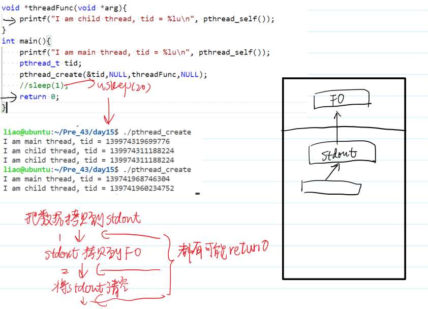

### 创建最多个线程并使用错误检查

- 可以创建的线程数跟栈区大小有关，受限于虚拟内存大小
```C
#include <43func.h>
void * threadFunc(void *arg){
    //printf("I am child thread, tid = %lu\n", pthread_self());
    while(1){
        sleep(1);
    }
}
int main(){
    pthread_t tid;
    for(int i = 0;;++i){
        int ret = pthread_create(&tid,NULL,threadFunc,NULL);
        THREAD_ERROR_CHECK(ret,"pthread_create");
        if(ret != 0){
            printf("i = %d\n", i);
            break;
        }
    }
}
```
### 代码检测线程的特性

#### 线程是并发执行的

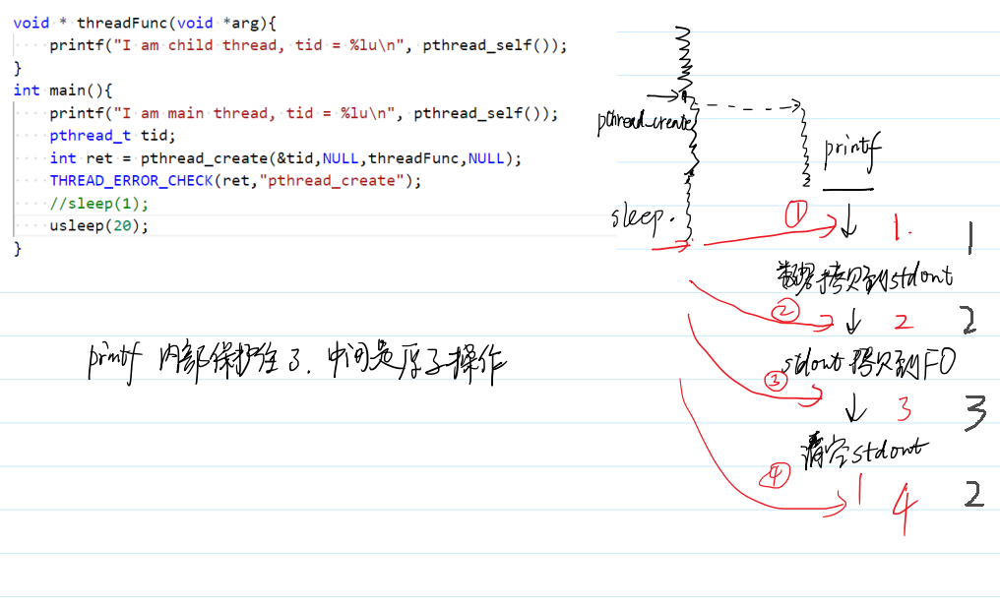

#### 多线程是共享内存地址空间

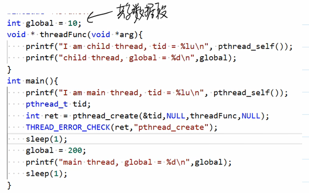

#### 多线程共享堆空间

更好的实现方式传递参数：
pthread_create(tid,NULL,threadFunc,____)

> 需要多次指针类型转换。

```C
#include <43func.h>
void * threadFunc(void *arg){
    printf("I am child thread, tid = %lu\n", pthread_self());
    int *pHeap = (int *)arg;
    *pHeap = 100;
    printf("child thread, *pHead = %d\n", *pHeap);
}
int main(){
    printf("I am main thread, tid = %lu\n", pthread_self());
    int *pHeap = (int *)malloc(sizeof(int));
    *pHeap = 0;
    pthread_t tid;
    int ret = pthread_create(&tid,NULL,threadFunc,(void *)pHeap);
    THREAD_ERROR_CHECK(ret,"pthread_create");
    sleep(1);
    printf("main thread, *pHead = %d\n", *pHeap);
}
```

### void *可以当指针用也可以当long用

- 多线程的栈区是相对独立的
- 一个线程可以通过地址去访问另一个线程的栈区

#### 多线程之间传递一个整数

- 传递：传长整型
直接传递一个long类型——**干脆把void*当整型long来用**

```C
#include <43func.h>
void * threadFunc(void *arg){
    long i = (long) arg;//把arg转回long类型
    printf("I am child thread, tid = %lu, i = %ld\n", pthread_self(), i);
}
int main(){
    pthread_t tid;
    long i = 1;
    int ret = pthread_create(&tid,NULL,threadFunc,(void *)i);//把long类型转为void *
    THREAD_ERROR_CHECK(ret,"pthread_create");
    i = 2;//主线程改变id
    ret = pthread_create(&tid,NULL,threadFunc,(void *)i);
    THREAD_ERROR_CHECK(ret,"pthread_create");
    printf("I am main thread, tid = %lu, i = %ld\n", pthread_self(), i);
    sleep(2);
}
```
> 这种方式只是传递数据，不会共享
> 主线程改变，子线程不跟着变


#### 多线程之间共享一个整数

- 共享：传指针
```C
#include <43func.h>
void * threadFunc(void *arg){
    long *pi = (long *) arg;//解引用
    printf("I am child thread, tid = %lu, i = %ld\n", pthread_self(), *pi);//解引用
}
int main(){
    pthread_t tid;
    long i = 1;
    int ret = pthread_create(&tid,NULL,threadFunc,(void *)&i);//取地址
    THREAD_ERROR_CHECK(ret,"pthread_create");
    i = 2;
    ret = pthread_create(&tid,NULL,threadFunc,(void *)&i);
    THREAD_ERROR_CHECK(ret,"pthread_create");
    sleep(2);
}
```

### 线程的终止

1. 调用之前学的进程终止都会导致整个进程终止，其中的所有线程终止
   1. main 里return
   2. exit
   3. _exit/_Exit
   4. abort
   5. 收到信号
2. 子线程如何只终止自己
   1. 从threadFunc中return (return NULL)(1尽量不要用这个)
   2. 任意位置调用`void pthread_exit(void *retval);`，其中参数为子进程的返回值


#### pthread_join 等待线程终止

调用 pthread_join 可以**使本线程处于等待状态，直到指定的 thread 终止**，就结束等待，并且捕获到的线程终止状态存入 retval 指针所指向的内存空间中。
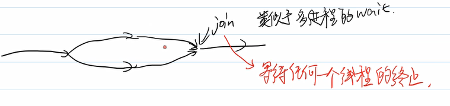
```C
int pthread_join(pthread_t thread, void **retval);
//目标线程的tid，不是一个指针；

//因为线程的终止状态是一个 void * 类型的数据
//调用join 想修改主调函数的void* ，所以间接修改、传递地址
```
- join和exit 的例子

```C
#include<43func.h>
void *threadFunc(void *arg){
    printf("i am child therad, tid = %lu\n",pthread_self());
    //return (void *) 10;
    pthread_exit((void *)234);
}
int main(){
    printf("i am main therad , tid = %lu\n",pthread_self());
    pthread_t tid;
    int ret = pthread_create(&tid,NULL,threadFunc,NULL);
    THREAD_ERROR_CHECK(ret,"pthread_create");
    /*
    写法1：
    long retval;//主线程申请8字节空间
    pthread_join(tid,(void **)&retval);//取地址传进去
    //主线程要拿&retval所指的内存空间存储子线程的返回值
    printf("retval = %ld\n",retval);
    */

    /*写法2：
    void *retval;
    pthread_join(tid,&retval);
    printf("retval = %ld\n",(long) retval);
    */

    //如果不想获取子线程的终止状态,阻塞线程知道tid线程终止
    //修改子线程return 变成exit
    pthread_join(tid,NULL);
    return 0;
}    
```
> 在使用 pthread_join 要特别注意参数的类型， thread 参数是不需要取地址的，如果参数错误，有些
情况下可能会陷入无限等待，还有些情况会立即终止，触发报错。
> 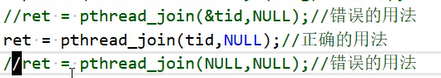

## 线程的取消和资源清理

### 线程的取消

- 多线程和信号不能同时使用
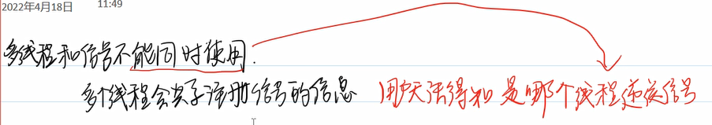

- 应该使用pthread_cancel 类似信号

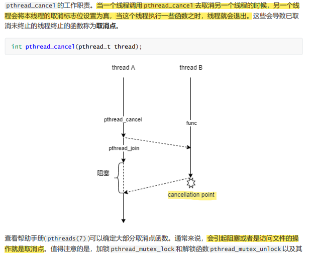

- 取消点：
man 7 pthreads
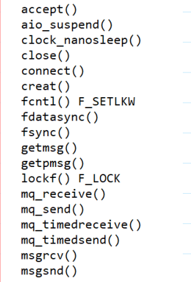

总结：
1. 操作文件的
2. 可能引发阻塞的(pthread_mutex_lock加锁 不是取消点)
3. 一般库函数都是(比如printf)

#### 取消成功的例子

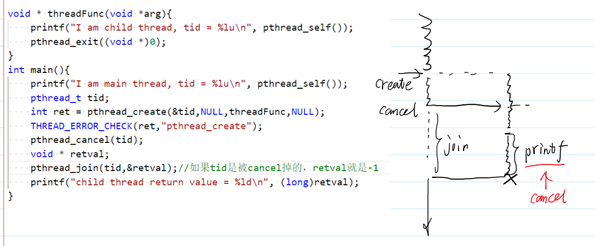


#### 取消失败

在子线程中加入while(1){}让它无法到达取消点

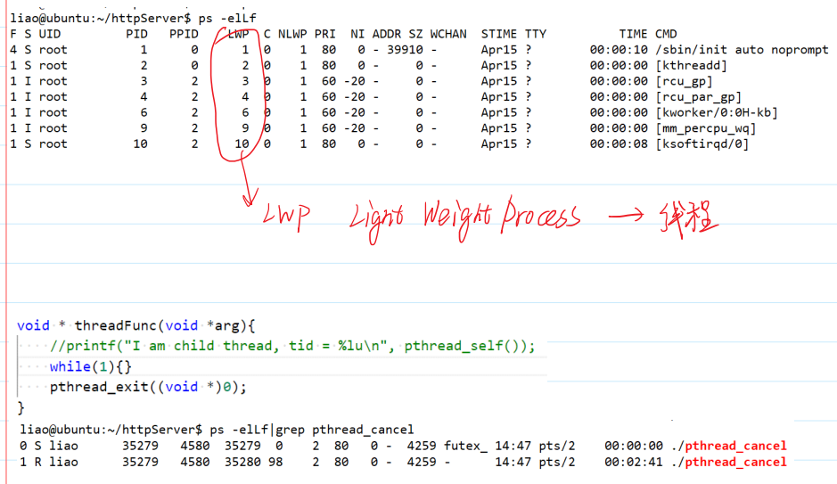


#### 手动增加取消点

```C
void pthread_testcancel(void);
```

- 调用

```C
void * threadFunc(void *arg){
    //printf("I am child thread, tid = %lu\n", pthread_self());
    while(1){
        pthread_testcancel();
    }
    pthread_exit((void *)0);
}
```


#### 取消流程总结

- cancel不是立刻中止另一个线程

1. cancel会立刻修改目标线程的取消标志位；
2. 目标线程运行到一些特殊的函数(取消点)；
3. 取消点函数调用完成前会终止线程(异步终止，有可能造成资源泄露)
    可能的资源泄露：
    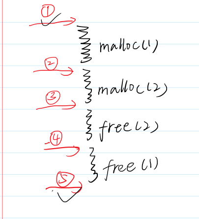
    或者锁

4. 机制：在23中间，运行线程终止清理函数。(栈结构管理)

### 资源清理栈
线程库引入了 pthread_cleanup_push 和 pthread_cleanup_pop 函数来管理线程主动或者被动终止时所申请资源（比如文件、堆空间、锁等等）。
```C
void pthread_cleanup_push(void (*routine)(void *), void *arg);
void pthread_cleanup_pop(int execute);

```
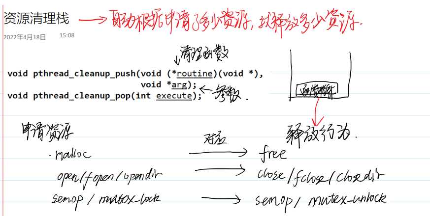

- 申请资源后，把对应的释放行为压栈(pthread_cleanup_push);

- 这个栈会在下列情况下弹出：
  - 线程**因为取消而终止**时。
  - 线程调用**pthread_exit**。
  - 线程**主动调用 pthread_clean_pop** 
    -  execute 参数非0时，弹出栈顶的清理函数并执行。
    - execute 参数为0时，弹出栈顶的清理函数不执行。
- 当线程在 **start_routine 中执行return语句**而终止的时候，清理函数**不会弹栈**！


**包装资源清理函数**

```C
int close(int fd);
//包装为：
void cleanup(void *arg){
    int *p = (int *)arg;
    close(*p);
}

```

#### clean_up 的基本使用
- pthread_cleanup_push(clean1,p1);
- pthread_cleanup_pop(1);

```C
#include <43func.h>
void clean1(void *arg){
    printf("I am clean1\n");
    free(arg);
}
void clean2(void *arg){
    printf("I am clean2\n");
    free(arg);
}
void * threadFunc(void *arg){
    printf("I am child thread, tid = %lu\n", pthread_self());
    int *p1 = malloc(4);//申请资源后马上将对应的清理行为压栈
    pthread_cleanup_push(clean1,p1);
    int *p2 = malloc(4);
    pthread_cleanup_push(clean2,p2);
    //return NULL;
    //pthread_cleanup_pop(1);
    //pthread_cleanup_pop(1);
    //sleep(1);
    int i;
    pthread_cleanup_pop(0);
    pthread_cleanup_pop(0);
    //i = 1;
    pthread_exit(NULL);
}
int main(){
    printf("I am main thread, tid = %lu\n", pthread_self());
    pthread_t tid;
    int ret = pthread_create(&tid,NULL,threadFunc,NULL);
    THREAD_ERROR_CHECK(ret,"pthread_create");
    pthread_join(tid,NULL);
}
```

#### push和pop必须成对出现

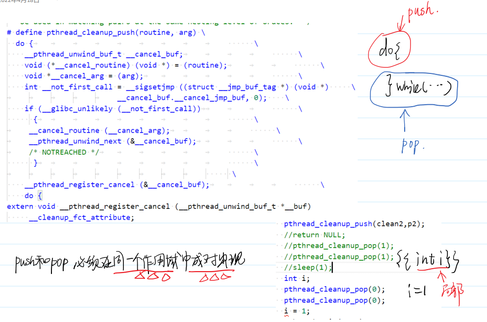

#### 整理一下资源清理

-  **clean up的目的**： 线程无论在什么时候终止，都会根据申请的资源进行合理的释放行为。
-  **核心数据结构**：清理函数栈
-  1. 每次申请资源后，把清理操作入栈
-  2. 弹栈的时机：
   -  pthread_exit和pthread_cancel 按FIFO全弹出
   -  pthread_cleanup_pop 弹一个(参数填正数)
   -  不要用return
-  push和pop成对出现
-  有了pop不要手动回收资源


## 互斥锁的引入

### 线程存在竞争条件

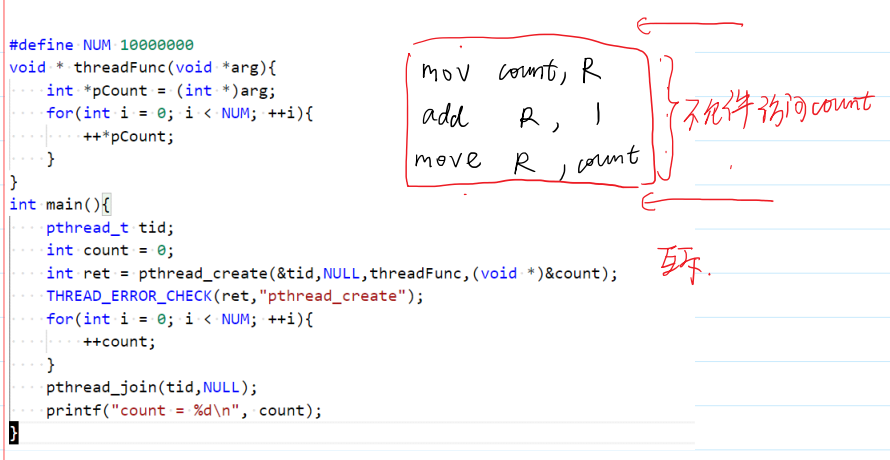
> 希望进程运行时互相排斥

### mutex互斥锁

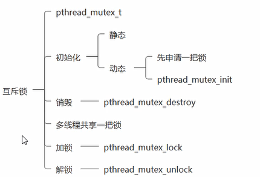
线程可以加锁，多线程共享一把锁。
1. 当一个线程持有锁的时候，其余线程再尝试加锁时（包括自己再次加锁），会使自己陷入阻塞状态，直到锁被持有线程解锁才能恢复运行。所以锁在某个时刻永远不能被两个线程同时持有。
2. 若未加锁，加锁，线程继续运行。

- 谁加锁，谁解锁！

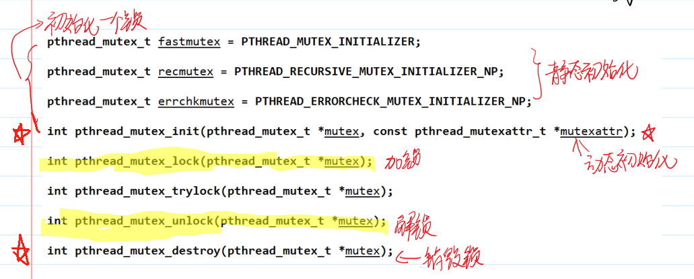

- 调用
> 1. 封装共享资源
> 2. void* 只是桥梁
> 3. 临界区所有共享资源的访问都要放在临界区
> 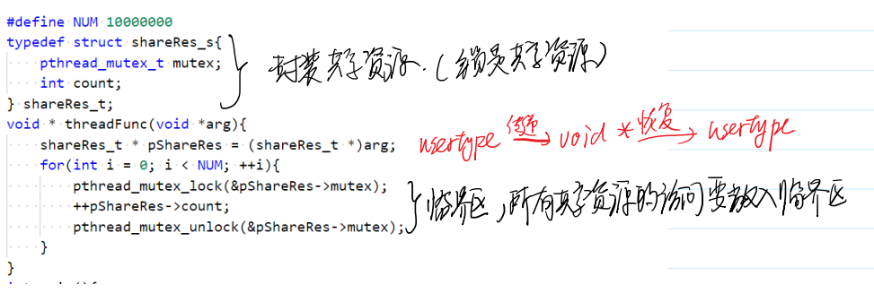
```C
#include <43func.h>
#define NUM 10000000
typedef struct shareRes_s{//封装共享资源
    pthread_mutex_t mutex;
    int count;
} shareRes_t;
void * threadFunc(void *arg){
    shareRes_t * pShareRes = (shareRes_t *)arg;
    for(int i = 0; i < NUM; ++i){
        pthread_mutex_lock(&pShareRes->mutex);
        ++pShareRes->count;
        pthread_mutex_unlock(&pShareRes->mutex);
    }
}
int main(){
    //pthread_mutex_t mutex = PTHREAD_MUTEX_INITIALIZER;//静态初始化
    //pthread_mutex_t mutex;
    //pthread_mutex_init(&mutex,NULL);//如果第二个参数是NULL，表示以默认形式初始化锁
    //pthread_mutex_destroy(&mutex);
    shareRes_t shareRes;
    shareRes.count = 0;
    pthread_mutex_init(&shareRes.mutex,NULL);
    pthread_t tid;
    struct timeval timeBeg,timeEnd;//
    gettimeofday(&timeBeg,NULL);//初始时间
    int ret = pthread_create(&tid,NULL,threadFunc,(void *)&shareRes);
    THREAD_ERROR_CHECK(ret,"pthread_create");
    for(int i = 0; i < NUM; ++i){
        pthread_mutex_lock(&shareRes.mutex);
        ++shareRes.count;
        pthread_mutex_unlock(&shareRes.mutex);
    }
    pthread_join(tid,NULL);
    gettimeofday(&timeEnd,NULL);//结束时间
    printf("total time = %ld us\n",
     1000000*(timeEnd.tv_sec - timeBeg.tv_sec) + timeEnd.tv_usec - timeBeg.tv_usec);//总运行时间
    printf("count = %d\n", shareRes.count);
    pthread_mutex_destroy(&shareRes.mutex);
}

```


### 死锁

线程阻塞：等待永远不可能为真的条件成立

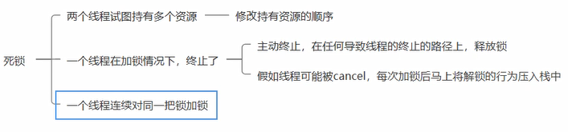

- 之前的死锁：
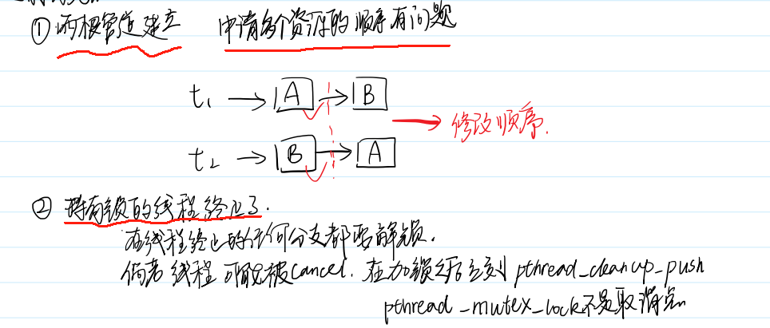

- 第三种：

一个线程对同一把锁加锁两次
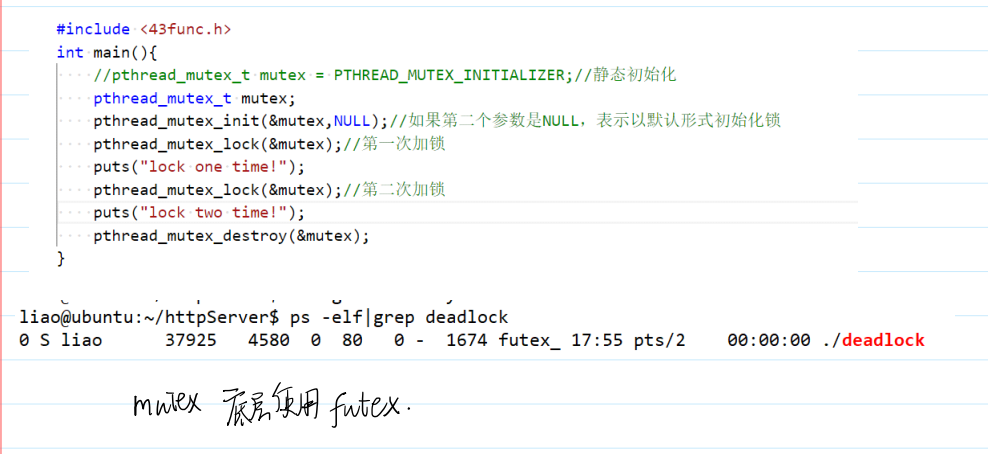

### mutex 底层实现原理
三种锁：
- mutex 互斥睡眠锁
- relock 读写锁(读操作不需要加锁，写操作加锁)不对称的锁
- spin 自旋锁(加锁如果已经持有锁时，不会睡眠而是执行while(1)死循环) 
  - 如果条件马上就会就绪，这个好

mutex——依赖——（底层）futex自旋锁


### 锁和二元信号量

锁和二元信号量几乎无差别

差别在用法上：

锁：谁加锁谁解锁
PV ：可以不同进程PV

### 解决第三种死锁
一个线程对同一把锁加锁两次

- 上策：不写这种代码
- 中策：非阻塞加锁 trylock
- 下策：修改锁的属性

#### trylock的基本使用

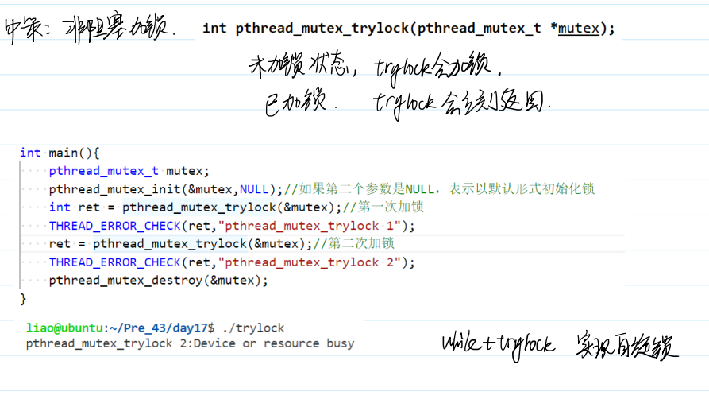

#### trylock可能导致活锁

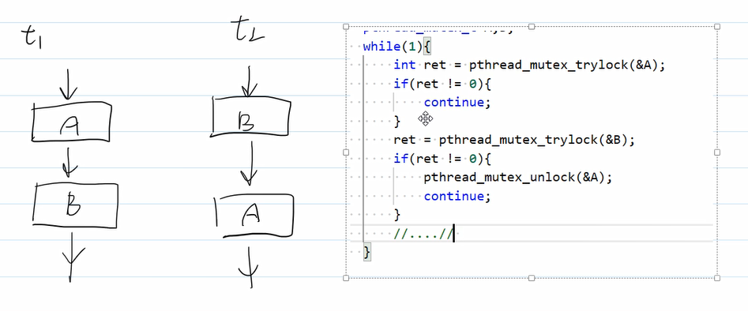

避免：让任意一个线程执行一个操作后sleep随机时间；或不管他，可能自己解掉。

#### 修改锁的属性
锁的属性同样先创建类型，init,使用后destory.

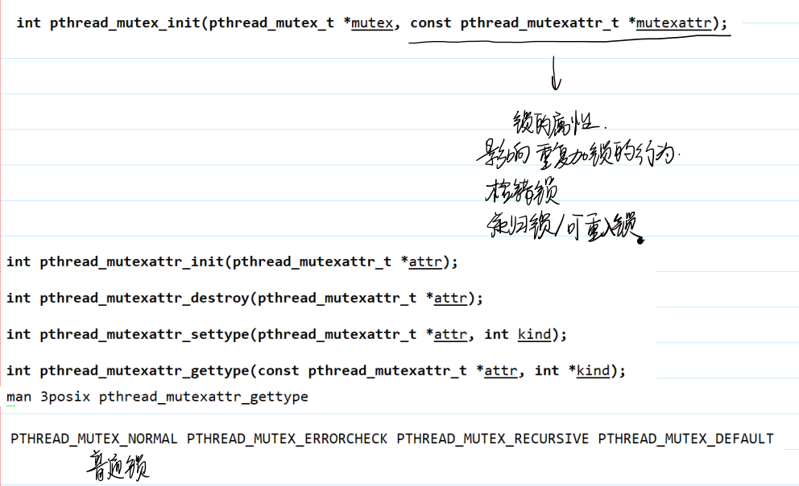

- 使用
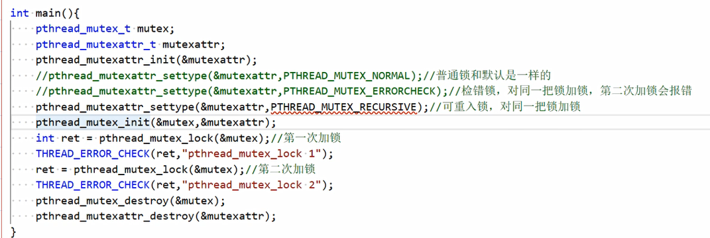

- 可重入锁的特点：
- 一个线程对同一把锁重复加锁，只是增加了锁的引用计数——加了几次锁就解几次
- 其余线程只有在锁的引用计数为0 的时候才能加锁
## 使用锁实现火车票卖票

### 初版

```C
#include <43func.h>
typedef struct shareRes_s
{
    int trainTicket;       // 火车票数量
    pthread_mutex_t mutex; // 锁
} shareRes_t;              // 共享的火车票资源
void *sellTicket1(void *arg)
{
    shareRes_t *pShareRes = (shareRes_t *)arg;
    while (pShareRes->trainTicket > 0)//对共享资源的访问没有处于锁的保护下
    {
        pthread_mutex_lock(&pShareRes->mutex);
        printf("before 1 sell ticket,num = %d\n", pShareRes->trainTicket);
        --pShareRes->trainTicket;
        printf("after 1 sell ticket,num = %d\n", pShareRes->trainTicket);
        pthread_mutex_unlock(&pShareRes->mutex);
        //sleep(1);
    }
}
void *sellTicket2(void *arg)
{
    shareRes_t *pShareRes = (shareRes_t *)arg;
    while (pShareRes->trainTicket > 0)//对共享资源的访问没有处于锁的保护下
    {
        pthread_mutex_lock(&pShareRes->mutex);
        printf("before 2 sell ticket,num = %d\n", pShareRes->trainTicket);
        --pShareRes->trainTicket;
        printf("after 2 sell ticket,num = %d\n", pShareRes->trainTicket);
        pthread_mutex_unlock(&pShareRes->mutex);
        //sleep(1);
    }
}

int main()
{
    shareRes_t shareRes;
    shareRes.trainTicket = 2000;
    pthread_mutex_init(&shareRes.mutex, NULL);
    pthread_t tid1, tid2;
    pthread_create(&tid1, NULL, sellTicket1, (void *)&shareRes);
    pthread_create(&tid2, NULL, sellTicket2, (void *)&shareRes);
    pthread_join(tid1, NULL);
    pthread_join(tid2, NULL);
    pthread_mutex_destroy(&shareRes.mutex);
}

```

> 有问题：while (pShareRes->trainTicket > 0)//对共享资源的访问没有处于锁的保护下——可能卖出负数的票
>
> 过程：当ticket是1 的时候，t1，t2都可以进入while，然后多卖了一张票
>
> 

### 改进—把while纳入锁的保护

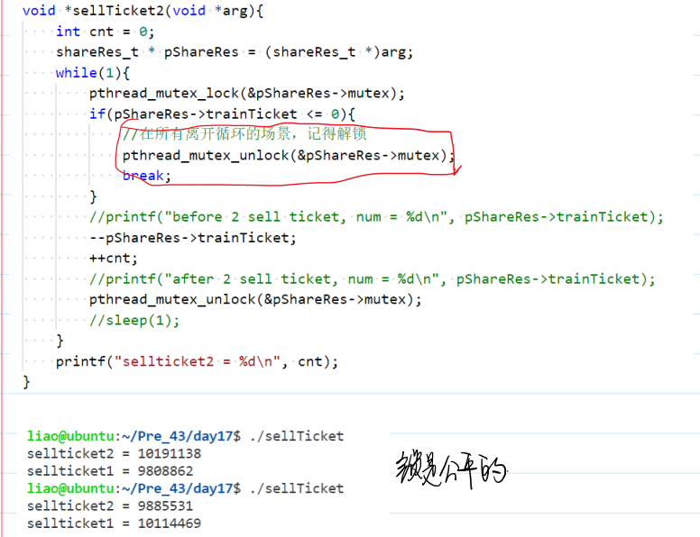


## 同步
(事件执行顺序固定)
### 利用mutex实现同步
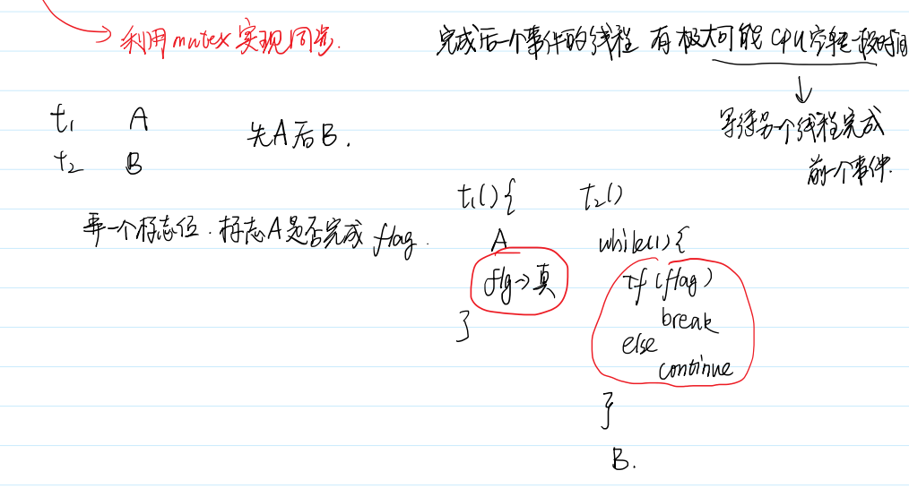

- 代价：浪费CPU资源

### *****条件变量

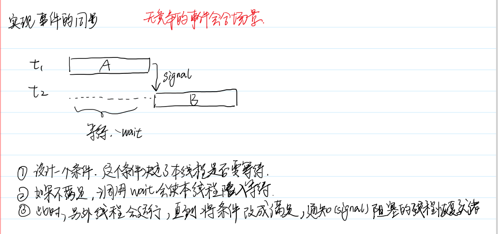

#### 条件变量的接口

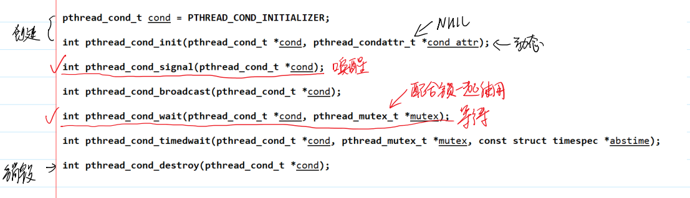


#### 条件变量的一般流程

```C
#include <43func.h>
typedef struct shareRes_s{
    int flag;
    pthread_cond_t cond;
    pthread_mutex_t mutex;
} shareRes_t;
void * threadFunc(void *arg){
    shareRes_t * pShareRes = (shareRes_t *)arg;

    //先加锁
    pthread_mutex_lock(&pShareRes->mutex);
    //只有在加锁的状态下，才能够使用wait
    if(pShareRes->flag == 0){
        pthread_cond_wait(&pShareRes->cond,&pShareRes->mutex);    
    }
    //从wait中唤醒的话，说明前面的事件已经完成了
    puts("world");
    //记得解锁
    pthread_mutex_unlock(&pShareRes->mutex);

    pthread_exit(NULL);
}
int main(){
    //初始化锁和条件变量
    shareRes_t shareRes;
    pthread_mutex_init(&shareRes.mutex,NULL);
    pthread_cond_init(&shareRes.cond,NULL);
    shareRes.flag = 0;
    //创建一个子线程
    pthread_t tid;
    pthread_create(&tid,NULL, threadFunc, (void *)&shareRes);

    sleep(1);
    pthread_mutex_lock(&shareRes.mutex); 
    //先执行一个事件，然后唤醒等待在条件变量上的某个线程
    puts("Hello");
    shareRes.flag = 1;
    pthread_cond_signal(&shareRes.cond);
    sleep(1);
    pthread_mutex_unlock(&shareRes.mutex);

    //收尾工作 等待子线程的终止，销毁锁和条件变量
    pthread_join(tid,NULL);
    pthread_cond_destroy(&shareRes.cond);
    pthread_mutex_destroy(&shareRes.mutex);
}
```


