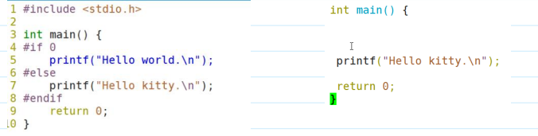
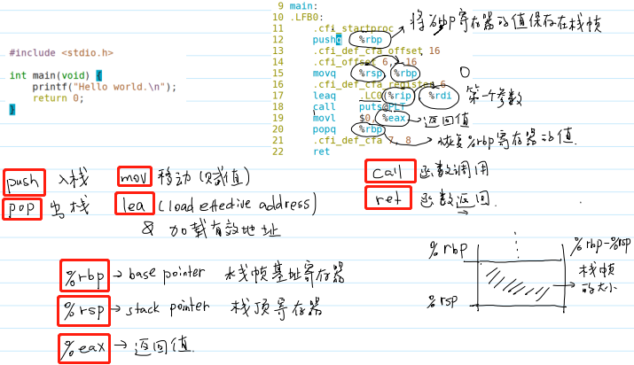
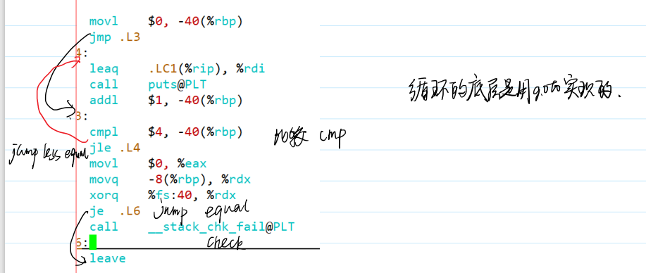

## 编译工具链
(难度高但不是特别重要)

### 1.预处理
1. #inclulde 文件包含
2. 宏定义（尽量用const、enum替换）
3. 宏函数（尽量用inline函数替换）

**linux下指令**：gcc -E hello.c -o hello.i
> -E 预处理指令
> -o 生成文件名

- 宏开关：
   1. #if #else #endif

   2. #ifdef N    #else   #endif
   
   3. #ifndef N   #else   #endif    (.h文件用的多，防卫式声明：如果没有包含该头文件，xxx【详见侯捷上笔记】)

### 2.编译

C语言a.i-->汇编代码a.s

**linux下指令**:
    gcc -S hello.i -o hello.s(可以从预处理后文件再编译)
    gcc -S hello.c -o hello.s(可以一步到位)

- x86架构 8086 数据总线16位  地址总线20位
- 一个字长：word 16位
- l：long word 32 bits
- q:quadra 64 bits

展开48字节的栈帧：
类型信息和变量名都在变异过程中被抹除掉：编程内存位置和字节长度
func调用，因为可能在不同文件里，这样就不知道内存位置。先假装已经调用了，等到链接过程再真正调用

### 3. 汇编
将汇编语言-->机器语言

