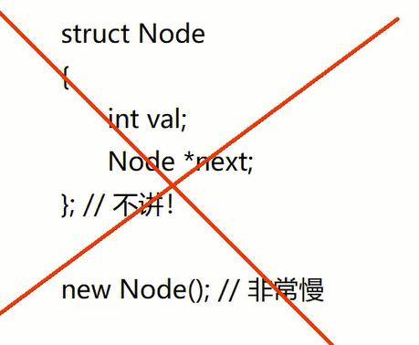

# AcWing《算法基础课》第2章 数据结构

## 单链表


动态链表太慢，面试用。

笔试：用数组模拟：邻接表（存储树和图）


**模板：**

```C
int e[N], ne[N]; // 链表元素、下个结点的地址
int head;       // 头结点地址（下标）
int idx;        // 可用位置

/** 创建含头结点的单链表 */
void init() {
    head = 0;

    // 头结点
    e[0] = 0;       // 值为链表长度
    ne[0] = -1;     


    idx = 1;        // 第1个结点的下标从1开始
}

/** 向链表头部插入一个数 */
void insert_head(int x) {
    e[idx] = x;
    ne[idx] = ne[head];
    ne[head] = idx;
    idx++;

    e[0]++;     // 链表长度+1
}

/** 删除下标为k后面的数 */
void rem(int k) {
    ne[k] = ne[ne[k]];
    e[0]--;     // 链表长度-1
}

/** 在下标为k的位置后插入一个数 */
void insert(int k, int x) {
    e[idx] = x;
    ne[idx] = ne[k];
    ne[k] = idx;
    idx++;

    e[0]++;     // 链表长度+1
}

/** 遍历链表 */
void print() {
    for (int i = ne[head]; i != -1; i = ne[i]) cout << e[i] << " ";
} 
```

**说明：**

*   采用含**头结点**的单链表，头结点存储链表长度
*   元素从下标`1`开始存储

## 双链表
用来优化某些问题
**模板：**

```C
const int N = 100010;
int e[N], l[N], r[N], idx;

/** 创建双链表（含头结点和尾结点） */
void init() {
    r[0] = 1;       // 头结点
    l[1] = 0;       // 尾结点
    idx = 2;
}

/** 在下标为k的结点右侧插入一个结点 */
void insert(int k, int x) {
    e[idx] = x;
    r[idx] = r[k];
    l[idx] = k;
    l[r[k]] = idx;
    r[k] = idx;
    idx++;
}

/** 删除下标为k的结点 */
void remove(int k) {
    r[l[k]] = r[k];
    l[r[k]] = l[k];
}

/** 输出 */
void print() {
    for (int i = r[0]; i != 1; i = r[i]) printf("%d ", e[i]);
} 
```

**说明：**

*   实现的双链表含**头结点**和**尾结点**，下标分别为`0`和`1`
*   `insert()`函数可根据参数的选取实现在链表任意位置插入的功能（包括头插和尾插）
*   遍历时从头结点的下一个位置开始（`r[0]`），直到遍历到尾结点（下标为`0`）

## 模拟栈

**模板：**

```C
int stk[N], tt = 0;     // tt表示栈顶

// 向栈顶插入一个数
stk[ ++ tt] = x;

// 从栈顶弹出一个数
tt -- ;

// 栈顶的值
stk[tt];

// 判断栈是否为空
if (tt) {...}       // 栈不为空 
```

**说明：**

*   栈从下标`1`开始存储元素
*   栈指针`tt`的值可表示栈的实际长度

## 模拟队列

### 普通队列

**模板：**

```C
// hh 表示队头，tt表示队尾
int q[N], hh = 0, tt = -1;

// 向队尾插入一个数
q[ ++ tt] = x;

// 从队头弹出一个数
hh ++ ;

// 队头的值
q[hh];

// 判断队列是否为空
if (hh > tt){...} 
```

**说明：**

*   `tt + 1 - hh`可表示**队列长度**

### 循环队列

**模板：**

```C
// hh 表示队头，tt表示队尾的后一个位置
int q[N], hh = 0, tt = 0;

// 向队尾插入一个数
q[tt ++ ] = x;
if (tt == N) tt = 0;

// 从队头弹出一个数
hh ++ ;
if (hh == N) hh = 0;

// 队头的值
q[hh];

// 判断队列是否为空
if (hh == tt){...} 
```

**说明：**

*   这种实现方式与普通队列方式有点区别，在这里是先存入，后`++`，故`tt`初值为`0`
*   可以把入队改成`q[tt] = x; tt = (tt + 1) % N;`，出队改成`hh = (hh + 1) % N; x = q[hh];`
*   队满判断可用`(tt + 1) % N == hh`
*   队列长度可用`(tt - hh + N) % N`求出

## 单调栈

**用途：**

为每个数找出满足如下条件的数：

*   在它左边
*   距离最近
*   比它小（大）

**模板：**

```C
int tt = 0;
for (int i = 1; i <= n; i ++ )
{
    while (tt && check(stk[tt], i)) tt -- ;
    stk[ ++ tt] = i;
} 
```

**说明：**时间复杂度由$O(n^2)$降为$O(n)$

## 单调队列

**用途：**

找出滑动窗口中的最大值（最小值）

**模板：**

```
int hh = 0, tt = -1;
for (int i = 0; i < n; i ++ )
{
    while (hh <= tt && check_out(q[hh])) hh ++ ;  // 判断队头是否滑出窗口
    while (hh <= tt && check(q[tt], i)) tt -- ;
    q[ ++ tt] = i;
} 
```

**说明：**时间复杂度由$O(nk)$降为$O(n+k)$

## KMP

**模板：**

```
// s[]是长文本，p[]是模式串，n是s的长度，m是p的长度
// 求模式串的Next数组：
for (int i = 2, j = 0; i <= m; i ++ )
{
    while (j && p[i] != p[j + 1]) j = ne[j];
    if (p[i] == p[j + 1]) j ++ ;
    ne[i] = j;
}

// 匹配
for (int i = 1, j = 0; i <= n; i ++ )
{
    while (j && s[i] != p[j + 1]) j = ne[j];
    if (s[i] == p[j + 1]) j ++ ;
    if (j == m)
    {
        j = ne[j];
        // 匹配成功后的逻辑
    }
} 
```

**说明：**

*   使用KMP算法时，起始下标为`1`
*   字符串可用`char`数组保存，读入时用`cin >> p + 1`读取，表示从下标`1`开始写入字符串
*   求`next`数组时，由于`ne[1]`初始化已经为`0`，故从`2`开始计算
*   `j == 0`表示从头开始匹配模式串，匹配时用`p[j + 1]`比较

## Trie树

**用途：**

快速存储和查找字符串集合，又称字典树

**模板：**

```
int son[N][26], cnt[N], idx;
// 0号点既是根节点，又是空节点
// son[][]存储树中每个节点的子节点
// cnt[]存储以每个节点结尾的单词数量

// 插入一个字符串
void insert(char *str)
{
    int p = 0;
    for (int i = 0; str[i]; i ++ )
    {
        int u = str[i] - 'a';           
        if (!son[p][u]) son[p][u] = ++ idx;     // 不存在结点则创建结点
        p = son[p][u];                        // 指向新结点
    }
    cnt[p] ++ ;
}

// 查询字符串出现的次数
int query(char *str)
{
    int p = 0;
    for (int i = 0; str[i]; i ++ )
    {
        int u = str[i] - 'a';
        if (!son[p][u]) return 0;
        p = son[p][u];
    }
    return cnt[p];
} 
```

**说明：**

*   Trie树共享前缀，结点存在不代表根到该结点的字符串存在，需要看标记数组`cnt`
*   Trie树是**多重集合**
*   `son`数组的第`1`维表示结点地址，要大于所有存储的字符串长度的**和**（不是字符串长度的最大值）；第`2`维表示每个结点的最大分支数，一般取字符种类数（如小写字母有26个）
*   `cnt[i]`表示以`son[i]`结点为末尾的字符串的个数

## 并查集

### 朴素并查集

**模板：**

```
int p[N]; //存储每个点的祖宗节点

// 返回x的祖宗节点
int find(int x)
{
    if (p[x] != x) p[x] = find(p[x]);       // 路径压缩
    return p[x];
}

// 初始化，假定节点编号是1~n
for (int i = 1; i <= n; i ++ ) p[i] = i;

// 合并a和b所在的两个集合：
p[find(a)] = find(b);

// 判断两个结点是否属于同一集合
if (find(a) == find(b)) {...} 
```

**说明：**

*   查找函数中使用了**路径压缩**优化并查集结构，使得每个非根结点直接连到根节点上，每棵树的深度不超过`2`
*   判断两个数是否属于同一个集合等价于判断两个数的祖宗结点是否相同，即`find(a) == find(b)`
*   合并操作本质是把其中一个祖宗结点连接到另一个祖宗结点上

### 维护size的并查集

**模板：**

```
int p[N], size[N];                  // 变动部分
//p[]存储每个点的祖宗节点, size[]只有祖宗节点的有意义，表示祖宗节点所在集合中的点的数量

// 返回x的祖宗节点
int find(int x)
{
    if (p[x] != x) p[x] = find(p[x]);
    return p[x];
}

// 初始化，假定节点编号是1~n
for (int i = 1; i <= n; i ++ )
{
    p[i] = i;
    size[i] = 1;                    // 变动部分
}

// 合并a和b所在的两个集合：
int x = find(a), y = find(b);
if (x != y) {
    p[x] = y;
    size[y] += size[x];
}

// 判断两个结点是否属于同一集合
if (find(a) == find(b)) {...} 
```

**说明：**

*   `size[x]`存储的是以该结点为根的树的结点树
*   在合并操作中，可以不必把`find(a)`和`find(b)`存入两个变量。因为第一次调用find()时会进行**路径压缩**，下一次调用就是`O(1)`复杂度了。但要注意先修改`size`再合并结点，二者顺序不可颠倒，因为结点含义会改变
*   改变`size`时，要先判断两个集合是否为同一个
*   在两个彼此不连通的连通图加上一条边连通二者，等价于把两个集合合并
*   为了避免合并步骤中出现顺序问题，可以用两个变量表示，同时也减少了代码量

### 维护到祖宗节点距离的并查集

**模板：**

```
int p[N], d[N];
//p[]存储每个点的祖宗节点, d[x]存储x到p[x]的距离

// 返回x的祖宗节点
int find(int x)
{
    if (p[x] != x)
    {
        int u = find(p[x]);         // 先更新d[p[x]]
        d[x] += d[p[x]];            // 再更新d[x]
        p[x] = u;                   // 最后更新p[x]
    }
    return p[x];
}

// 初始化，假定节点编号是1~n
for (int i = 1; i <= n; i ++ )
{
    p[i] = i;
    d[i] = 0;                       // 自身到自身的距离是0
}

// 合并a和b所在的两个集合：
p[find(a)] = find(b);
d[find(a)] = distance; // 根据具体问题，初始化find(a)的偏移量 
```

**说明：**

*   注意`find`函数语句的先后次序，次序不对可能会导致含义错误

## 堆

**普通模板：**

```
// h[N]存储堆中的值, h[1]是堆顶，x的左儿子是2x, 右儿子是2x + 1
int h[N], size;}

void down(int u)
{
    int t = u;
    if (u * 2 <= size && h[u * 2] < h[t]) t = u * 2;
    if (u * 2 + 1 <= size && h[u * 2 + 1] < h[t]) t = u * 2 + 1;
    if (u != t)
    {
        swap(u, t);
        down(t);
    }
}

void up(int u)
{
    while (u / 2 && h[u] < h[u / 2])
    {
        swap(u, u / 2);
        u >>= 1;
    }
}

// --------------------------------基本操作--------------------------------
// 0. 建堆
void init() {
    for (int i = n / 2; i; i -- ) down(i);
}

// 1. 插入一个数
void insert(int x) {
    h[++size] = x;
    up[size];  
}

// 2. 求最小值
int top() {
    return h[1];
}

// 3. 删除最小值
void remove() {
    h[1] = h[size];
    size--;
    down(1);
}

// 4. 删除任意位置的元素（STL没有）
void remove(int k) {
    h[k] = h[size];
    size--;
    down(k);
    up(k);
}

// 5. 修改任意位置的元素（STL没有）
void update(int k, int x) {
    h[k] = x;
    down(k);
    up(k);
} 
```

**说明：**

*   所有基本操作都可由`up()`和`down()`组合而成
*   建堆的时间可以看做是$O(n)$，因为只有$\\frac{n}{2}$个结点参与建堆，这些结点向下调整的次数至多为$2^{h-1}\\times 1+2^{h-2}\\times 2+2^1\\times \\left( d-2 \\right) +2^0\\times \\left( d-1 \\right) $，由错位相减法可知结果$\\lt n$
*   实现`down`时，注意`t`的含义是当前最小结点的下标，是变化的，而`u`是不变的，不要与`u`的含义弄混
*   STL没有**基本操作4**和**基本操作5**，尽管它们实现时同时调用了`down()`和`up()`，但实际上只会执行其中一个
*   建堆是从`n/2`逆着遍历到`1`

**加强模板：**

```
// h[N]存储堆中的值, h[1]是堆顶，x的左儿子是2x, 右儿子是2x + 1
// ph[k]存储第k个插入的点在堆中的位置
// hp[k]存储堆中下标是k的点是第几个插入的
int h[N], ph[N], hp[N], size, m;

// 加强swap
void heap_swap(int a, int b)
{
    swap(ph[hp[a]],ph[hp[b]]);
    swap(hp[a], hp[b]);
    swap(h[a], h[b]);
}

void down(int u)
{
    int t = u;
    if (u * 2 <= size && h[u * 2] < h[t]) t = u * 2;
    if (u * 2 + 1 <= size && h[u * 2 + 1] < h[t]) t = u * 2 + 1;
    if (u != t)
    {
        heap_swap(u, t);            // 加强swap
        down(t);
    }
}

void up(int u)
{
    while (u / 2 && h[u] < h[u / 2])
    {
        heap_swap(u, u / 2);        // 加强swap
        u >>= 1;
    }
}

// --------------------------------基本操作--------------------------------
// 0. 建堆
void init() {
    for (int i = n / 2; i; i -- ) down(i);
}

// 1. 插入一个数
void insert(int x) {
    h[++size] = x;
    ph[++m] = size;         // m为当前插入的序号
    hp[size] = m;
    up[size];  
}

// 2. 求最小值
int top() {
    return h[1];
}

// 3. 删除最小值
void remove() {
    heap_swap(1, siz);          // 加强swap
    size--;
    down(1);
}

// 4. 删除第k次插入的元素（STL没有）
void remove(int k) {
    k = ph[k];
    heap_swap(k, size);         // 加强swap
    size--;
    down(k);
    up(k);
}

// 5. 修改第k次插入的元素（STL没有）
void update(int k, int x) {
    k = ph[k];
    h[k] = x;
    down(k);
    up(k);
} 
```

**说明：**

*   加强模板额外存储了插入记录`ph`，**映射**插入序号和元素在堆中的位置，同时构建了`ph`的**逆映射**`hp`，可根据堆中的下标反推插入序号
*   所有`swap`改成加强版的`heap_swap`，因为要维护`ph`和`hp`
*   在`heap_swap`中，由于参数是下标，但`ph`数组需要提供插入序号`k`，因此可用数组`hp`的值来作为`ph`的下标

## 哈希表

**模板：**

```
// (1) 拉链法
int h[N], e[N], ne[N], idx;

// 向哈希表中插入一个数
void insert(int x)
{
    int k = (x % N + N) % N;
    e[idx] = x;
    ne[idx] = h[k];
    h[k] = idx ++ ;
}

// 在哈希表中查询某个数是否存在
bool find(int x)
{
    int k = (x % N + N) % N;
    for (int i = h[k]; i != -1; i = ne[i])
        if (e[i] == x)
            return true;

    return false;
}

// (2) 开放寻址法
const int null = 0x3f3f3f3f;
int h[N];

memset(h, 0x3f, sizeof h);      // 给h的每个字节初始化成0x3f，使得每个元素的值都是null

// 如果x在哈希表中，返回x的下标；如果x不在哈希表中，返回x应该插入的位置
int find(int x)
{
    int t = (x % N + N) % N;
    while (h[t] != null && h[t] != x)
    {
        t ++ ;
        if (t == N) t = 0;
    }
    return t;
} 
```

**说明：**

*   `(x % N + N) % N`首先把`x`缩放到满足`abs(x) < N`，由于第一次求余的结果可能是**负数**，因此还要再进行一次求余
*   用单链表实现拉链法
*   用**质数**作为长度可以使得**冲突最少**（数学能证明）
*   可以事先实现一个求质数的函数，算出比`N`大的最小**质数**，作为`N`的值
*   离散化是哈希的特例，因为离散化要求相对顺序不变，而哈希没有要求
*   哈希表的**删除**是通过标记实现的
*   开放寻址法手动设定`null`的值，其值可根据题目给出的元素数值范围设计。例如元素值的绝对值$\\leq 10^9$，又知`0x3FFFFFFF`$\\gt 10^9$，但`memset`只能按字节赋值，故可考虑`0x3F3F3F3F`，经检验它$\\gt 10^9$，故可使用`memset(h, 0x3f, sizeof h);`为数组元素“赋”初值`null`

## 字符串哈希

**用途：**

`O(1)`代价计算**子串**的哈希值

**模板：**

```
typedef unsigned long long ULL;
ULL h[N], p[N]; // h[k]存储字符串前k个字母的哈希值, p[k]存储 P^k mod 2^64
const int P = 131;          // 或13331

// 初始化
p[0] = 1;
for (int i = 1; i <= n; i ++ )
{
    h[i] = h[i - 1] * P + str[i];
    p[i] = p[i - 1] * P;
}

// 计算子串 str[l ~ r] 的哈希值
ULL get(int l, int r)
{
    return h[r] - h[l - 1] * p[r - l + 1];
} 
```

**说明：**

*   取模的数选用$2^{64}$，这样可用`unsigned long long`类型自动进行求余运算，因为该类型**溢出**等价于`mod`$2^{64}$
*   质数`p`可取**经验值**`131`或`13331`
*   $s\_i$取`s[i]`的ASCII值
*   方法类似**前缀和**，只是这里还要额外乘上$p^{r-l+1}$，具体过程如下图所示


## STL模板

```
// vector, 变长数组，倍增的思想
    size()  // 返回元素个数
    empty()  // 返回是否为空
    clear()  // 清空
    front() / back()
    push_back() / pop_back()
    begin() / end()
    []
    // 支持比较运算，按字典序

// pair<int, int>
    first, 第一个元素
    second, 第二个元素
    // 支持比较运算，以first为第一关键字，以second为第二关键字（字典序）

// string，字符串
    size() / length()  // 返回字符串长度
    empty()
    clear()
    substr(起始下标，(子串长度))  // 返回子串
    c_str()  // 返回字符串所在字符数组的起始地址

// queue, 队列
    size()
    empty()
    push()  // 向队尾插入一个元素
    front()  // 返回队头元素
    back()  // 返回队尾元素
    pop()  // 弹出队头元素

// priority_queue, 优先队列，默认是大根堆
    size()
    empty()
    push()  // 插入一个元素
    top()  // 返回堆顶元素
    pop()  // 弹出堆顶元素
    // 定义成小根堆的方式：priority_queue<int, vector<int>, greater<int>> q;

// stack, 栈
    size()
    empty()
    push()  // 向栈顶插入一个元素
    top()  // 返回栈顶元素
    pop()  // 弹出栈顶元素

// deque, 双端队列
    size()
    empty()
    clear()
    front() / back()
    push_back() / pop_back()
    push_front() / pop_front()
    begin() / end()
    []

// set, map, multiset, multimap, 基于平衡二叉树（红黑树），动态维护有序序列
    size()
    empty()
    clear()
    begin() / end()
    // ++, -- 返回前驱和后继，时间复杂度 O(logn)

    // set/multiset
        insert()  // 插入一个数
        find()  // 查找一个数
        count()  // 返回某一个数的个数
        erase()
            // (1) 输入是一个数x，删除所有x   O(k + logn)
            // (2) 输入一个迭代器，删除这个迭代器
        lower_bound()/upper_bound()
            lower_bound(x)  // 返回大于等于x的最小的数的迭代器
            upper_bound(x)  // 返回大于x的最小的数的迭代器
    // map/multimap
        insert()  // 插入的数是一个pair
        erase()  // 输入的参数是pair或者迭代器
        find()
        []  // 注意multimap不支持此操作。 时间复杂度是 O(logn)
        lower_bound() / upper_bound()

// unordered_set, unordered_map, unordered_multiset, unordered_multimap, 哈希表
    // 和上面类似，增删改查的时间复杂度是 O(1)
    // 不支持 lower_bound()/upper_bound()， 迭代器的++，--

// bitset, 圧位
bitset<10000> s;
//     ~, &, |, ^
//     >>, <<
//     ==, !=
//     []

    count()  // 返回有多少个1

    any()  // 判断是否至少有一个1
    none()  // 判断是否全为0

    set()  // 把所有位置成1
    set(k, v)  // 将第k位变成v
    reset()  // 把所有位变成0
    flip()  // 等价于~
    flip(k) // 把第k位取反 
```

**说明：**

*   系统为某程序分配空间所需要的时间与空间大小无关，而与**申请次数**有关
*   `priority-queue`默认是大根堆，可通过插入`-x`变成小根堆

