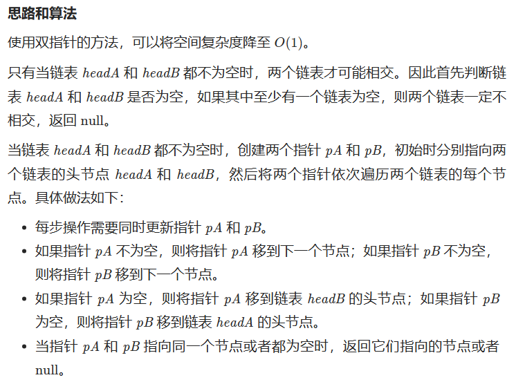
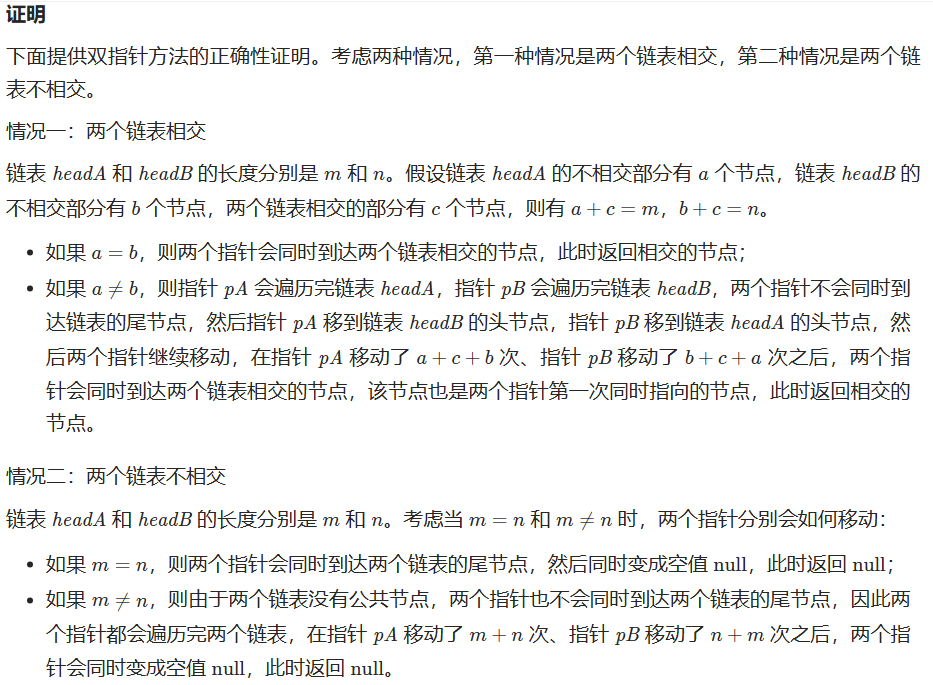

[24. 两两交换链表中的节点](https://leetcode.cn/problems/swap-nodes-in-pairs/)

```C++
class Solution {
public:
    ListNode* swapPairs(ListNode* head) {
        ListNode* dummyHead = new ListNode(0); // 设置头结点
        dummyHead->next = head; 
        ListNode* cur = dummyHead;
        while(cur->next != NULL && cur->next->next != NULL){
            ListNode* tmp = cur->next; // 记录临时节点
            ListNode* tmp1 = cur->next->next->next; // 记录临时节点
            cur->next = cur->next->next;
            cur->next->next=tmp;
            cur->next->next->next = tmp1;

            cur = cur->next->next;
        }
        return dummyHead->next;
    }
};
```


[19. 删除链表的倒数第 N 个结点](https://leetcode.cn/problems/remove-nth-node-from-end-of-list/)
计算链表长度：
```C
class Solution {
public:
    int getLength(ListNode* head) {
        int length = 0;
        while (head) {
            ++length;
            head = head->next;
        }
        return length;
    }

    ListNode* removeNthFromEnd(ListNode* head, int n) {
        ListNode* dummy = new ListNode(0, head);
        int length = getLength(head);
        ListNode* cur = dummy;
        for (int i = 1; i < length - n + 1; ++i) {
            cur = cur->next;
        }
        cur->next = cur->next->next;
        ListNode* ans = dummy->next;
        delete dummy;
        return ans;
    }
};
```

双指针：少一次扫描过程

```C
class Solution {
public:
    ListNode* removeNthFromEnd(ListNode* head, int n) {
        ListNode* dummyHead = new ListNode(0);
        dummyHead->next = head;
        ListNode* slow = dummyHead;
        ListNode* fast = dummyHead;
        while(n-- && fast != NULL) {
            fast = fast->next;
        }
        fast = fast->next; // fast再提前走一步，因为需要让slow指向删除节点的上一个节点
        while (fast != NULL) {
            fast = fast->next;
            slow = slow->next;
        }
        slow->next = slow->next->next; 
        
        return dummyHead->next;
    }
};
```

[面试题 02.07. 链表相交](https://leetcode.cn/problems/intersection-of-two-linked-lists-lcci/)

哈希：以后做

双指针：简略写法大为震撼



```C
class Solution {
public:
    ListNode *getIntersectionNode(ListNode *headA, ListNode *headB) {
        if (headA == nullptr || headB == nullptr) {
            return nullptr;
        }
        ListNode *pA = headA, *pB = headB;
        while (pA != pB) {
            pA = pA == nullptr ? headB : pA->next;
            pB = pB == nullptr ? headA : pB->next;
        }
        return pA;
    }
};
```

[142.环形链表II](https://leetcode.cn/problems/linked-list-cycle-ii/)

1. 哈希（以后做）

2， 双指针（数学思维—）
```C++
class Solution {
public:
    ListNode *detectCycle(ListNode *head) {
        ListNode* fast = head;
        ListNode* slow = head;
        while(fast != NULL && fast->next != NULL) {
            slow = slow->next;
            fast = fast->next->next;
            // 快慢指针相遇，此时从head 和 相遇点，同时查找直至相遇
            if (slow == fast) {
                ListNode* index1 = fast;
                ListNode* index2 = head;
                while (index1 != index2) {
                    index1 = index1->next;
                    index2 = index2->next;
                }
                return index2; // 返回环的入口
            }
        }
        return NULL;
    }
};
```