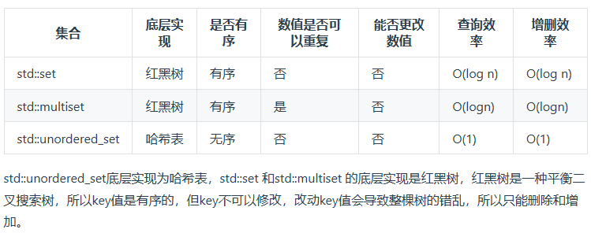
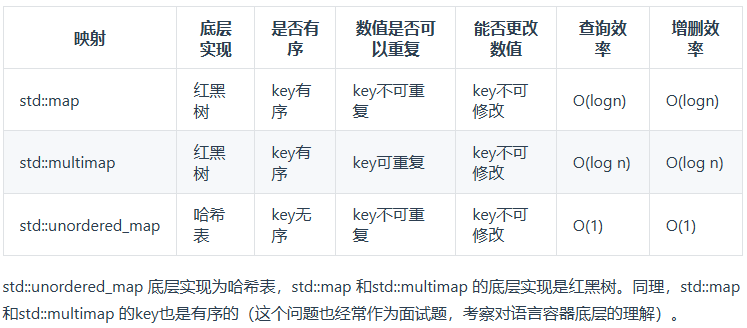

哈希表，
什么时候使用哈希法，当我们需要查询一个元素是否出现过，或者一个元素是否在集合里的时候，就要第一时间想到哈希法。
具体有数组解决(有数的范围且较小)、
set解决:

当我们要使用集合来解决哈希问题的时候，优先使用unordered_set，因为它的查询和增删效率是最优的；
如果需要集合是有序的，那么就用set；
如果要求不仅有序还要有重复数据的话，那么就用multiset。

map解决:


在map 是一个key value 的数据结构，map中，对key是有限制，对value没有限制的，因为key的存储方式使用红黑树实现的。

[242. 有效的字母异位词](https://leetcode.cn/problems/valid-anagram/description/)

用数组解决，只有26个字母
```C++
class Solution {
public:
    bool isAnagram(string s, string t) {
        int record[26] = {0};
        for (int i = 0; i < s.size(); i++) {
            // 并不需要记住字符a的ASCII，只要求出一个相对数值就可以了
            record[s[i] - 'a']++;
        }
        for (int i = 0; i < t.size(); i++) {
            record[t[i] - 'a']--;
        }
        for (int i = 0; i < 26; i++) {
            if (record[i] != 0) {
                // record数组如果有的元素不为零0，说明字符串s和t 一定是谁多了字符或者谁少了字符。
                return false;
            }
        }
        // record数组所有元素都为零0，说明字符串s和t是字母异位词
        return true;
    }
};
```

[349. 两个数组的交集](https://leetcode.cn/problems/intersection-of-two-arrays/)


用set解决：
```C++
class Solution {
public:
    vector<int> intersection(vector<int>& nums1, vector<int>& nums2) {
        unordered_set<int> result_set;//存放结果
        unordered_set<int> nums_set(nums1.begin(),nums1.end());
        for(int i=0;i<nums2.size();i++){
            if(nums_set.find(nums2[i]) != nums_set.end()){
                result_set.insert(nums2[i]);
            }
        }
    return vector<int>(result_set.begin(),result_set.end());
    }
};
```

因为规定了集合内元素大小小于1000，也可以用数组解决
```C++
class Solution {
public:
    vector<int> intersection(vector<int>& nums1, vector<int>& nums2) {
        unordered_set<int> result;
        int hash[1010]={0};
        for(int num:nums1){
            hash[num]=1;
        }
        for(int num:nums2){
            if(hash[num]==1){
                result.insert(num);
            }
        }
        return vector<int>(result.begin(),result.end());
    }
};
```

[202. 快乐数](https://leetcode.cn/problems/happy-number/)
- 思路一：一直计算，直到找到相等或者等于1，用哈希
```C++
class Solution {
public:
    // 取数值各个位上的单数之和
    int getSum(int n) {
        int sum = 0;
        while (n) {
            sum += (n % 10) * (n % 10);
            n /= 10;
        }
        return sum;
    }
    bool isHappy(int n) {
        unordered_set<int> set;
        while(1) {
            int sum = getSum(n);
            if (sum == 1) {
                return true;
            }
            // 如果这个sum曾经出现过，说明已经陷入了无限循环了，立刻return false
            if (set.find(sum) != set.end()) {
                return false;
            } else {
                set.insert(sum);
            }
            n = sum;
        }
    }
};
```

- 思路二：判断循环：快慢指针
```C++
class Solution {
public:
    int bitSquareSum(int n)
    {
        int sum = 0;
        while(n > 0)
        {
            int bit = n % 10;
            sum += bit * bit;
            n /= 10;
        }
        return sum;
    }

    bool isHappy(int n) 
    {
        int slow = n, fast = n;
        do
        {
            slow = bitSquareSum(slow);//slow每次走一格
            fast = bitSquareSum(fast);//fast每次走两格
            fast = bitSquareSum(fast);
        }while(slow != fast);//最终相等要么都是1，要么都不是1

        return slow == 1;
    }
};
```
