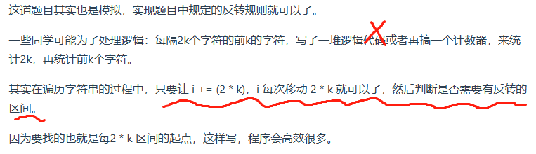

## 字符串

[344. 反转字符串](https://leetcode.cn/problems/reverse-string/description/)

- reverse的实现：reverse(s.begin(),s.end());
```C++
class Solution {
public:
    void reverseString(vector<char>& s) {
        for(int i=0,j=s.size()-1;i<s.size()/2;i++,j--){
            swap(s[i],s[j]);
        }
    }
};
```

[541. 反转字符串 II](https://leetcode.cn/problems/reverse-string-ii/description/)

```C++
class Solution {
public:
    string reverseStr(string s, int k) {
        int n=s.size(),pos=0;
        while(pos<n){
            if(pos+k<=n) reverse(s.begin()+pos,s.begin()+pos+k);
            else reverse(s.begin()+pos,s.end());
            pos+=2*k;
        }
        return s;
    }
};
```
- 思路2

```C++
class Solution {
public:
    string reverseStr(string s, int k) {
        for (int i = 0; i < s.size(); i += (2 * k)) {
            // 1. 每隔 2k 个字符的前 k 个字符进行反转
            // 2. 剩余字符小于 2k 但大于或等于 k 个，则反转前 k 个字符
            if (i + k <= s.size()) {
                reverse(s.begin() + i, s.begin() + i + k );
            } else {
                // 3. 剩余字符少于 k 个，则将剩余字符全部反转。
                reverse(s.begin() + i, s.end());
            }
        }
        return s;
    }
};
```

[剑指 Offer 05. 替换空格](https://leetcode.cn/problems/ti-huan-kong-ge-lcof/description/)

- 从后往前遍历可以做到O(n)，从前往后只能做到O(n2)
```C++
class Solution {
public:
    string replaceSpace(string s) {
        int count = 0; // 统计空格的个数
        int sOldSize = s.size();
        for(int i:s)
            if(i==' ') count+=2;
        // 扩充字符串s的大小，也就是每个空格替换成"%20"之后的大小
        s.resize(s.size() + count);
        int sNewSize = s.size();
        // 从后先前将空格替换为"%20"
        for (int i = sNewSize - 1, j = sOldSize - 1; j < i; i--, j--) {
            if (s[j] != ' ') {
                s[i] = s[j];
            } else {
                s[i] = '0';
                s[i - 1] = '2';
                s[i - 2] = '%';
                i -= 2;
            }
        }
        return s;
    }
};
```

[151. 反转字符串中的单词](https://leetcode.cn/problems/reverse-words-in-a-string/)