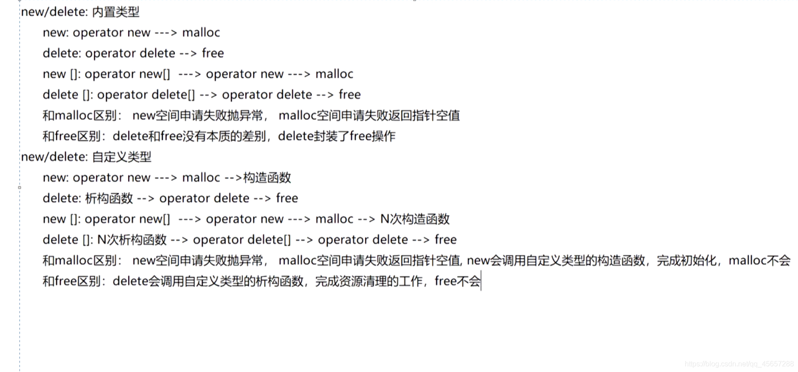

1. **在main执行之前和之后执行的代码可能是什么？**
- 之前：初始化系统相关资源
    1. 设置栈指针
    2. 初始化静态static变量和global全局变量
    3. 将未初始化部分的全局变量赋初值（0、false、NULL）
    4. 全局对象初始化，在main之前调用构造函数
    5. 将main函数的参数argc、argv等传给main函数
    6. __attribute__((constructor))
- main函数执行后：
    1. 全局对象的析构函数
    2. atexit注册的函数会在main之后执行
    3. __attribute__((destructor))


2. **结构体内存对齐问题？（以后再背）**
- 结构体内成员按照声明顺序存储，第一个成员地址和整个结构体地址相同
- 未特殊说明时，按结构体中size最大的成员对齐
- C++11关键字：alignof 可以计算出类型的对齐方式，alignas 可以指定结构体的对齐方式（有些情况不可用，见[阿秀2.](https://interviewguide.cn/notes/03-hunting_job/02-interview/01-01-01-basic.html)
- 暂略


3. **指针和引用的区别**
- 指针是一个变量，存储地址； 引用与原来变量本质是一个东西，是原变量的别名
- 指针可以多级； 引用只能有一级
- 指针可以为空； 引用不能为NULL且定义时必须初始化
- 指针生命和定义可以分开，可以改变指向； 引用声明必须初始化，且初始化后不可改变
- sizeof指针得到的是本指针大小； sizeof引用得到的是引用所指变量的大小
- 做参数时指针是值传递，函数内改变变量指向不影响实参； 引用会影响实参
- ？引用本质是一个指针，同样会占4字节内存；指针是具体变量，需要占用存储空间（，具体情况还要具体分析


4. **在传递函数参数时，什么时候该使用指针，什么时候该使用引用呢？**
- 需要返回函数内局部变量内存的时候用指针(开辟内存记得释放); 返回局部变量的引用无意义
- 对栈空间大小敏感(如递归)的时候用引用，开销小
- 类对象做参数时候用引用

5. **堆和栈的区别**

栈：去饭馆吃饭，只管点菜(发出申请)、吃(使用)，不用管其他，快捷但是自由度小；
堆：自己动手做喜欢的菜，麻烦但是符合自己口味，自由度高
- 申请方式不同：
- 内存管理机制不同：
  
- 空间大小限制不同：
- 效率不同：
- 碎片问题：
- 生长方向：
- 分配方式：堆都是动态分配； 栈有静态/动态(alloca函数，但是释放由编译器进行)
- 分配效率

6. **堆快一点还是栈快一点？**

栈快
操作系统在底层对栈提供支持，分配专门的寄存器存放栈的地址，入栈出栈简单也有专门的指令执行，所以栈的效率高；
堆的操作由C++函数库提供的，分配内存时候需要算法寻找合适大小的内存。获取堆内容的时候需要两次访问：第一次访问指针，第二次根据指针的地址访问内存。


7. **区别以下指针类型？**
```C++
int *p[10]      //指针数组，强调数组，数组每个元素是一个指针
int (*p)[10]    //数组指针，强调指针，一个变量，指向一个数组大小10的int类型数组
int *p(int)     //函数声明 int符号占位，返回值int*类型
int (*p)(int)   //函数指针，指向的函数有int类型参数、返回值int类型
```
- 拓展
```C++
char *(* c[10])(int **p);
int (*(*(*pfunc)(int *))[5])(int *);
```

8. **new / delete 与 malloc / free的异同**

- 相同：都可用于内存的动态申请和释放
- 不同：
  - new/delete是C++运算符（关键字，直接由编译器支持），可以重载； malloc/free是C/C++语言标准库函数（需要库文件<cstdlib>支持）
  - new自动计算分配空间大小； malloc需要手工计算
  - new类型安全； malloc不是
  - new的实现过程（见下）； malloc均没有相关调用
  - new在申请空间后会调用构造函数完成对象的初始化，delete在释放空间前后会调用析构函数完成空间中资源的清理； 后者只分配释放内存
  - 前者可对数组用new[] 和delete[]； 后者只能对单个内存块管理


9.  **new和delete是如何实现的？**

new： 先调用 operator new(标准库函数)，分配足够大的原始空闲区域存储对象。找到后-运行构造函数来初始化构造对象-返回该块的指针；
delete：检查指针是否为空，确保不会删除一个未初始化或已经被删除的对象；非空-->对指针指向的对象运行适当的析构函数；然后通过调用名为operator delete的标准库函数释放该对象所用内存

10.  **malloc和new的区别？**

- malloc的返回值为void*, 在使用时必须强转，new不需要，因为new后跟的是空间的类型
- malloc申请空间失败时，返回的是NULL，因此使用时必须判空，new不需要，但是new需要捕获异常


11.  **既然有了malloc/free，C++中为什么还需要new/delete呢？直接用malloc/free不好吗？**

对自定义类型需要：


12. **被free回收的内存是立即返还给操作系统吗？**

不是，被free回收的内存首先被ptmalloc使用双链表保护起来，当用户下一次申请内存的时候，会尝试从这些内存中寻找合适的返回。这样就避免了频繁的系统调用，占用过多的系统资源。(同时ptmalloc也会尝试对小块内存进行合并，避免过多的内存碎片。)

13. **宏定义和函数有何区别？**

- 宏定义在预处理阶段完成替换，执行起来更快； 函数调用在运行时需要跳转到具体调用函数；
- 宏定义属于在结构中插入代码，无返回值； 函数调用具有返回值；
- 宏定义参数无类型 不进行类型检查； 函数相反
- 宏定义后面不加分号

14. **宏定义和typedef有何区别？**

- 宏主要用于定义常量；typedef主要用于定义类型别名
- 宏替换在预编译阶段，属于文本插入替换； typedef是编译的一部分
- 宏不进行类型检查； typedef有
- 宏不是语句，不在末尾加分号； typedef加
- **注意对指针的操作，typedef char * p_char和#define p_char char *区别巨大**？

15. **变量声明和定义区别？**

- 声明仅仅是把变量的声明的位置及类型提供给编译器，并不分配内存空间；定义要在定义的地方为其分配存储空间。

- 相同变量可以在多处声明（外部变量extern），但只能在一处定义。

16. **strlen和sizeof区别？**

- sizeof是运算符，不是函数，结果在编译时而非运行中获得； strlen是字符处理的库函数
- sizeof参数可以是任意数据类型； strlen参数只能是字符指针且结尾是'\0'的字符串
- sizeof值在编译时确定，因此不能用来得到动态分配（运行时分配）存储空间的大小
```C++
  int main(int argc, char const *argv[]){
      
      const char* str = "name";

      sizeof(str); // 取的是指针str的长度，是8
      strlen(str); // 取的是这个字符串的长度，不包含结尾的 \0。大小是4
      return 0;
  }
```

17. **常量指针和指针常量区别？**

- 指针常量：int const *p/ const int *p  *p不可变，即只想的是只读变量
- 常量指针：int* const p    p不可变，p是指针，即指向不可变

18. **a和&a有什么区别？**

- 假设数组int a[10]; int (*p)[10] = &a;其中：

    - a是数组名，是数组首元素地址，+1表示地址值加上一个int类型的大小，如果a的值是0x00000001，加1操作后变为0x00000005。*(a + 1) = a[1]。
    - &a是数组的指针，其类型为int (*)[10]（就是前面提到的数组指针），其加1时，系统会认为是数组首地址加上整个数组的偏移（10个int型变量），值为数组a尾元素后一个元素的地址。
    - 若(int *)p ，此时输出 *p时，其值为a[0]的值，因为被转为int *类型，解引用时按照int类型大小来读取。

19. C++和Python的区别


20. C++和C语言的区别


21. C++与Java的区别


22. struct和class的区别

**相同点**
- 都有成员函数 公有和私有部分
**不同点**
- struct成员默认公有类型； class默认私有
- struct默认public继承； class默认private继承

22. 拓展：C和C++stuct的区别

- C语言的struct是用户自定义数据类型； C++中是抽象数据类型，可以继承和多态，支持成员函数的定义
- C中struct无权限设置，只能封装不能隐藏，成员不可以是函数； C++中，struct有访问权限，和类一样有成员函数
- C中struct声明后，必须在结构体名前加struct才能做结构体类型名（除typedef……）； C++中结构体名可以直接作为结构体类型名使用

23. define和const的区别

** 编译阶段**
- define在预处理阶段起作用，属于文本插入替换； const在编译运行时起作用
**安全性**
- define只做替换，无类型检查； const有
**内存占用**
- define在内存中产生多份相同的备份； const在运行中只有一份备份
- 宏定义的数据没有分配内存空间，知识插入替换掉； const定义的变量只是值不能改变，但要分配内存空间
24. const和static的作用
**static**
- 不考虑类
  - 隐藏。使可看性限制在该文件所在的编译模块
  - 默认初始化为0
  - 静态变量在函数内定义，始终存在，且只进行一次初始化，具有记忆性，其作用范围与局部变量相同，函数退出后依然存在，但不能使用
- 考虑类
  - static成员变量：只与类关联，不与类的对象关联。类内声明类外初始化，可被非static成员函数任意访问
  - static成员函数：不具有this指针，无法访问类对象的非static变量和函数；不能被声明为const，徐函数和volatile； 
  - 可以被非static成员函数任意访问
**const**
- 不考虑类
  - 隐藏，同static
  - const常量在定义时必须初始化，之后无法修改
  - const形参可以接受const和非const的实参
- 考虑类
  - const成员变量：只能通过构造函数初始化列表初始化切必须有构造函数；
  - const成员函数：const对象不可调用非const成员函数；非const对象均可调用；不可改变非mutable(声明变量可以在const成员函数中被修改)数据的值

25. C++的顶层const和底层const(类比指针常量和常量指针)

- 顶层const：const修饰的变量**本身** 是一个常量，指的是指针(const在*右边)
- 底层const：const修饰的变量**所指的对象** 是一个常量，指的是所指变量(const在*左边)

```C++
int a = 10;int* const b1 = &a;        //顶层const，b1本身是一个常量
const int* b2 = &a;       //底层const，b2本身可变，所指的对象是常量
const int b3 = 20; 		   //顶层const，b3是常量不可变
const int* const b4 = &a;  //前一个const为底层，后一个为顶层，b4不可变
const int& b5 = a;		   //用于声明引用变量，都是底层const

```
**区分作用：**
- 执行对象拷贝时有限制，常量的底层const不能赋值给非常量的底层const
- 强转函数const_cast时，只能改变运算对象的底层const
- const int a;int const a;const int *a;int *const a;
  - const int a;int const a；均表示定义常量类型a
  - const int *a，其中a为指向int型变量的指针，\*a不可变
  - int *const a,a为指向指向整形数据的常指针，a不可变

26. 数组名和(指向数组首元素的)指针的区别？
- 都可通过偏移量来访问数组元素
- 数组名类似常指针，不能自增自减
- **当数组名做形参传给调用函数后，就是去了原有特性，退化为一般指针，多了自增自减操作，但sizeof运算符不能再得到原数组的大小了**

27. final和override

- override重写：

父类使用了虚函数，子类对这个虚函数重写：
```c++
class A
{
    virtual void foo();
}
class B : public A
{
    void foo(); //OK
    virtual void foo(); // OK
    void foo() override; //OK
}

```

如果不用重写，写错名之类的会被当成新的函数；如果用重写，编译器知道是重写父类的，就会报错

- final

不希望某个类被继承或某个虚函数被重写，在类名或虚函数后添加final关键字。例：
```c++
class Base
{
    virtual void foo();
};
 
class A : public Base
{
    void foo() final; // foo 被override并且是最后一个override，在其子类中不可以重写
};

class B final : A // 指明B是不可以被继承的
{
    void foo() override; // Error: 在A中已经被final了
};
 
class C : B // Error: B is final
{
};

```

28. 拷贝初始化和直接初始化

用于类类型对象时：
- 直接初始化：直接调用与实参匹配的构造函数
- 拷贝初始化：调用拷贝构造函数。首先置顶构造函数创建临时变量，然后拷贝构造函数将那个临时对象拷贝到正在创建的对象
- 为了提高效率，允许编译器跳过创建临时对象这一步，直接调用构造函数构造要创建的对象，这样就完全等价于直接初始化了

记：初始化时，使用`=`的是拷贝初始化，不使用`=`的是直接初始化
```c++
string str1("I am a string");//语句1 直接初始化
string str2(str1);//语句2 直接初始化，str1是已经存在的对象，直接调用拷贝构造函数对str2进行初始化
string str3 = "I am a string";//语句3 拷贝初始化，先为字符串”I am a string“创建临时对象，再把临时对象作为参数，使用拷贝构造函数构造str3
string str4 = str1;//语句4 拷贝初始化，这里相当于隐式调用拷贝构造函数，而不是调用赋值运算符函数

```

29. 初始化和赋值的区别

- 对于简单类型来说，初始化和赋值没什么区别
- 对于类和复杂数据类型，例
```c++
class A{
public:
    int num1;
    int num2;
public:
    A(int a=0, int b=0):num1(a),num2(b){};
    A(const A& a){};
    //重载 = 号操作符函数
    A& operator=(const A& a){
        num1 = a.num1 + 1;
        num2 = a.num2 + 1;
        return *this;
    };
};
int main(){
    A a(1,1);
    A a1 = a; //拷贝初始化操作，调用拷贝构造函数
    A b;
    b = a;//赋值操作，对象a中，num1 = 1，num2 = 1；对象b中，num1 = 2，num2 = 2
    return 0;
}
```
30. extern "C"的用法

C++调用C函数
```c
//xx.h
extern int add(...)

//xx.c
int add(){
    
}

//xx.cpp
extern "C" {
    #include "xx.h"
}

```

31. 野指针和悬空指针

- 野指针：未被初始化
  - 避免：初始化时赋值为nullptr
- 悬空指针：内存已经被释放了的指针
  - 避免：释放后立即置空； 智能指针的本质就是避免悬空指针的产生

32. c和c++的类型安全

33. C++中的重载 重写（覆盖）和隐藏的区别

- 重载overload

同意定义范围内的同名成员函数。函数名相同，参数类型和数目不同

- 重写（override）

重写指的是在派生类中覆盖基类中的同名函数，重写就是重写函数体，要求基类函数必须是虚函数且：
  - 与基类的虚函数有相同的参数个数
  - 与基类的虚函数有相同的参数类型
  - 与基类的虚函数有相同的返回值类型
可以加override确保是重写`virtual int fun(int a) override{}`

- 隐藏（hide）

派生类的函数屏蔽了基类的同名函数，**和重写的区别在于基类函数是否是虚函数。**

34. C++有哪几种构造函数

默认构造函数
初始化构造函数（有参数）
拷贝构造函数
移动构造函数（move和右值引用）
委托构造函数
转换构造函数

35. 深拷贝与浅拷贝的区别

浅拷贝

只是拷贝一个指针，拷贝的指针与原指针指向同一块地址，如果原来的指针所指向的资源释放了，那么再释放浅拷贝的指针的资源就会出现错误。

深拷贝

深拷贝不仅拷贝值，还开辟出一块新的空间用来存放新的值，即使原先的对象被析构掉，释放内存了也不会影响到深拷贝得到的值。在自己实现拷贝赋值的时候，如果有指针变量的话是需要自己实现深拷贝的。


36. 内联函数和宏定义的区别

在使用时，宏只做简单字符串替换（编译前）。而内联函数可以进行参数类型检查（编译时），且具有返回值。
内联函数在编译时直接将函数代码嵌入到目标代码中，省去函数调用的开销来提高执行效率，并且进行参数类型检查，具有返回值，可以实现重载。
宏定义时要注意书写（参数要括起来）否则容易出现歧义，内联函数不会产生歧义
内联函数有类型检测、语法判断等功能，而宏没有

37. public，protected和private访问和继承权限/public/protected/private的区别？

访问权限：public 可以被任意实体访问，protected 只允许子类（无论什么继承方式）及本类的成员函数访问，private 只允许本类的成员函数访问。

继承权限：public继承不会改变基类的成员的访问权限

private继承使得基类所有成员在派生类的访问权限变为private，派生类的成员可以访问基类的public和protected成员，但是派生类的对象不可以访问基类的任何成员，并且如果再继承的话，派生类的子类的成员也不能访问基类的成员

protect继承使得基类成员在派生类的访问权限变为protected，派生类的成员可以访问基类的public和protected成员，但是派生类的对象不可以访问基类的任何成员，它可以再向下继承，相当于把基类的成员属性一直按照protected向下继承

注意：基类private属性的成员永远不能被访问

简单来说：protect继承和private继承除了在再继承方面有区别，其他的可以认为是一样。

38. 判断大小端存储

大端存储：字数据的高字节存储在低地址中

小端存储：字数据的低字节存储在低地址中

例如：32bit的数字0x12345678

所以在Socket编程中，往往需要将操作系统所用的小端存储的IP地址转换为大端存储，这样才能进行网络传输

```C++
#include <iostream>
using namespace std;
int main()
{
    int a = 0x1234;
    //由于int和char的长度不同，借助int型转换成char型，只会留下低地址的部分
    char c = (char)(a);
    if (c == 0x12)
        cout << "big endian" << endl;
    else if(c == 0x34)
        cout << "little endian" << endl;
}
```


