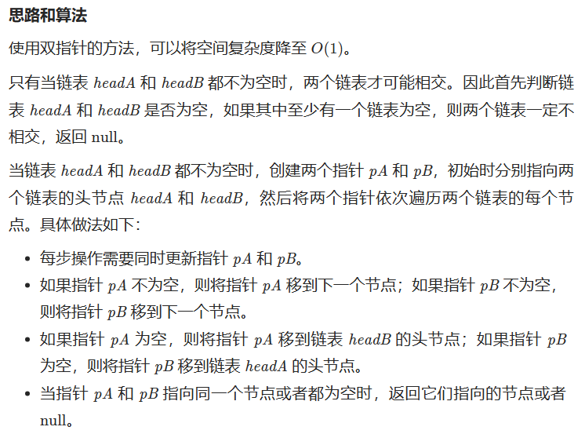
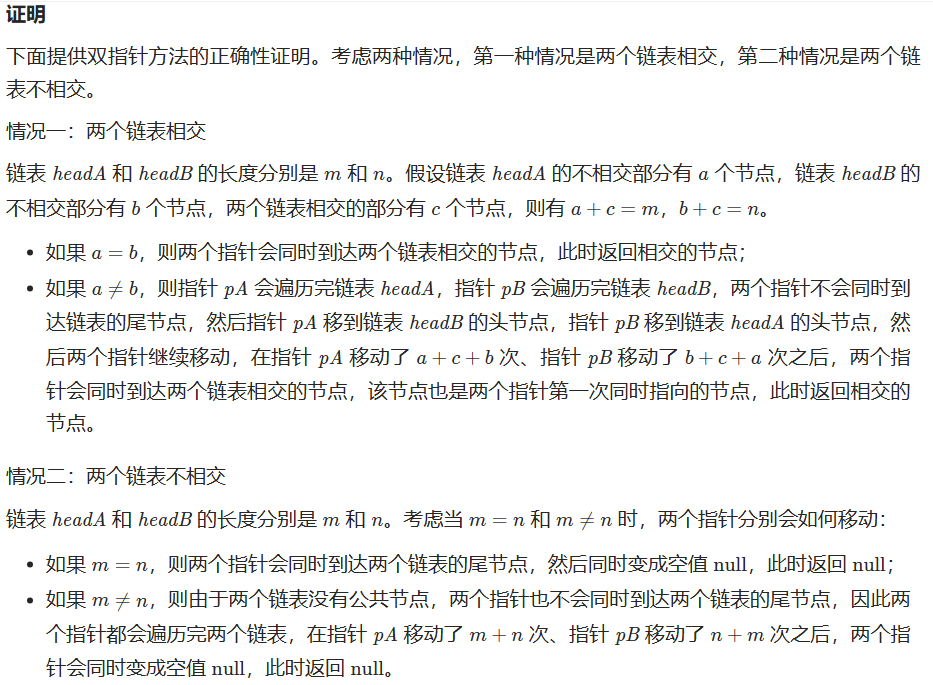

[203. 移除链表元素](https://leetcode.cn/problems/remove-linked-list-elements/)

1. 不附加头结点，需要单独判断头结点的条件，是否删除
```C++
class Solution {
public:
    ListNode* removeElements(ListNode* head, int val) {
        //头结点要删除
        while(head != nullptr &&head->val ==val){
            ListNode* tmp = head;
            head= head->next;
            delete tmp;
        }
        //其他节点需要删除
        ListNode* cur = head;
        while(cur != nullptr && cur->next !=nullptr){
            if(cur->next->val == val){
                ListNode* tmp = cur->next;
                cur->next = cur->next->next;
                delete tmp;
            }else cur = cur->next;
        }
        return head;
    }
};

```

2. 加虚拟头结点，可以简化少一次判断

```C
class Solution {
public:
    ListNode* removeElements(ListNode* head, int val) {
        ListNode* dummyHead = new ListNode(0); // 设置一个虚拟头结点
        dummyHead->next = head; // 将虚拟头结点指向head，这样方面后面做删除操作
        ListNode* cur = dummyHead;
        while (cur->next != NULL) {
            if(cur->next->val == val) {
                ListNode* tmp = cur->next;
                cur->next = cur->next->next;
                delete tmp;
            } else {
                cur = cur->next;
            }
        }
        head = dummyHead->next;
        delete dummyHead;
        return head;
    }
};

```

[707. 设计链表](https://leetcode.cn/problems/design-linked-list/)

需要debug，抽空二刷巩固链表

```C
class MyLinkedList {
public:
    // 定义链表节点结构体
    struct LinkedNode {
        int val;
        LinkedNode* next;
        LinkedNode(int val):val(val), next(nullptr){}
    };

    // 初始化链表
    MyLinkedList() {
        _dummyHead = new LinkedNode(0); // 这里定义的头结点 是一个虚拟头结点，而不是真正的链表头结点
        _size = 0;
    }

    // 获取到第index个节点数值，如果index是非法数值直接返回-1， 注意index是从0开始的，第0个节点就是头结点
    int get(int index) {
        if (index > (_size - 1) || index < 0) {
            return -1;
        }
        LinkedNode* cur = _dummyHead->next;
        while(index--){ // 如果--index 就会陷入死循环
            cur = cur->next;
        }
        return cur->val;
    }

    // 在链表最前面插入一个节点，插入完成后，新插入的节点为链表的新的头结点
    void addAtHead(int val) {
        LinkedNode* newNode = new LinkedNode(val);
        newNode->next = _dummyHead->next;
        _dummyHead->next = newNode;
        _size++;
    }

    // 在链表最后面添加一个节点
    void addAtTail(int val) {
        LinkedNode* newNode = new LinkedNode(val);
        LinkedNode* cur = _dummyHead;
        while(cur->next != nullptr){
            cur = cur->next;
        }
        cur->next = newNode;
        _size++;
    }

    // 在第index个节点之前插入一个新节点，例如index为0，那么新插入的节点为链表的新头节点。
    // 如果index 等于链表的长度，则说明是新插入的节点为链表的尾结点
    // 如果index大于链表的长度，则返回空
    void addAtIndex(int index, int val) {
        if (index > _size) {
            return;
        }
        LinkedNode* newNode = new LinkedNode(val);
        LinkedNode* cur = _dummyHead;
        while(index--) {
            cur = cur->next;
        }
        newNode->next = cur->next;
        cur->next = newNode;
        _size++;
    }

    // 删除第index个节点，如果index 大于等于链表的长度，直接return，注意index是从0开始的
    void deleteAtIndex(int index) {
        if (index >= _size || index < 0) {
            return;
        }
        LinkedNode* cur = _dummyHead;
        while(index--) {
            cur = cur ->next;
        }
        LinkedNode* tmp = cur->next;
        cur->next = cur->next->next;
        delete tmp;
        _size--;
    }

    // 打印链表
    void printLinkedList() {
        LinkedNode* cur = _dummyHead;
        while (cur->next != nullptr) {
            cout << cur->next->val << " ";
            cur = cur->next;
        }
        cout << endl;
    }
private:
    int _size;
    LinkedNode* _dummyHead;

};

```

[206. 反转链表](https://leetcode.cn/problems/reverse-linked-list/)

1. 非递归
```C++
class Solution {
public:
    ListNode* reverseList(ListNode* head) {
        ListNode *tmp;
        ListNode *cur=head;
        ListNode *pre=nullptr;
        while(cur){
            tmp=cur->next;
            cur->next = pre;

            pre=cur;
            cur=tmp;
        }
        return pre;
    }
};
```
2. 递归大致看了一下，从头两个节点翻转递归下去，思路差不多


[24. 两两交换链表中的节点](https://leetcode.cn/problems/swap-nodes-in-pairs/)

```C++
class Solution {
public:
    ListNode* swapPairs(ListNode* head) {
        ListNode* dummyHead = new ListNode(0); // 设置头结点
        dummyHead->next = head; 
        ListNode* cur = dummyHead;
        while(cur->next != NULL && cur->next->next != NULL){
            ListNode* tmp = cur->next; // 记录临时节点
            ListNode* tmp1 = cur->next->next->next; // 记录临时节点
            cur->next = cur->next->next;
            cur->next->next=tmp;
            cur->next->next->next = tmp1;

            cur = cur->next->next;
        }
        return dummyHead->next;
    }
};
```


[19. 删除链表的倒数第 N 个结点](https://leetcode.cn/problems/remove-nth-node-from-end-of-list/)
计算链表长度：
```C
class Solution {
public:
    int getLength(ListNode* head) {
        int length = 0;
        while (head) {
            ++length;
            head = head->next;
        }
        return length;
    }

    ListNode* removeNthFromEnd(ListNode* head, int n) {
        ListNode* dummy = new ListNode(0, head);
        int length = getLength(head);
        ListNode* cur = dummy;
        for (int i = 1; i < length - n + 1; ++i) {
            cur = cur->next;
        }
        cur->next = cur->next->next;
        ListNode* ans = dummy->next;
        delete dummy;
        return ans;
    }
};
```

双指针：少一次扫描过程

```C
class Solution {
public:
    ListNode* removeNthFromEnd(ListNode* head, int n) {
        ListNode* dummyHead = new ListNode(0);
        dummyHead->next = head;
        ListNode* slow = dummyHead;
        ListNode* fast = dummyHead;
        while(n-- && fast != NULL) {
            fast = fast->next;
        }
        fast = fast->next; // fast再提前走一步，因为需要让slow指向删除节点的上一个节点
        while (fast != NULL) {
            fast = fast->next;
            slow = slow->next;
        }
        slow->next = slow->next->next; 
        
        return dummyHead->next;
    }
};
```

[面试题 02.07. 链表相交](https://leetcode.cn/problems/intersection-of-two-linked-lists-lcci/)

哈希：以后做

双指针：简略写法大为震撼



```C
class Solution {
public:
    ListNode *getIntersectionNode(ListNode *headA, ListNode *headB) {
        if (headA == nullptr || headB == nullptr) {
            return nullptr;
        }
        ListNode *pA = headA, *pB = headB;
        while (pA != pB) {
            pA = pA == nullptr ? headB : pA->next;
            pB = pB == nullptr ? headA : pB->next;
        }
        return pA;
    }
};
```

[142.环形链表II](https://leetcode.cn/problems/linked-list-cycle-ii/)

1. 哈希（以后做）

2， 双指针（数学思维—）
```C++
class Solution {
public:
    ListNode *detectCycle(ListNode *head) {
        ListNode* fast = head;
        ListNode* slow = head;
        while(fast != NULL && fast->next != NULL) {
            slow = slow->next;
            fast = fast->next->next;
            // 快慢指针相遇，此时从head 和 相遇点，同时查找直至相遇
            if (slow == fast) {
                ListNode* index1 = fast;
                ListNode* index2 = head;
                while (index1 != index2) {
                    index1 = index1->next;
                    index2 = index2->next;
                }
                return index2; // 返回环的入口
            }
        }
        return NULL;
    }
};
```