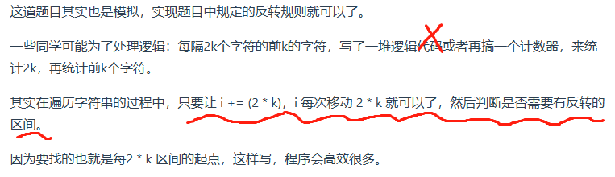

## 字符串

[344. 反转字符串](https://leetcode.cn/problems/reverse-string/description/)

- reverse的实现：reverse(s.begin(),s.end());
```C++
class Solution {
public:
    void reverseString(vector<char>& s) {
        for(int i=0,j=s.size()-1;i<s.size()/2;i++,j--){
            swap(s[i],s[j]);
        }
    }
};
```

[541. 反转字符串 II](https://leetcode.cn/problems/reverse-string-ii/description/)

```C++
class Solution {
public:
    string reverseStr(string s, int k) {
        int n=s.size(),pos=0;
        while(pos<n){
            if(pos+k<=n) reverse(s.begin()+pos,s.begin()+pos+k);
            else reverse(s.begin()+pos,s.end());
            pos+=2*k;
        }
        return s;
    }
};
```
- 思路2

```C++
class Solution {
public:
    string reverseStr(string s, int k) {
        for (int i = 0; i < s.size(); i += (2 * k)) {
            // 1. 每隔 2k 个字符的前 k 个字符进行反转
            // 2. 剩余字符小于 2k 但大于或等于 k 个，则反转前 k 个字符
            if (i + k <= s.size()) {
                reverse(s.begin() + i, s.begin() + i + k );
            } else {
                // 3. 剩余字符少于 k 个，则将剩余字符全部反转。
                reverse(s.begin() + i, s.end());
            }
        }
        return s;
    }
};
```

[剑指 Offer 05. 替换空格](https://leetcode.cn/problems/ti-huan-kong-ge-lcof/description/)

- 从后往前遍历可以做到O(n)，从前往后只能做到O(n2)
```C++
class Solution {
public:
    string replaceSpace(string s) {
        int count = 0; // 统计空格的个数
        int sOldSize = s.size();
        for(int i:s)
            if(i==' ') count+=2;
        // 扩充字符串s的大小，也就是每个空格替换成"%20"之后的大小
        s.resize(s.size() + count);
        int sNewSize = s.size();
        // 从后先前将空格替换为"%20"
        for (int i = sNewSize - 1, j = sOldSize - 1; j < i; i--, j--) {
            if (s[j] != ' ') {
                s[i] = s[j];
            } else {
                s[i] = '0';
                s[i - 1] = '2';
                s[i - 2] = '%';
                i -= 2;
            }
        }
        return s;
    }
};
```

[151. 反转字符串中的单词](https://leetcode.cn/problems/reverse-words-in-a-string/)
```C++
class Solution {
public:
    void reverse(string& s, int start, int end){ //翻转，区间写法：左闭右闭 []
        for (int i = start, j = end; i < j; i++, j--) {
            swap(s[i], s[j]);
        }
    }

    void removeExtraSpaces(string& s) {//去除所有空格并在相邻单词之间添加空格, 快慢指针。
        int slow = 0;   //整体思想参考https://programmercarl.com/0027.移除元素.html
        for (int i = 0; i < s.size(); ++i) { //
            if (s[i] != ' ') { //遇到非空格就处理，即删除所有空格。
                if (slow != 0) s[slow++] = ' '; //手动控制空格，给单词之间添加空格。slow != 0说明不是第一个单词，需要在单词前添加空格。
                while (i < s.size() && s[i] != ' ') { //补上该单词，遇到空格说明单词结束。
                    s[slow++] = s[i++];
                }
            }
        }
        s.resize(slow); //slow的大小即为去除多余空格后的大小。
    }

    string reverseWords(string s) {
        removeExtraSpaces(s); //去除多余空格，保证单词之间之只有一个空格，且字符串首尾没空格。
        reverse(s, 0, s.size() - 1);
        int start = 0; //removeExtraSpaces后保证第一个单词的开始下标一定是0。
        for (int i = 0; i <= s.size(); ++i) {
            if (i == s.size() || s[i] == ' ') { //到达空格或者串尾，说明一个单词结束。进行翻转。
                reverse(s, start, i - 1); //翻转，注意是左闭右闭 []的翻转。
                start = i + 1; //更新下一个单词的开始下标start
            }
        }
        return s;
    }
};
```

[剑指 Offer 58 - II. 左旋转字符串](https://leetcode.cn/problems/zuo-xuan-zhuan-zi-fu-chuan-lcof/)
```C++
class Solution {
public:
    string reverseLeftWords(string s, int n) {
        reverse(s.begin(),s.begin()+n);
        reverse(s.begin()+n,s.end());
        reverse(s.begin(),s.end());
        return s;
    }
};
```


KMP 

```C++
//求Next数组：
// s[]是模式串，p[]是模板串, n是s的长度，m是p的长度
for (int i = 2, j = 0; i <= m; i ++ )
{
    while (j && p[i] != p[j + 1]) j = ne[j];
    if (p[i] == p[j + 1]) j ++ ;
    ne[i] = j;
}

// 匹配
for (int i = 1, j = 0; i <= n; i ++ )
{
    while (j && s[i] != p[j + 1]) j = ne[j];
    if (s[i] == p[j + 1]) j ++ ;
    if (j == m)
    {
        j = ne[j];
        // 匹配成功后的逻辑
    }
}
```

### kpm两题待补充


### 总结

#### 1. 什么是字符串
字符串是若干字符组成的有限序列，也可以理解为是一个字符数组

在C语言中，把一个字符串存入一个数组时，也把结束符 '\0'存入数组，并以此作为该字符串是否结束的标志。
```C
char a[5] = "asd";
for (int i = 0; a[i] != '\0'; i++) {
}
```

在C++中，提供一个string类，string类会提供 size接口，可以用来判断string类字符串是否结束，就不用'\0'来判断是否结束。

```C
string a = "asd";
for (int i = 0; i < a.size(); i++) {
}
```
- vector< char > 和 string 又有什么区别呢？

其实在基本操作上没有区别，但是 string提供更多的字符串处理的相关接口，例如string 重载了+，而vector却没有。

所以想处理字符串，我们还是会定义一个string类型。

#### 2. 双指针法
在344.反转字符串 (opens new window)，我们使用双指针法实现了反转字符串的操作，双指针法在数组，链表和字符串中很常用。

接着在字符串：替换空格 (opens new window)，同样还是使用双指针法在时间复杂度O(n)的情况下完成替换空格。

其实很多数组填充类的问题，都可以先预先给数组扩容带填充后的大小，然后在从后向前进行操作。

那么针对数组删除操作的问题，其实在27. 移除元素 (opens new window)中就已经提到了使用双指针法进行移除操作。

同样的道理在151.翻转字符串里的单词 (opens new window)中我们使用O(n)的时间复杂度，完成了删除冗余空格。

一些同学会使用for循环里调用库函数erase来移除元素，这其实是O(n^2)的操作，因为erase就是O(n)的操作，所以这也是典型的不知道库函数的时间复杂度，上来就用的案例了。

#### 3. 反转系列
在反转上还可以在加一些玩法，其实考察的是对代码的掌控能力。

541. 反转字符串II (opens new window)中，一些同学可能为了处理逻辑：每隔2k个字符的前k的字符，写了一堆逻辑代码或者再搞一个计数器，来统计2k，再统计前k个字符。

其实当需要固定规律一段一段去处理字符串的时候，要想想在在for循环的表达式上做做文章。

只要让 i += (2 * k)，i 每次移动 2 * k 就可以了，然后判断是否需要有反转的区间。

因为要找的也就是每2 * k 区间的起点，这样写程序会高效很多。

在151.翻转字符串里的单词 (opens new window)中要求翻转字符串里的单词，这道题目可以说是综合考察了字符串的多种操作。是考察字符串的好题。

这道题目通过 先整体反转再局部反转，实现了反转字符串里的单词。

后来发现反转字符串还有一个牛逼的用处，就是达到左旋的效果。

在字符串：反转个字符串还有这个用处？ (opens new window)中，我们通过先局部反转再整体反转达到了左旋的效果。

#### 4. KMP
KMP的主要思想是当出现字符串不匹配时，可以知道一部分之前已经匹配的文本内容，可以利用这些信息避免从头再去做匹配了。

KMP的精髓所在就是前缀表，在KMP精讲 (opens new window)中提到了，什么是KMP，什么是前缀表，以及为什么要用前缀表。

前缀表：起始位置到下标i之前（包括i）的子串中，有多大长度的相同前缀后缀。

那么使用KMP可以解决两类经典问题：

匹配问题：28. 实现 strStr()(opens new window)
重复子串问题：459.重复的子字符串(opens new window)
再一次强调了什么是前缀，什么是后缀，什么又是最长相等前后缀。

前缀：指不包含最后一个字符的所有以第一个字符开头的连续子串。

后缀：指不包含第一个字符的所有以最后一个字符结尾的连续子串。

然后针对前缀表到底要不要减一，这其实是不同KMP实现的方式，我们在KMP精讲 (opens new window)中针对之前两个问题，分别给出了两个不同版本的的KMP实现。

其中主要理解j=next[x]这一步最为关键！

#### 5. 总结
字符串类类型的题目，往往想法比较简单，但是实现起来并不容易，复杂的字符串题目非常考验对代码的掌控能力。

双指针法是字符串处理的常客。

KMP算法是字符串查找最重要的算法，但彻底理解KMP并不容易，我们已经写了五篇KMP的文章，不断总结和完善，最终才把KMP讲清楚。

好了字符串相关的算法知识就介绍到了这里了，明天开始新的征程，大家加油！